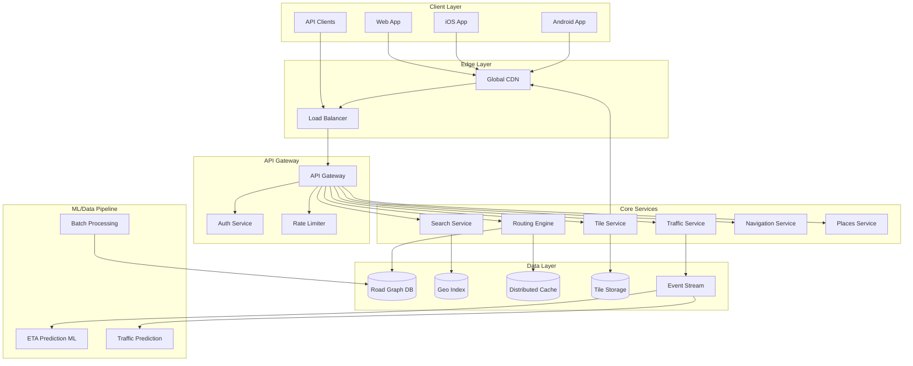
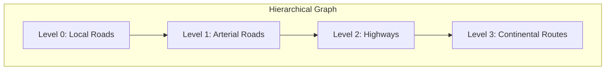
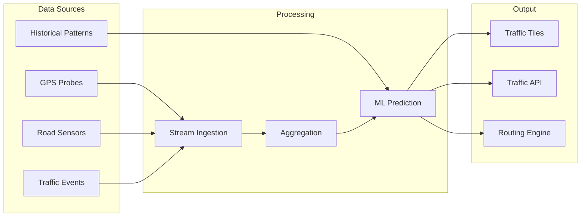
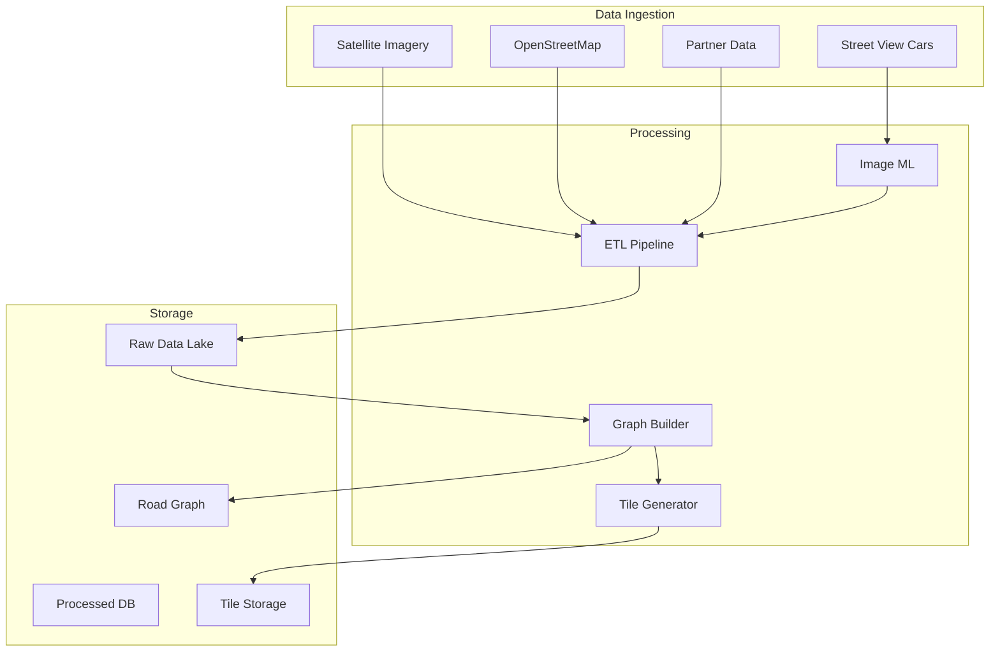
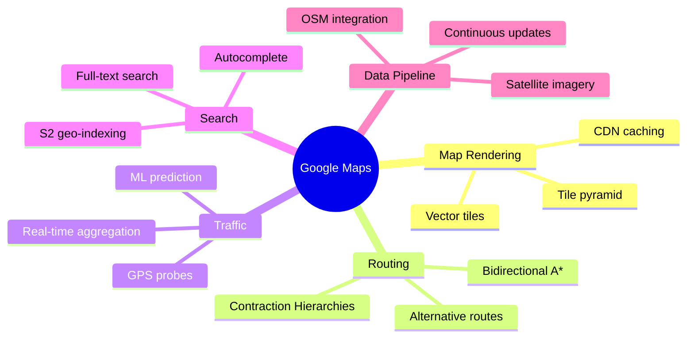

# Design Google Maps

<Info>
**Difficulty**: 🔴 Hard | **Time**: 45-60 min | **Prerequisites**: Graph algorithms, Geo-indexing, CDN
</Info>

Design a large-scale navigation and mapping service that handles billions of queries daily, provides real-time traffic updates, and calculates optimal routes across the globe.

---

## 1. Requirements Clarification

### Functional Requirements

| Feature | Description |
|---------|-------------|
| **Map Rendering** | Display interactive maps with zoom levels from world to street |
| **Search** | Find places, addresses, businesses by name or category |
| **Routing** | Calculate optimal routes for driving, walking, cycling, transit |
| **Real-time Traffic** | Show live traffic conditions and adjust ETAs |
| **Navigation** | Turn-by-turn directions with voice guidance |
| **Street View** | 360° imagery of streets and locations |

### Non-Functional Requirements

- **Latency**: Route calculation < 200ms, map tiles < 50ms
- **Availability**: 99.99% uptime
- **Scale**: 1 billion daily active users, 10B+ daily API calls
- **Coverage**: 200+ countries, 25+ million miles of roads

### Capacity Estimation

```
Daily Active Users: 1 billion
Average sessions/user: 2
Average requests/session: 50
Daily requests: 1B × 2 × 50 = 100 billion requests

Peak QPS: 100B / 86400 × 3 (peak factor) ≈ 3.5 million QPS

Storage:
- Road graph: ~500GB (compressed)
- Map tiles (all zoom levels): ~50 PB
- Street View imagery: ~200 PB
- Search index: ~10 TB
```

---

## 2. High-Level Architecture



---

## 3. Core Components Deep Dive

### 3.1 Map Tile System

Maps are divided into **tiles** at different zoom levels using a quadtree structure.

```
Zoom Level 0: 1 tile (entire world)
Zoom Level 1: 4 tiles (2x2 grid)
Zoom Level 2: 16 tiles (4x4 grid)
...
Zoom Level 20: 1,099,511,627,776 tiles
```

#### Tile Addressing

```python
def lat_lon_to_tile(lat: float, lon: float, zoom: int) -> tuple:
    """Convert lat/lon to tile coordinates"""
    n = 2 ** zoom
    x = int((lon + 180) / 360 * n)
    y = int((1 - math.asinh(math.tan(math.radians(lat))) / math.pi) / 2 * n)
    return (x, y, zoom)

def get_tile_url(x: int, y: int, z: int) -> str:
    """Generate tile URL"""
    return f"https://tiles.maps.com/{z}/{x}/{y}.png"
```

#### Tile Caching Strategy

| Layer | TTL | Purpose |
|-------|-----|---------|
| **Browser Cache** | 1 week | Static tiles rarely change |
| **CDN Edge** | 24 hours | Geographic distribution |
| **Origin Cache** | 1 hour | Reduce tile generation |

```python
# Tile request flow
def get_tile(x, y, z):
    cache_key = f"tile:{z}:{x}:{y}"
    
    # L1: Local cache
    if tile := local_cache.get(cache_key):
        return tile
    
    # L2: Distributed cache
    if tile := redis.get(cache_key):
        local_cache.set(cache_key, tile, ttl=300)
        return tile
    
    # L3: Generate/fetch from storage
    tile = tile_storage.get(x, y, z)
    redis.set(cache_key, tile, ttl=3600)
    return tile
```

### 3.2 Road Graph Data Structure

The road network is stored as a **weighted directed graph**:

```python
@dataclass
class RoadSegment:
    segment_id: str
    start_node: str
    end_node: str
    length_meters: float
    road_class: str  # highway, arterial, residential
    speed_limit: float
    is_one_way: bool
    geometry: List[LatLon]  # polyline points
    
@dataclass
class Intersection:
    node_id: str
    lat: float
    lon: float
    connected_segments: List[str]
    traffic_signals: bool
    turn_restrictions: Dict[str, List[str]]  # from_seg -> blocked_to_segs
```

#### Graph Partitioning

The world's road network is too large for a single machine. We use **graph partitioning**:



- **Partition by Geography**: Each region (city, country) is a partition
- **Border Nodes**: Connect partitions at highway entry/exit points
- **Contraction Hierarchies**: Pre-compute shortcuts for faster long-distance routing

### 3.3 Routing Algorithm

For optimal routing, we use **Contraction Hierarchies (CH)** combined with **A\* search**:

```python
class RoutingEngine:
    def find_route(self, origin: LatLon, destination: LatLon, mode: str) -> Route:
        """
        1. Snap points to nearest road nodes
        2. Use bidirectional A* with contraction hierarchies
        3. Apply real-time traffic adjustments
        4. Return optimal route
        """
        start_node = self.snap_to_road(origin)
        end_node = self.snap_to_road(destination)
        
        # Bidirectional search
        forward_queue = PriorityQueue()
        backward_queue = PriorityQueue()
        
        forward_queue.push(start_node, heuristic(start_node, end_node))
        backward_queue.push(end_node, heuristic(end_node, start_node))
        
        while not forward_queue.empty() and not backward_queue.empty():
            # Expand from both directions
            meeting_node = self.expand_search(
                forward_queue, backward_queue
            )
            
            if meeting_node:
                return self.reconstruct_path(
                    start_node, meeting_node, end_node
                )
        
        return None
    
    def apply_traffic(self, route: Route) -> Route:
        """Adjust edge weights based on real-time traffic"""
        for segment in route.segments:
            traffic_factor = self.traffic_service.get_factor(segment.id)
            segment.travel_time *= traffic_factor
        return route
```

#### Route Alternatives

Users often want multiple route options:

```python
def find_alternatives(origin, destination, primary_route):
    alternatives = []
    
    # Penalize edges from primary route
    penalty_graph = apply_penalties(primary_route, factor=2.0)
    
    # Find k-shortest paths
    for i in range(3):
        alt = find_route(origin, destination, graph=penalty_graph)
        if is_sufficiently_different(alt, primary_route, alternatives):
            alternatives.append(alt)
            penalty_graph = apply_penalties(alt, factor=1.5)
    
    return alternatives
```

### 3.4 Real-Time Traffic System



#### Traffic Calculation

```python
class TrafficService:
    def calculate_traffic_speed(self, segment_id: str) -> TrafficData:
        """
        Combine multiple signals to estimate current traffic speed
        """
        # Get recent GPS probe data (5-minute window)
        probes = self.get_recent_probes(segment_id, window_minutes=5)
        
        if len(probes) > 10:
            # Enough data for direct calculation
            avg_speed = sum(p.speed for p in probes) / len(probes)
        else:
            # Fall back to historical + nearby segments
            historical = self.historical_model.predict(
                segment_id, 
                day_of_week=datetime.now().weekday(),
                hour=datetime.now().hour
            )
            nearby_factor = self.get_nearby_traffic_factor(segment_id)
            avg_speed = historical * nearby_factor
        
        # Calculate traffic factor relative to free-flow speed
        free_flow_speed = self.get_free_flow_speed(segment_id)
        traffic_factor = avg_speed / free_flow_speed
        
        return TrafficData(
            segment_id=segment_id,
            current_speed=avg_speed,
            free_flow_speed=free_flow_speed,
            traffic_factor=traffic_factor,
            confidence=len(probes) / 20  # Higher confidence with more data
        )
```

### 3.5 ETA Prediction

ETA is not just distance/speed—it requires ML prediction:

```python
class ETAPredictionModel:
    """
    Features for ETA prediction:
    - Route distance and segment count
    - Current traffic on each segment
    - Historical patterns (day, hour, events)
    - Weather conditions
    - Intersection delays
    - User's driving behavior (optional)
    """
    
    def predict_eta(self, route: Route) -> ETAPrediction:
        features = self.extract_features(route)
        
        # Base ETA from traffic-adjusted travel times
        base_eta = sum(seg.travel_time for seg in route.segments)
        
        # ML adjustment for unpredictable factors
        ml_adjustment = self.model.predict(features)
        
        # Confidence interval
        lower_bound = base_eta * 0.9
        upper_bound = base_eta * 1.3
        
        return ETAPrediction(
            eta_seconds=base_eta + ml_adjustment,
            confidence_lower=lower_bound,
            confidence_upper=upper_bound
        )
```

---

## 4. Geo-Indexing for Search

To find nearby places efficiently, we use **geospatial indexing**:

### Option 1: Geohash

```python
def encode_geohash(lat: float, lon: float, precision: int = 8) -> str:
    """
    Encode lat/lon into a geohash string
    Nearby locations share common prefixes
    """
    # ... geohash algorithm
    return geohash_string

# Search nearby
def find_nearby_places(lat, lon, radius_km):
    center_hash = encode_geohash(lat, lon, precision=6)
    neighbor_hashes = get_neighbors(center_hash)
    
    places = []
    for hash in [center_hash] + neighbor_hashes:
        places.extend(db.query(f"geohash LIKE '{hash}%'"))
    
    # Filter by exact distance
    return [p for p in places if haversine(lat, lon, p.lat, p.lon) <= radius_km]
```

### Option 2: S2 Cells (Used by Google)

S2 geometry provides better coverage at poles and consistent cell sizes:

```python
import s2sphere

def get_covering_cells(lat, lon, radius_meters, max_cells=8):
    """Get S2 cells that cover a circular region"""
    region = s2sphere.Cap.from_axis_height(
        s2sphere.LatLng.from_degrees(lat, lon).to_point(),
        s2sphere.earth_meters_to_radians(radius_meters)
    )
    
    coverer = s2sphere.RegionCoverer()
    coverer.max_cells = max_cells
    covering = coverer.get_covering(region)
    
    return [cell.id() for cell in covering]
```

---

## 5. Data Pipeline



### Map Update Pipeline

```python
class MapUpdatePipeline:
    def process_update(self, update: MapUpdate):
        """
        Process a map update (new road, closure, speed limit change)
        """
        # 1. Validate update
        if not self.validate(update):
            return
        
        # 2. Update road graph
        self.graph_db.apply_update(update)
        
        # 3. Invalidate affected tiles
        affected_tiles = self.get_affected_tiles(update.geometry)
        for tile in affected_tiles:
            self.cache.invalidate(tile)
            self.tile_queue.enqueue(tile)  # Regenerate
        
        # 4. Recompute routing shortcuts
        affected_partitions = self.get_affected_partitions(update)
        for partition in affected_partitions:
            self.routing.recompute_shortcuts(partition)
        
        # 5. Publish update event
        self.event_bus.publish("map_updated", update)
```

---

## 6. Scalability Considerations

### Geographic Sharding

```
Shard by Region:
├── Americas (US-WEST, US-EAST, LATAM)
├── EMEA (EU-WEST, EU-CENTRAL, MIDDLE-EAST, AFRICA)
├── APAC (ASIA-EAST, ASIA-SOUTH, OCEANIA)
```

Each region runs independently with:
- Local road graph replicas
- Regional tile caches
- Traffic data aggregation

### Caching Strategy

| Data Type | Cache Layer | TTL | Eviction |
|-----------|-------------|-----|----------|
| Map tiles | CDN + Redis | 24h | LRU |
| Routing shortcuts | Local memory | 1h | On update |
| Traffic data | Redis | 1m | Time-based |
| Place details | Redis | 1h | LRU |
| Search results | CDN | 10m | LRU |

---

## 7. Interview Tips

### Common Follow-ups

<AccordionGroup>
  <Accordion title="How do you handle offline maps?" icon="wifi-slash">
    - **Pre-download tiles** for a region at multiple zoom levels
    - **Compact road graph** for the region (smaller than server version)
    - **On-device routing** with simplified algorithm
    - **Sync updates** when back online
  </Accordion>
  
  <Accordion title="How do you detect new roads?" icon="road">
    - **GPS traces** that don't match existing roads
    - **Satellite imagery** + ML for road detection
    - **User reports** and driver feedback
    - **Partner data** from city governments
  </Accordion>
  
  <Accordion title="How do you handle traffic incidents?" icon="car-burst">
    - **Real-time event ingestion** from multiple sources
    - **Immediate routing recalculation** for affected areas
    - **Push notifications** to users on affected routes
    - **Predictive modeling** for incident duration
  </Accordion>
</AccordionGroup>

### Key Trade-offs

| Decision | Option A | Option B | Recommendation |
|----------|----------|----------|----------------|
| Tile format | Raster (PNG) | Vector | Vector for mobile (smaller, styling) |
| Routing algorithm | Dijkstra | Contraction Hierarchies | CH for long routes, Dijkstra for local |
| Traffic storage | Time-series DB | Stream processing | Both: stream for real-time, TSDB for historical |
| Geo-index | Geohash | S2 Cells | S2 for global scale, Geohash simpler |

---

## 8. Summary



**Key Takeaways:**
1. **Hierarchical graph** with contraction hierarchies for fast routing
2. **Tile pyramid** with aggressive CDN caching for map rendering
3. **S2 cells** for efficient geospatial queries
4. **Real-time traffic** from GPS probes + ML prediction
5. **Geographic sharding** for global scale
