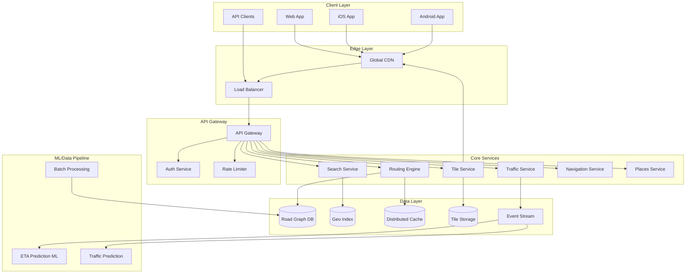
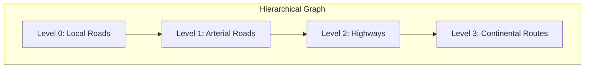
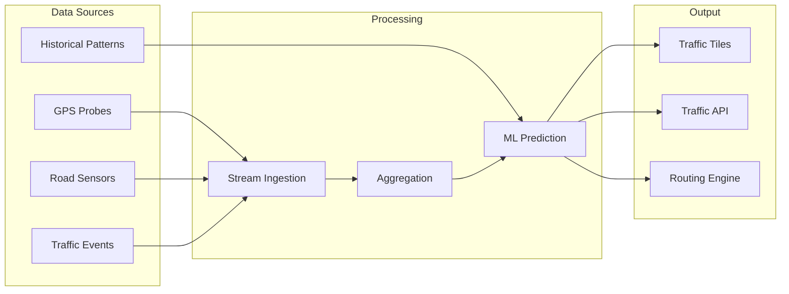
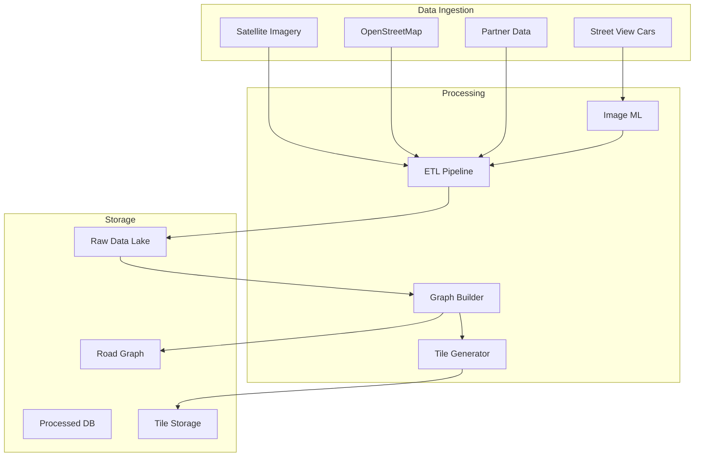
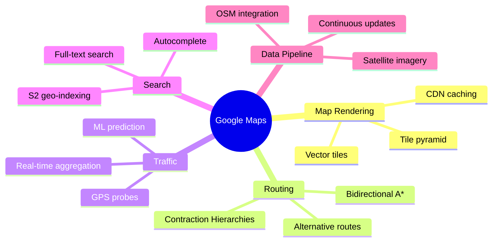

# Design Google Maps

<Info>
**Difficulty**: 🔴 Hard | **Time**: 45-60 min | **Prerequisites**: Graph algorithms, Geo-indexing, CDN
</Info>

Design a large-scale navigation and mapping service that handles billions of queries daily, provides real-time traffic updates, and calculates optimal routes across the globe.

---

## 1. Requirements Clarification

### Functional Requirements

| Feature | Description |
|---------|-------------|
| **Map Rendering** | Display interactive maps with zoom levels from world to street |
| **Search** | Find places, addresses, businesses by name or category |
| **Routing** | Calculate optimal routes for driving, walking, cycling, transit |
| **Real-time Traffic** | Show live traffic conditions and adjust ETAs |
| **Navigation** | Turn-by-turn directions with voice guidance |
| **Street View** | 360° imagery of streets and locations |

### Non-Functional Requirements

- **Latency**: Route calculation < 200ms, map tiles < 50ms
- **Availability**: 99.99% uptime
- **Scale**: 1 billion daily active users, 10B+ daily API calls
- **Coverage**: 200+ countries, 25+ million miles of roads

### Capacity Estimation

```
Daily Active Users: 1 billion
Average sessions/user: 2
Average requests/session: 50
Daily requests: 1B × 2 × 50 = 100 billion requests

Peak QPS: 100B / 86400 × 3 (peak factor) ≈ 3.5 million QPS

Storage:
- Road graph: ~500GB (compressed)
- Map tiles (all zoom levels): ~50 PB
- Street View imagery: ~200 PB
- Search index: ~10 TB
```

---

## 2. High-Level Architecture


```mermaid
graph TB
    subgraph "Client Layer"
        WEB[Web App]
        IOS[iOS App]
        AND[Android App]
        API[API Clients]
    end
    
    subgraph "Edge Layer"
        CDN[Global CDN]
        LB[Load Balancer]
    end
    
    subgraph "API Gateway"
        GW[API Gateway]
        AUTH[Auth Service]
        RL[Rate Limiter]
    end
    
    subgraph "Core Services"
        SEARCH[Search Service]
        ROUTE[Routing Engine]
        TRAFFIC[Traffic Service]
        TILE[Tile Service]
        NAV[Navigation Service]
        PLACES[Places Service]
    end
    
    subgraph "Data Layer"
        GRAPH[(Road Graph DB)]
        GEO[(Geo Index)]
        CACHE[(Distributed Cache)]
        TILES[(Tile Storage)]
        STREAM[Event Stream]
    end
    
    subgraph "ML/Data Pipeline"
        ETA[ETA Prediction ML]
        TRAFFIC_ML[Traffic Prediction]
        BATCH[Batch Processing]
    end
    
    WEB --> CDN
    IOS --> CDN
    AND --> CDN
    API --> LB
    
    CDN --> LB
    LB --> GW
    GW --> AUTH
    GW --> RL
    
    GW --> SEARCH
    GW --> ROUTE
    GW --> TRAFFIC
    GW --> TILE
    GW --> NAV
    GW --> PLACES
    
    SEARCH --> GEO
    ROUTE --> GRAPH
    ROUTE --> CACHE
    TRAFFIC --> STREAM
    TILE --> TILES
    TILE --> CDN
    
    STREAM --> ETA
    STREAM --> TRAFFIC_ML
    BATCH --> GRAPH
```

---

## 3. Core Components Deep Dive

### 3.1 Map Tile System

Maps are divided into **tiles** at different zoom levels using a quadtree structure.

```
Zoom Level 0: 1 tile (entire world)
Zoom Level 1: 4 tiles (2x2 grid)
Zoom Level 2: 16 tiles (4x4 grid)
...
Zoom Level 20: 1,099,511,627,776 tiles
```

#### Tile Addressing

```python
def lat_lon_to_tile(lat: float, lon: float, zoom: int) -> tuple:
    """Convert lat/lon to tile coordinates"""
    n = 2 ** zoom
    x = int((lon + 180) / 360 * n)
    y = int((1 - math.asinh(math.tan(math.radians(lat))) / math.pi) / 2 * n)
    return (x, y, zoom)

def get_tile_url(x: int, y: int, z: int) -> str:
    """Generate tile URL"""
    return f"https://tiles.maps.com/{z}/{x}/{y}.png"
```

#### Tile Caching Strategy

| Layer | TTL | Purpose |
|-------|-----|---------|
| **Browser Cache** | 1 week | Static tiles rarely change |
| **CDN Edge** | 24 hours | Geographic distribution |
| **Origin Cache** | 1 hour | Reduce tile generation |

```python
# Tile request flow
def get_tile(x, y, z):
    cache_key = f"tile:{z}:{x}:{y}"
    
    # L1: Local cache
    if tile := local_cache.get(cache_key):
        return tile
    
    # L2: Distributed cache
    if tile := redis.get(cache_key):
        local_cache.set(cache_key, tile, ttl=300)
        return tile
    
    # L3: Generate/fetch from storage
    tile = tile_storage.get(x, y, z)
    redis.set(cache_key, tile, ttl=3600)
    return tile
```

### 3.2 Road Graph Data Structure

The road network is stored as a **weighted directed graph**:

```python
@dataclass
class RoadSegment:
    segment_id: str
    start_node: str
    end_node: str
    length_meters: float
    road_class: str  # highway, arterial, residential
    speed_limit: float
    is_one_way: bool
    geometry: List[LatLon]  # polyline points
    
@dataclass
class Intersection:
    node_id: str
    lat: float
    lon: float
    connected_segments: List[str]
    traffic_signals: bool
    turn_restrictions: Dict[str, List[str]]  # from_seg -> blocked_to_segs
```

#### Graph Partitioning

The world's road network is too large for a single machine. We use **graph partitioning**:


```mermaid
graph TB
    subgraph "Hierarchical Graph"
        L0[Level 0: Local Roads]
        L1[Level 1: Arterial Roads]
        L2[Level 2: Highways]
        L3[Level 3: Continental Routes]
    end
    
    L0 --> L1 --> L2 --> L3
```

- **Partition by Geography**: Each region (city, country) is a partition
- **Border Nodes**: Connect partitions at highway entry/exit points
- **Contraction Hierarchies**: Pre-compute shortcuts for faster long-distance routing

### 3.3 Routing Algorithm

For optimal routing, we use **Contraction Hierarchies (CH)** combined with **A\* search**:

```python
class RoutingEngine:
    def find_route(self, origin: LatLon, destination: LatLon, mode: str) -> Route:
        """
        1. Snap points to nearest road nodes
        2. Use bidirectional A* with contraction hierarchies
        3. Apply real-time traffic adjustments
        4. Return optimal route
        """
        start_node = self.snap_to_road(origin)
        end_node = self.snap_to_road(destination)
        
        # Bidirectional search
        forward_queue = PriorityQueue()
        backward_queue = PriorityQueue()
        
        forward_queue.push(start_node, heuristic(start_node, end_node))
        backward_queue.push(end_node, heuristic(end_node, start_node))
        
        while not forward_queue.empty() and not backward_queue.empty():
            # Expand from both directions
            meeting_node = self.expand_search(
                forward_queue, backward_queue
            )
            
            if meeting_node:
                return self.reconstruct_path(
                    start_node, meeting_node, end_node
                )
        
        return None
    
    def apply_traffic(self, route: Route) -> Route:
        """Adjust edge weights based on real-time traffic"""
        for segment in route.segments:
            traffic_factor = self.traffic_service.get_factor(segment.id)
            segment.travel_time *= traffic_factor
        return route
```

#### Route Alternatives

Users often want multiple route options:

```python
def find_alternatives(origin, destination, primary_route):
    alternatives = []
    
    # Penalize edges from primary route
    penalty_graph = apply_penalties(primary_route, factor=2.0)
    
    # Find k-shortest paths
    for i in range(3):
        alt = find_route(origin, destination, graph=penalty_graph)
        if is_sufficiently_different(alt, primary_route, alternatives):
            alternatives.append(alt)
            penalty_graph = apply_penalties(alt, factor=1.5)
    
    return alternatives
```

### 3.4 Real-Time Traffic System


```mermaid
graph LR
    subgraph "Data Sources"
        GPS[GPS Probes]
        SENSOR[Road Sensors]
        EVENTS[Traffic Events]
        HISTORY[Historical Patterns]
    end
    
    subgraph "Processing"
        INGEST[Stream Ingestion]
        AGG[Aggregation]
        ML[ML Prediction]
    end
    
    subgraph "Output"
        TILES[Traffic Tiles]
        API[Traffic API]
        ROUTE[Routing Engine]
    end
    
    GPS --> INGEST
    SENSOR --> INGEST
    EVENTS --> INGEST
    HISTORY --> ML
    
    INGEST --> AGG
    AGG --> ML
    
    ML --> TILES
    ML --> API
    ML --> ROUTE
```

#### Traffic Calculation

```python
class TrafficService:
    def calculate_traffic_speed(self, segment_id: str) -> TrafficData:
        """
        Combine multiple signals to estimate current traffic speed
        """
        # Get recent GPS probe data (5-minute window)
        probes = self.get_recent_probes(segment_id, window_minutes=5)
        
        if len(probes) > 10:
            # Enough data for direct calculation
            avg_speed = sum(p.speed for p in probes) / len(probes)
        else:
            # Fall back to historical + nearby segments
            historical = self.historical_model.predict(
                segment_id, 
                day_of_week=datetime.now().weekday(),
                hour=datetime.now().hour
            )
            nearby_factor = self.get_nearby_traffic_factor(segment_id)
            avg_speed = historical * nearby_factor
        
        # Calculate traffic factor relative to free-flow speed
        free_flow_speed = self.get_free_flow_speed(segment_id)
        traffic_factor = avg_speed / free_flow_speed
        
        return TrafficData(
            segment_id=segment_id,
            current_speed=avg_speed,
            free_flow_speed=free_flow_speed,
            traffic_factor=traffic_factor,
            confidence=len(probes) / 20  # Higher confidence with more data
        )
```

### 3.5 ETA Prediction

ETA is not just distance/speed—it requires ML prediction:

```python
class ETAPredictionModel:
    """
    Features for ETA prediction:
    - Route distance and segment count
    - Current traffic on each segment
    - Historical patterns (day, hour, events)
    - Weather conditions
    - Intersection delays
    - User's driving behavior (optional)
    """
    
    def predict_eta(self, route: Route) -> ETAPrediction:
        features = self.extract_features(route)
        
        # Base ETA from traffic-adjusted travel times
        base_eta = sum(seg.travel_time for seg in route.segments)
        
        # ML adjustment for unpredictable factors
        ml_adjustment = self.model.predict(features)
        
        # Confidence interval
        lower_bound = base_eta * 0.9
        upper_bound = base_eta * 1.3
        
        return ETAPrediction(
            eta_seconds=base_eta + ml_adjustment,
            confidence_lower=lower_bound,
            confidence_upper=upper_bound
        )
```

---

## 4. Geo-Indexing for Search

To find nearby places efficiently, we use **geospatial indexing**:

### Option 1: Geohash

```python
def encode_geohash(lat: float, lon: float, precision: int = 8) -> str:
    """
    Encode lat/lon into a geohash string
    Nearby locations share common prefixes
    """
    # ... geohash algorithm
    return geohash_string

# Search nearby
def find_nearby_places(lat, lon, radius_km):
    center_hash = encode_geohash(lat, lon, precision=6)
    neighbor_hashes = get_neighbors(center_hash)
    
    places = []
    for hash in [center_hash] + neighbor_hashes:
        places.extend(db.query(f"geohash LIKE '{hash}%'"))
    
    # Filter by exact distance
    return [p for p in places if haversine(lat, lon, p.lat, p.lon) <= radius_km]
```

### Option 2: S2 Cells (Used by Google)

S2 geometry provides better coverage at poles and consistent cell sizes:

```python
import s2sphere

def get_covering_cells(lat, lon, radius_meters, max_cells=8):
    """Get S2 cells that cover a circular region"""
    region = s2sphere.Cap.from_axis_height(
        s2sphere.LatLng.from_degrees(lat, lon).to_point(),
        s2sphere.earth_meters_to_radians(radius_meters)
    )
    
    coverer = s2sphere.RegionCoverer()
    coverer.max_cells = max_cells
    covering = coverer.get_covering(region)
    
    return [cell.id() for cell in covering]
```

---

## 5. Data Pipeline


```mermaid
graph TB
    subgraph "Data Ingestion"
        SAT[Satellite Imagery]
        OSM[OpenStreetMap]
        PARTNERS[Partner Data]
        STREET[Street View Cars]
    end
    
    subgraph "Processing"
        ETL[ETL Pipeline]
        ML_IMG[Image ML]
        GRAPH_BUILD[Graph Builder]
        TILE_GEN[Tile Generator]
    end
    
    subgraph "Storage"
        RAW[Raw Data Lake]
        PROCESSED[Processed DB]
        GRAPH[Road Graph]
        TILES[Tile Storage]
    end
    
    SAT --> ETL
    OSM --> ETL
    PARTNERS --> ETL
    STREET --> ML_IMG
    
    ETL --> RAW
    ML_IMG --> ETL
    RAW --> GRAPH_BUILD
    GRAPH_BUILD --> GRAPH
    GRAPH_BUILD --> TILE_GEN
    TILE_GEN --> TILES
```

### Map Update Pipeline

```python
class MapUpdatePipeline:
    def process_update(self, update: MapUpdate):
        """
        Process a map update (new road, closure, speed limit change)
        """
        # 1. Validate update
        if not self.validate(update):
            return
        
        # 2. Update road graph
        self.graph_db.apply_update(update)
        
        # 3. Invalidate affected tiles
        affected_tiles = self.get_affected_tiles(update.geometry)
        for tile in affected_tiles:
            self.cache.invalidate(tile)
            self.tile_queue.enqueue(tile)  # Regenerate
        
        # 4. Recompute routing shortcuts
        affected_partitions = self.get_affected_partitions(update)
        for partition in affected_partitions:
            self.routing.recompute_shortcuts(partition)
        
        # 5. Publish update event
        self.event_bus.publish("map_updated", update)
```

---

## 6. Scalability Considerations

### Geographic Sharding

```
Shard by Region:
├── Americas (US-WEST, US-EAST, LATAM)
├── EMEA (EU-WEST, EU-CENTRAL, MIDDLE-EAST, AFRICA)
├── APAC (ASIA-EAST, ASIA-SOUTH, OCEANIA)
```

Each region runs independently with:
- Local road graph replicas -- the US road graph (~200GB compressed) is replicated to all US-region servers. Cross-region routes (e.g., a route from the US to Canada) use border nodes where regional graphs connect
- Regional tile caches -- a user in Tokyo should never fetch tiles from a US server. Tile requests are routed to the nearest CDN edge, then to the regional tile cache, and only hit the origin as a last resort
- Traffic data aggregation -- traffic signals from GPS probes in each region are aggregated locally. Historical patterns are region-specific (rush hour in Tokyo is different from rush hour in NYC). Only global events (major holidays, worldwide incidents) require cross-region data sharing

**Why geographic sharding works here**: Unlike social media (where a user in Tokyo might follow someone in NYC, creating cross-region data dependencies), mapping queries are inherently local. A routing query from point A to point B only needs graph data along the route. The vast majority of queries are within a single region, making geographic sharding natural and efficient.

### Caching Strategy

| Data Type | Cache Layer | TTL | Eviction |
|-----------|-------------|-----|----------|
| Map tiles | CDN + Redis | 24h | LRU |
| Routing shortcuts | Local memory | 1h | On update |
| Traffic data | Redis | 1m | Time-based |
| Place details | Redis | 1h | LRU |
| Search results | CDN | 10m | LRU |

---

## 7. Interview Tips

### Common Follow-ups

<AccordionGroup>
  <Accordion title="How do you handle offline maps?" icon="wifi-slash">
    - **Pre-download tiles** for a region at multiple zoom levels
    - **Compact road graph** for the region (smaller than server version)
    - **On-device routing** with simplified algorithm
    - **Sync updates** when back online
  </Accordion>
  
  <Accordion title="How do you detect new roads?" icon="road">
    - **GPS traces** that don't match existing roads
    - **Satellite imagery** + ML for road detection
    - **User reports** and driver feedback
    - **Partner data** from city governments
  </Accordion>
  
  <Accordion title="How do you handle traffic incidents?" icon="car-burst">
    - **Real-time event ingestion** from multiple sources
    - **Immediate routing recalculation** for affected areas
    - **Push notifications** to users on affected routes
    - **Predictive modeling** for incident duration
  </Accordion>
</AccordionGroup>

### Key Trade-offs

| Decision | Option A | Option B | Recommendation |
|----------|----------|----------|----------------|
| Tile format | Raster (PNG) | Vector | Vector for mobile (60-80% smaller, client-side styling). Raster for satellite/aerial imagery where vector representation is impossible. Google transitioned Maps to vector tiles on mobile around 2010 -- this single change reduced bandwidth by roughly 100x for map data. |
| Routing algorithm | Dijkstra | Contraction Hierarchies | CH for long routes (sub-second cross-country queries vs. minutes with Dijkstra). Use plain Dijkstra or A* only for short local routes within a single partition. The preprocessing cost of CH is high (hours for a continental graph) but the query speedup is 1000x+. |
| Traffic storage | Time-series DB | Stream processing | Both: stream for real-time aggregation (Kafka/Flink with 30-second windows), TSDB for historical patterns. The ML model needs both -- real-time data for current conditions, historical data for predicting what happens next. |
| Geo-index | Geohash | S2 Cells | S2 for global scale -- it handles poles and the antimeridian correctly, which Geohash does not. Geohash is simpler to implement and works fine for regional systems. If your system only operates in one country, Geohash is a pragmatic choice. |

### Common Candidate Mistakes

```
Mistake 1: Treating routing as a simple shortest-path problem
  Real routing considers turn restrictions, road closures, vehicle
  type (trucks cannot use certain roads), time-of-day restrictions,
  and tolls. A naive Dijkstra implementation ignores all of these.

Mistake 2: Storing the entire road graph in one database
  The global road graph has billions of edges. You need hierarchical
  partitioning: local roads in city-level partitions, highways in
  regional partitions, with border nodes connecting them. Without
  this, a single cross-country route query touches the entire graph.

Mistake 3: Underestimating tile storage
  At zoom level 18, there are ~69 billion tiles. Pre-rendering all
  of them is impractical. Use on-demand rendering with aggressive
  caching. Only pre-render zoom levels 0-12 and popular urban areas
  at higher zoom levels.

Mistake 4: Not discussing offline mode
  Google Maps stores ~150MB of pre-downloaded data per city for
  offline use, including a simplified road graph for on-device
  routing. This is a strong discussion point that shows you
  understand real-world product constraints.
```

---

## 8. Summary


```mermaid
mindmap
  root((Google Maps))
    Map Rendering
      Tile pyramid
      Vector tiles
      CDN caching
    Routing
      Contraction Hierarchies
      Bidirectional A*
      Alternative routes
    Traffic
      GPS probes
      Real-time aggregation
      ML prediction
    Search
      S2 geo-indexing
      Full-text search
      Autocomplete
    Data Pipeline
      Satellite imagery
      OSM integration
      Continuous updates
```

**Key Takeaways:**
1. **Hierarchical graph** with contraction hierarchies for fast routing
2. **Tile pyramid** with aggressive CDN caching for map rendering
3. **S2 cells** for efficient geospatial queries
4. **Real-time traffic** from GPS probes + ML prediction
5. **Geographic sharding** for global scale

---

## Interview Deep-Dive Questions

### Q1: Explain how the map tile system works at zoom level 18, where there are approximately 69 billion possible tiles. You obviously cannot pre-render all of them. What is your rendering and caching strategy?

**Strong Answer:**
- The tile pyramid follows a quadtree structure: zoom level 0 is 1 tile (the whole world), each level quadruples. At zoom level 18, that is 4^18 = roughly 69 billion tiles. Pre-rendering all of them is impractical -- at 20KB per tile, that is over 1 petabyte of storage, and 99%+ of those tiles cover ocean, desert, and uninhabited areas that nobody ever requests.
- **The strategy is hybrid: pre-render popular tiles, render-on-demand for the rest.** Pre-render zoom levels 0-12 for the entire world (about 22 million tiles -- very manageable). Pre-render zoom levels 13-18 for high-demand urban areas (top 500 cities cover roughly 80% of requests). Everything else is rendered on demand.
- **On-demand rendering flow**: Client requests tile `(x=152847, y=98231, z=18)`. CDN cache miss. Origin cache (Redis) miss. The tile renderer fetches the vector data for that geographic region from the road graph and POI database, renders it to a PNG (or generates a vector tile protobuf), caches the result at the origin with a 24-hour TTL, and returns it. Subsequent requests are served from cache.
- **Cost optimization**: On-demand rendering has latency (50-200ms for rasterization). To hide this from users, the client **prefetches neighboring tiles** as the user pans. The map viewport typically shows 6-12 tiles; the client requests a 3x3 grid around each visible tile, warming the cache before the user scrolls there.
- **Vector tiles vs raster tiles** changes the economics significantly. Vector tiles are 60-80% smaller than raster (5KB vs 20KB), can be styled client-side, and are resolution-independent. Google Maps switched to vector tiles on mobile around 2010, reducing bandwidth by roughly 100x. The trade-off: vector rendering requires GPU acceleration on the client, which older devices may not support.

**Red flag answer:** "Pre-render all tiles and store them in S3." The candidate has not done the math. 69 billion tiles at 20KB each is 1.3PB. At S3 pricing, that is about $30K/month just for storage, plus the compute to re-render when the map data changes. A strong candidate immediately identifies that most tiles are never requested and proposes a tiered strategy.

**Follow-ups:**
1. The map data for downtown Manhattan changes frequently (new construction, road closures, new businesses). How do you invalidate and regenerate affected tiles without re-rendering the entire zoom level?
2. A user with a slow connection is on zoom level 16 and zooms to level 18. The level-18 tiles have not loaded yet. What do you display in the meantime, and how does the client handle this gracefully?

---

### Q2: Why are Contraction Hierarchies used for routing instead of plain Dijkstra or A*? Walk me through how CH achieves sub-second cross-country route calculations.

**Strong Answer:**
- Plain Dijkstra explores all nodes reachable within the shortest-path distance. For a cross-country route (New York to Los Angeles), Dijkstra would explore millions of nodes across the entire US road network, taking minutes. A* improves this with a heuristic (straight-line distance) that biases the search toward the destination, but it still explores hundreds of thousands of nodes for long routes -- too slow for a 200ms latency budget.
- **Contraction Hierarchies** solve this with a preprocessing step. The idea: assign an "importance" rank to every node in the graph. Local residential intersections are low-importance; highway junctions are high-importance. Then, create **shortcut edges** that bypass low-importance nodes. If nodes A-B-C form a path where B is the least important, add a direct shortcut A-C with weight equal to `weight(A-B) + weight(B-C)`, then "contract" (remove) node B.
- After preprocessing, the graph has a hierarchical structure. At query time, a **bidirectional search** runs from both origin and destination. The critical property: the search only needs to explore nodes of **increasing importance**. The forward search from New York climbs up through local roads to arterials to highways. The backward search from LA does the same. They meet at the highway level, having explored only a few thousand nodes instead of millions.
- **Query time: sub-millisecond for most routes.** A continental US query explores roughly 500-2000 nodes with CH, versus 5-10 million with Dijkstra. The preprocessing cost is high (hours for a continental graph), but it is done offline once (or when the graph changes) and the result is a compact augmented graph stored in memory.
- **The trade-off**: CH assumes static edge weights. When traffic conditions change, the shortcuts are invalidated because the shortcut weight was precomputed from static speed limits. The practical solution is **Customizable Contraction Hierarchies (CCH)**, which separate the graph structure (node ordering) from the edge weights. The ordering is computed once (expensive), but weights can be updated quickly (seconds) when traffic changes.

**Red flag answer:** "Just use A* with a good heuristic." A* with Euclidean distance heuristic does improve over Dijkstra but is still too slow for long-distance routes on continental-scale graphs. The candidate does not understand why preprocessing-based approaches are necessary at this scale. A good follow-up test: ask them what the worst-case complexity of A* is -- it is still O(V log V + E) same as Dijkstra; the heuristic only improves average case.

**Follow-ups:**
1. The road graph is updated 50,000 times per day (new roads, closures, speed limit changes). How do you keep the Contraction Hierarchies up-to-date without re-preprocessing the entire graph each time?
2. A user requests a route that avoids tolls. How does this constraint interact with the precomputed CH shortcuts, which were built assuming tolls are allowed?

---

### Q3: You are receiving GPS probe data from 500 million active devices. How do you ingest, process, and serve real-time traffic data with sub-minute freshness?

**Strong Answer:**
- **Ingestion**: 500M devices reporting position every 5-15 seconds means 30-100 billion GPS points per day, or roughly 350K-1.2M points per second at peak. This is a classic stream processing problem. GPS data flows from mobile devices to a Kafka cluster, partitioned by geographic region (S2 cell at level 4, giving ~6,000 partitions worldwide). Geographic partitioning ensures locality -- all probes for a road segment land on the same partition.
- **Processing**: A Flink or Kafka Streams job consumes the GPS stream and performs **map matching** -- snapping raw GPS coordinates (which are noisy, off by 5-20 meters) to actual road segments. This uses a Hidden Markov Model that considers road geometry, speed limits, and transition probabilities. After map matching, the job aggregates speed observations per road segment in 30-second tumbling windows.
- **Speed estimation per segment**: For a given road segment in a 30-second window, you might have 50 GPS probes. Compute the median speed (not mean -- outliers from GPS noise or vehicles stopping at intersections would skew the mean). If fewer than 5 probes, the confidence is low, and you fall back to a **historical model** that predicts speed based on day-of-week and time-of-day patterns from the last 8 weeks.
- **Serving**: The aggregated traffic data (segment_id, speed, confidence, timestamp) is written to a Redis cluster keyed by segment ID, with a 60-second TTL. The routing engine reads this when computing routes. For the traffic overlay on the map, traffic data is pre-aggregated into **traffic tiles** at each zoom level -- color-coded polylines (green/yellow/red) rendered onto tile images or served as vector overlays.
- **Latency**: GPS probe arrives at Kafka, map-matching takes 10-50ms, aggregation window is 30 seconds, Redis write takes 1ms. End-to-end freshness: 30-60 seconds from real-world event to available-in-routing. This is well within the "sub-minute" requirement.

**Red flag answer:** "Store all GPS data in a time-series database and query it when needed." This is a batch mindset applied to a real-time problem. Querying a TSDB for every routing request adds 10-50ms of latency and does not scale to millions of routing queries per second. The candidate does not understand the difference between a materialized view (pre-aggregated in Redis) and on-demand aggregation.

**Follow-ups:**
1. Your map-matching algorithm incorrectly assigns GPS probes from a highway to a parallel service road (they are 15 meters apart). This makes the highway appear congested when it is not. How do you detect and correct this?
2. It is 3 AM and you have very few GPS probes on most road segments. How do you estimate traffic with low-confidence data, and should you fall back to free-flow speeds or historical data?

---

### Q4: Compare Geohash and S2 Cells for geospatial indexing. When would you choose each, and what are the edge cases that make this choice matter?

**Strong Answer:**
- Both Geohash and S2 Cells solve the same fundamental problem: converting 2D geographic coordinates into a 1D index that preserves spatial locality (nearby points have similar index values), enabling efficient range queries.
- **Geohash** divides the world into a rectangular grid using alternating longitude and latitude bit splits. A geohash string like `9q8yyk` represents a rectangle. Nearby locations share a common prefix. Pros: simple to implement, human-readable strings, supported natively by Redis (GEOADD), PostgreSQL (PostGIS), and Elasticsearch. Cons: **edge cases at the borders** -- two points 1 meter apart can have completely different geohash prefixes if they straddle a grid boundary. To handle this, you must always query the 8 neighboring cells, which can return up to 9x more candidates than needed.
- **S2 Cells** (developed by Google) project the Earth's surface onto a cube, then apply a Hilbert curve to convert 2D positions to 1D cell IDs. Pros: **uniform cell sizes** everywhere on Earth (Geohash cells get distorted near the poles, becoming very elongated), exact covering of arbitrary regions (you can ask "give me the minimum set of cells that cover this circle"), and handles the antimeridian and poles correctly. Cons: more complex to implement, cell IDs are 64-bit integers (not human-readable), and fewer databases support it natively.
- **When to choose Geohash**: Regional systems (single country, no polar regions), simple "find nearby" queries, when using Redis or Elasticsearch which have native geohash support. For example, a food delivery app operating in the US -- Geohash works perfectly.
- **When to choose S2**: Global-scale systems, queries near the poles or antimeridian, when you need to cover arbitrary shapes (polygons, circles) efficiently, when cell size uniformity matters (e.g., density-based analysis). Google Maps, Uber H3 (which is similar in concept to S2), and global ride-sharing platforms use S2 or S2-like systems.
- **The edge case that trips people up**: Search for restaurants near a point in Reykjavik, Iceland (64 degrees N latitude). Geohash cells at this latitude are roughly 2x wider than tall because longitude lines converge near the poles. A "nearby" query with a geohash precision of 6 covers a different physical area than the same query in Nairobi. S2 cells maintain consistent size.

**Red flag answer:** "They are basically the same thing, just use Geohash because it is simpler." This signals the candidate has never worked with geospatial data at global scale. The distortion at high latitudes and the antimeridian problem are real production issues, not academic edge cases. Ships crossing the international date line, flights over the North Pole, and users in Scandinavian countries all exercise these edge cases.

**Follow-ups:**
1. You are building a "restaurants within 500 meters" feature using Geohash. A user is at a geohash cell boundary -- the restaurant 50 meters away has a completely different geohash prefix. How does your query handle this, and what is the performance cost of the workaround?
2. Uber uses H3 (hexagonal grid) instead of S2 or Geohash. What advantage do hexagons provide over the square/rectangular grids of Geohash and S2?

---

### Q5: A user downloads the offline map for Tokyo (approximately 150MB). Two weeks later, several roads have been added and a major highway ramp has closed. How does your offline maps system handle updates without re-downloading the entire 150MB?

**Strong Answer:**
- **Delta updates** are the key. Rather than re-downloading the entire offline map, the system tracks changes since the user's last sync timestamp and delivers only the diff.
- **Server-side**: Maintain a changelog of map edits with timestamps. When the client requests an update, the server computes: "since your last sync at timestamp T, here are the changed tiles and graph segments." For Tokyo over 2 weeks, this might be 500 changed tiles and 200 modified road segments -- roughly 2-5MB instead of 150MB.
- **Tile updates**: The offline map stores tiles for zoom levels 10-17 for the metro area. Only tiles that intersect with changed geographic regions need updating. The server sends a manifest: `[{"tile_id": "15/28750/12826", "action": "update", "url": "..."},` `{"tile_id": "15/28751/12826", "action": "update", "url": "..."}]`. The client downloads only those tiles.
- **Graph updates**: The offline routing graph is a simplified version of the server-side graph (fewer road attributes, lower precision geometry). Updates are expressed as: `[{"segment": "tokyo_seg_47291", "action": "add", "data": {...}},` `{"segment": "tokyo_seg_12044", "action": "modify", "speed_limit": 40, "closed": true}]`. The on-device routing engine applies these edits to its local graph.
- **Conflict resolution**: If the user planned a route while offline that uses the now-closed highway ramp, the app should re-route when the update is applied. The client detects that the active route traverses a modified segment and triggers a local re-computation.
- **Storage management on device**: Offline maps for a major city at useful zoom levels (10-17) require roughly 100-200MB. The client tracks "freshness" per region. If a region has not been updated in 30+ days, prompt the user. If storage is low, offer to delete regions the user has not accessed recently (LRU eviction).
- **The nuance interviewers look for**: on-device routing must use a simpler algorithm than the server. Contraction Hierarchies require significant preprocessing that cannot happen on a phone. Instead, the offline graph uses **A* with a pre-computed distance table** for the local region, which is good enough for city-scale routing but not cross-country.

**Red flag answer:** "Just re-download the whole map when it changes." This wastes bandwidth (150MB on a cellular connection is expensive in many markets), takes minutes, and is a terrible user experience. Or "use git-style diffs on the binary tile files" -- binary diffing of PNG tiles produces diffs that are nearly as large as the originals because PNG compression makes even small visual changes affect large portions of the binary.

**Follow-ups:**
1. The user is navigating with offline maps and enters an area where their downloaded region ends. How does the client handle the boundary gracefully without a data connection?
2. Your delta update system works for road changes, but a new satellite imagery layer was added for Tokyo. How do you handle raster imagery updates efficiently, given that satellite images do not diff well?

---

### Q6: How does the routing engine calculate an accurate ETA that accounts for real-time traffic, time-of-day patterns, and unpredictable factors like weather?

**Strong Answer:**
- ETA prediction is fundamentally a **machine learning problem**, not a simple distance-divided-by-speed calculation. The naive approach (sum segment_length / segment_speed for each road segment) can be off by 30-50% because it ignores intersection delays, traffic signal timing, turn penalties, and the fact that traffic conditions change during the journey.
- **Base ETA from traffic-adjusted segments**: For each segment on the route, look up the current traffic speed (from the real-time GPS probe pipeline). Compute travel time per segment: `length / current_speed`. Sum them. This gives a base ETA that is accurate within 10-15%.
- **Add intersection and turn delays**: Every intersection has a modeled delay based on traffic signals (average wait time: 15-45 seconds at a red light), stop signs (5-10 seconds), and turn type (left turns across traffic add 10-20 seconds). These are learned from historical GPS traces -- the time difference between entering and exiting an intersection, aggregated over millions of trips.
- **ML adjustment layer**: A gradient-boosted model (or neural network) takes features and predicts a correction factor. Key features: (1) route distance and segment count, (2) current traffic factor per segment, (3) time of day and day of week, (4) weather (rain adds 10-20% to ETA in urban areas), (5) number of traffic signals on the route, (6) historical variability of this route (some routes have consistent travel times, others are highly variable), (7) upcoming events (stadium event ending in 30 minutes will create a traffic surge).
- **Confidence intervals**: Google Maps shows "usually 25-35 min." The ML model outputs not just a point estimate but a distribution. The confidence interval narrows with more traffic data and widens during unusual conditions (weather events, holidays).
- **Dynamic ETA updates during navigation**: As the user drives, the system continuously re-estimates based on actual progress. If the user is 5 minutes behind the original ETA after the first 10 minutes, the remaining ETA is adjusted. This is a Kalman filter-style approach -- combining the predicted model with observed reality.

**Red flag answer:** "Just divide the route distance by the speed limit." This ignores traffic entirely and will be wildly inaccurate during rush hour. Or "use the average historical speed for each road" -- this ignores real-time conditions and will be wrong whenever today's traffic deviates from the average (accidents, events, weather).

**Follow-ups:**
1. Your ETA model is consistently 10% optimistic (underestimates travel time). Users are frustrated because they arrive late. How do you diagnose whether the error comes from the traffic data, the intersection model, or the ML adjustment layer?
2. The user is driving a route and a major accident occurs 5 km ahead. How quickly can your system detect the incident, re-route the user, and update the ETA?

---

### Q7: Your map service operates globally with geographic sharding (Americas, EMEA, APAC). A user in Paris plans a road trip to Istanbul. The route crosses from the EU-WEST shard to the MIDDLE-EAST shard. How does cross-shard routing work?

**Strong Answer:**
- Cross-shard routing is one of the hardest problems in a geographically sharded mapping system. The route Paris-to-Istanbul crosses France, Germany (or Switzerland/Austria), the Balkans, and Turkey -- potentially spanning 3-4 geographic shards.
- **The solution is hierarchical routing with border nodes.** Each shard contains the full road graph for its region plus "border nodes" -- points where roads cross shard boundaries. Border nodes are duplicated across adjacent shards. For example, the highway crossing from EU-WEST to EU-CENTRAL at the France-Germany border exists in both shards.
- **Query execution**: The routing request goes to the origin shard (EU-WEST, because the user is in Paris). The local routing engine computes paths from Paris to all EU-WEST border nodes that could be on a path toward Istanbul. It sends these partial paths (with costs) to a **cross-shard routing coordinator**. The coordinator assembles a graph of inter-shard connections and finds the optimal sequence of shards to traverse. It then queries each intermediate shard for the best path between its entry and exit border nodes. Finally, it stitches the partial paths together.
- **Pre-computation makes this fast**: At the continental level, the "highway backbone graph" -- just highways and major arterials connecting cities -- is small enough (a few hundred thousand nodes) to fit in a single machine's memory. The coordinator runs A* on this backbone graph to find the approximate route, identifies which shards it traverses, and only queries those shards. This avoids querying all shards.
- **Latency**: Cross-shard routing is inherently slower than single-shard because it requires coordination. Single-shard: <100ms. Cross-shard: 200-500ms because of the sequential shard queries. To mitigate, the coordinator queries intermediate shards in parallel where possible (if the route goes through shards A, B, C, the coordinator can query B and C simultaneously once it knows the entry points).
- **Traffic data across shards**: Each shard maintains its own real-time traffic data. The cross-shard route must use traffic-adjusted weights from each shard. The coordinator aggregates these when stitching the path.

**Red flag answer:** "Just replicate the entire road graph in every shard." The global road graph is ~500GB compressed. Replicating it everywhere means every shard needs 500GB of graph memory, and every graph update must propagate globally. This does not scale. The whole point of sharding is to partition the data. A strong candidate understands that you replicate only the border nodes and backbone graph, not the entire dataset.

**Follow-ups:**
1. The route Paris-to-Istanbul has an alternative through Italy that is 30 minutes longer but avoids a construction zone in Austria. Your EU-CENTRAL shard knows about the construction, but the coordinator does not. How do you propagate this information to produce accurate cross-shard route alternatives?
2. The user's navigation crosses from the EU-WEST shard to the EU-CENTRAL shard mid-drive. How does the handoff work so the user does not experience a gap in navigation instructions?

---

### Q8: Your CDN serves 3.5 million tile requests per second globally. A major map data update (new satellite imagery for Europe) causes widespread cache invalidation. How do you handle the thundering herd problem without taking down the tile rendering servers?

**Strong Answer:**
- The thundering herd scenario: you invalidate 10 million tiles from the CDN cache simultaneously. Millions of users request those tiles, all get CDN misses, all requests flood your origin tile renderers. A tile renderer that normally handles 10K req/s suddenly receives 500K req/s and crashes.
- **Strategy 1 - Staggered invalidation**: Do not invalidate all tiles at once. Process invalidations in geographic batches over 30-60 minutes. Start with low-traffic regions (rural Europe), monitor origin load, then move to high-traffic regions (major cities). This spreads the cache-miss wave over time.
- **Strategy 2 - Request coalescing (lock-based)**: When multiple requests arrive for the same uncached tile simultaneously, only the first request triggers rendering. Subsequent requests for the same tile key block (or poll) until the first request completes and populates the cache. In implementation, this is a distributed lock: `SETNX render_lock:tile_z15_x28750_y12826 1 EX 30`. If the lock exists, the request waits up to 30 seconds for the cache to be populated. This reduces rendering load from N concurrent requests per tile to exactly 1.
- **Strategy 3 - Stale-while-revalidate**: Serve the old tile from a secondary cache (or a "stale" copy kept beyond its TTL) while the new tile renders in the background. The user sees slightly outdated imagery for a few seconds, but the experience is seamless. This is the `stale-while-revalidate` HTTP cache directive, supported by most CDNs (Cloudflare, Fastly, CloudFront).
- **Strategy 4 - Pre-warming**: Before invalidating the CDN cache, pre-render the new tiles and push them to the CDN edge. Only after the new tiles are cached do you invalidate the old ones. This eliminates the cache-miss window entirely. The cost: you need enough rendering capacity to generate new tiles while still serving old ones.
- **In practice, use all four**: Pre-warm high-traffic tiles (zoom 0-14 for major cities), stagger invalidation for the rest, use coalescing to handle bursts, and stale-while-revalidate as the safety net.

**Red flag answer:** "Just scale up the rendering servers." Auto-scaling takes 2-5 minutes to spin up new instances. The thundering herd hits in seconds. By the time new capacity is ready, the origin is already overwhelmed. Scaling helps for sustained load, not instantaneous spikes. A strong candidate thinks about the transient spike, not just steady-state capacity.

**Follow-ups:**
1. Your request coalescing uses Redis `SETNX` for distributed locks. What happens if the rendering worker holding the lock crashes before completing the render? How do you avoid both deadlock and duplicate rendering?
2. Pre-warming sounds ideal, but you have 50 petabytes of tile data. How do you prioritize which tiles to pre-warm, and how long does it take to pre-warm the most critical subset?

---

## Conversational Interview Walkthrough

The following simulates a realistic back-and-forth interview dialogue. Each exchange includes the interviewer's question, a strong candidate response, an immediate follow-up, and the follow-up answer -- the way a real 45-minute system design conversation unfolds.

<AccordionGroup>
  <Accordion title="Walk me through how you would design the routing engine for a navigation service that needs to compute routes across continents in under 200 milliseconds." icon="route">
    **Interviewer:** "Let's start with routing. A user in Paris wants driving directions to Istanbul -- that is 2,800 km across multiple countries. How do you return a route in under 200 milliseconds when the European road graph has billions of edges?"

    **Strong Candidate Response:**
    - The naive approach -- running Dijkstra on the full European road graph -- would explore millions of nodes and take minutes. Even A* with a straight-line heuristic would explore hundreds of thousands of nodes for a route this long. The key insight is that for long-distance routing, you do not need to consider residential streets in Berlin when the route passes through on the highway.
    - I would use Contraction Hierarchies (CH). The idea is a preprocessing step: rank every node by importance (residential intersections are low, highway junctions are high), then create shortcut edges that bypass low-importance nodes. After preprocessing, a query only explores nodes of increasing importance from both endpoints. A bidirectional search from Paris climbs from local streets to arterials to highways; a backward search from Istanbul does the same. They meet at the highway level, having explored maybe 2,000 nodes instead of 5 million.
    - For the cross-country aspect, the road graph is geographically sharded. France is one partition, Germany is another, Turkey is another. Each partition has "border nodes" where highways cross partition boundaries. A cross-shard routing coordinator finds the optimal sequence of partitions and queries each one for the best path between its entry and exit border nodes.
    - At the continental level, I maintain a compact "highway backbone graph" -- just major highways and border nodes -- small enough to fit in memory on a single machine. The coordinator runs A* on this backbone to determine which partitions the route traverses, then queries those partitions in parallel.
    - The result: sub-100ms for single-partition routes, 200-500ms for cross-partition routes. The preprocessing cost is high (hours for a continental graph), but it is done offline.

    **Interviewer Follow-up:** "Real-time traffic changes the picture entirely. Your contraction hierarchy shortcuts were precomputed with static speed limits. Rush hour in Munich makes the A9 highway twice as slow. How do you incorporate live traffic into CH-based routing without recomputing the entire hierarchy?"

    **Follow-up Answer:**
    - This is where Customizable Contraction Hierarchies (CCH) come in. The key innovation is separating the graph structure (node ordering and shortcut topology) from the edge weights. The node ordering -- which is the expensive part, taking hours to compute -- is based on graph topology, not on edge weights. Once the ordering is fixed, you can update all edge weights and recompute shortcut weights in seconds.
    - Here is how it works in practice. Every 30-60 seconds, the traffic service publishes updated speed factors for each road segment (from the GPS probe pipeline). A "weight customization" job takes these speed factors and recomputes the CH shortcut weights. Because it only recomputes weights (not the ordering), this takes 2-5 seconds for a continental graph.
    - During the 2-5 second recomputation window, queries use the previous set of weights. This means traffic data is at most 30-60 seconds stale -- well within acceptable bounds for navigation.
    - For the specific Munich A9 scenario: when GPS probes report that A9 speeds have dropped to 40 km/h (from the usual 120 km/h), the next weight update reflects this. The routing engine now assigns a 3x higher traversal cost to A9 segments. A Paris-to-Istanbul route that previously went through Munich via A9 might now route through Austria via A10 instead, because the updated weights make the Austria route faster despite being slightly longer.
    - The trade-off is memory: you need to keep two copies of the weight table (current and being-updated) for seamless swapping. For a European graph with 100M edges, each weight table is about 800MB. So you need 1.6GB of memory per routing server just for the weight tables.
  </Accordion>

  <Accordion title="What would break first if your mapping service went from 1 billion to 10 billion daily requests?" icon="bolt">
    **Interviewer:** "Your mapping service handles 1 billion daily requests. We just signed a deal that will 10x our traffic. What breaks first?"

    **Strong Candidate Response:**
    - At 10 billion daily requests, the peak QPS goes from roughly 35,000 to 350,000. The first thing that breaks is not the backend -- it is the CDN and tile serving layer. Map tiles make up 80-90% of total requests. At current scale, the CDN handles this with high cache hit rates. At 10x, two things happen: (1) the long tail of rarely-requested tiles creates more cache misses, and (2) the CDN edge nodes in smaller cities saturate their capacity.
    - The CDN cache miss ratio is the critical metric. At 1 billion requests, we might have a 95% cache hit rate, meaning 50 million requests hit the origin tile servers daily. At 10x traffic, even if the cache hit rate stays at 95%, that is 500 million origin requests -- a 10x increase in origin load. But the cache hit rate will likely decrease because the new traffic includes more diverse tile requests (different zoom levels, different regions). If it drops to 90%, origin requests jump to 1 billion.
    - My remediation priority list: (1) Add more CDN edge capacity in the top 50 cities by traffic volume. (2) Add a shield/mid-tier cache between the CDN edge and the origin to absorb cache misses before they hit tile renderers. (3) Pre-render and push tiles for the top 500 metro areas at zoom levels 0-16 into the CDN before the traffic spike. (4) Implement request coalescing at the origin so that 1,000 simultaneous cache misses for the same tile result in only 1 render operation.
    - The second thing that breaks is the routing engine. Routing is CPU-intensive (even with contraction hierarchies, each query touches thousands of nodes). At 35K routing QPS, a fleet of 50 routing servers handles it. At 350K QPS, you need 500 routing servers, each holding the full regional road graph in memory. That is 500 servers, each with 64GB+ RAM -- a significant infrastructure cost. The optimization here is to cache route results for popular origin-destination pairs. The route from JFK Airport to Manhattan is computed thousands of times per hour with the same result (adjusted for traffic). A route cache with a 5-minute TTL for popular corridors can absorb 30-40% of routing queries.

    **Interviewer Follow-up:** "You mentioned a route cache. But routes depend on real-time traffic, which changes constantly. How do you cache a route that becomes stale every few minutes?"

    **Follow-up Answer:**
    - The trick is to cache at the right granularity and accept that "stale" is relative. A route from JFK to Manhattan has maybe 5-6 realistic path options. The path itself (which roads to take) changes infrequently -- maybe once an hour when traffic shifts significantly. What changes every minute is the ETA, not the path.
    - So I would cache two things separately: the route geometry (the actual sequence of road segments) with a 5-10 minute TTL, and the ETA with a 30-60 second TTL. When a cache hit occurs, I return the cached route geometry but recompute the ETA based on current traffic speeds. ETA computation is much cheaper than route computation -- it is just summing travel times along known segments, which takes microseconds.
    - For cache key design: I would use a "geohash snap" approach. Instead of caching by exact lat/lon (which would never match), snap the origin and destination to the nearest road intersection (node in the graph) and use the node pair as the cache key. This means all requests from the JFK terminal area hit the same cache entry, even if they originate from slightly different GPS coordinates.
    - Cache invalidation: when a major traffic event occurs (accident, road closure), I publish an event that invalidates all cached routes passing through the affected road segments. This targeted invalidation is feasible because the cache entries store the list of segment IDs they traverse.
  </Accordion>

  <Accordion title="A user is navigating and drives into a tunnel with no GPS signal. How does the system handle this?" icon="tunnel">
    **Interviewer:** "Real-world failure scenario. A user is actively navigating, following turn-by-turn directions, and drives into a tunnel. GPS signal is completely lost. What happens on the client side and the server side?"

    **Strong Candidate Response:**
    - This is primarily a client-side problem, and it is one that separates a good navigation app from a great one. The server is not heavily involved because the client should be able to handle short GPS outages autonomously.
    - On the client side, when GPS signal is lost, the app switches to dead reckoning. Dead reckoning uses the last known position, speed, and heading to estimate the current position. The phone's accelerometer and gyroscope (inertial measurement unit) provide movement data even without GPS. If the user was traveling at 60 km/h heading north when they entered the tunnel, the app continues moving the position dot north at approximately 60 km/h.
    - Dead reckoning accuracy degrades over time. After 10 seconds, the estimated position might be off by 20-50 meters. After 30 seconds, it could be off by 100+ meters. This is acceptable for straight tunnels but problematic for tunnels with curves or forks.
    - Map-matching helps constrain the dead reckoning. The client knows the road geometry from the downloaded route. If the tunnel is a straight 2 km stretch with no turns, dead reckoning is easy -- the user must be on this road. If the tunnel has a fork, the client cannot determine which fork was taken until GPS returns. In this case, the app should pre-compute both possibilities and be ready to snap to the correct one instantly when GPS signal resumes.
    - The navigation instruction timing also needs adjustment. If the app knows "turn right in 500 meters" from the current estimated position, it should still deliver that instruction at the estimated time, with slightly wider tolerance. Better to say "prepare to turn right" a few seconds early than to miss the instruction entirely.
    - On the server side, the server stops receiving location updates. If the server was tracking this user for real-time traffic aggregation, it simply treats the user's data as missing during the tunnel period. No traffic speed is calculated for the tunnel segment based on this user. When GPS resumes, the server receives a burst of cached GPS points (the client buffered them during the outage with timestamps) and processes them for traffic data.

    **Interviewer Follow-up:** "The user exits the tunnel and GPS returns, but the dead reckoning was off by 200 meters. They are now past the turn they were supposed to take. How does the system recover?"

    **Follow-up Answer:**
    - When GPS returns, the client performs a "re-snap" -- matching the current GPS position to the nearest road segment. If the re-snapped position is past the intended turn, the client immediately detects that the user has deviated from the planned route.
    - This triggers an automatic reroute. The client sends the current position and the original destination to the routing engine (or computes locally if offline maps are available). The new route starts from the user's current position and finds the best path to the destination. The voice guidance says something like "recalculating route" and then provides the new first instruction.
    - The reroute should happen within 1-2 seconds. The client-side routing (using a simplified A* algorithm on the local road graph) is fast enough for this -- the destination has not changed, and the new starting point is close to the original route, so the search space is small.
    - There is a UX subtlety: the 200-meter position jump when GPS returns should be animated smoothly on the map, not a jarring teleport. The map smoothly scrolls from the dead-reckoned position to the actual GPS position over 1-2 seconds. During this animation, the app suppresses any navigation instructions to avoid confusion.
    - For the traffic data pipeline: the server reconciles the gap. The client sends buffered GPS readings with timestamps. The server uses these to compute that the user was in the tunnel from T1 to T2, traveling at approximately X speed. This data is valuable -- tunnels often have limited probe data because of the GPS blackout, so any inferred speed data helps.
  </Accordion>

  <Accordion title="How would you design the search-ahead (autocomplete) feature for place names with sub-50ms latency?" icon="keyboard">
    **Interviewer:** "The user starts typing 'Star' in the search bar. Within 50 milliseconds, you need to show suggestions: Starbucks (3 nearby), Star Pizza, Starlight Theater, plus street names like Stark Street. How do you build this with sub-50ms latency when you have 200 million places globally?"

    **Strong Candidate Response:**
    - Autocomplete at this scale is one of the hardest latency-sensitive problems because every keystroke triggers a query, and users expect results to appear as fast as they type. The 50ms budget means the backend computation must complete in under 20ms (the rest is network latency to the nearest edge).
    - I would use a two-tier approach: a prefix trie for exact prefix matching and an inverted index for fuzzy matching.
    - The prefix trie is the fast path. For each place name, insert all relevant prefixes into a trie data structure stored in memory. When the user types "Star," traverse the trie to the "Star" node and retrieve the pre-computed top-K completions (sorted by popularity and proximity). This is an O(L) lookup where L is the query length -- essentially constant time.
    - But a global trie of 200 million places is too large for a single server. The solution: geographic partitioning. The autocomplete request includes the user's current location. The request is routed to the regional autocomplete server (e.g., US-West for a user in San Francisco). Each regional server holds a trie of places within that region, which is much smaller (maybe 20 million places for the US).
    - Ranking the suggestions is the harder part. "Star" near downtown San Francisco should prioritize the Starbucks 200 meters away over the Starlight Theater 5 miles away, even though Starlight Theater is a more complete name match. The ranking function combines: (1) prefix match quality, (2) geographic distance from user, (3) place popularity (review count, visit frequency), and (4) personalization (the user goes to this Starbucks every morning). These ranking features are pre-computed and stored alongside the trie nodes.
    - For fuzzy matching (user types "Starbcks" -- a typo): the trie does not help because "Starbcks" does not match the "Starbucks" prefix. I add a secondary lookup using an n-gram index. "Starbucks" is indexed as bigrams: "st", "ta", "ar", "rb", "bu", "uc", "ck", "ks". "Starbcks" shares enough bigrams to score highly. This fuzzy lookup is slower (5-10ms) but still within budget.

    **Interviewer Follow-up:** "The user is typing fast -- 'S', then 'St', then 'Sta', then 'Star' -- four queries in 800 milliseconds. Each query triggers a backend call. How do you handle this burst without wasting server resources on queries the user has already moved past?"

    **Follow-up Answer:**
    - Client-side debouncing is the first line of defense. The client waits 100-150ms after the last keystroke before sending the query. If the user types "Star" in quick succession, only the final query "Star" is sent, not "S", "St", "Sta" separately. This eliminates 75% of the queries for fast typists.
    - For the queries that do reach the server, I use request cancellation. Each autocomplete request carries a session-level sequence number. When the server receives query #4 ("Star"), it checks if it is still processing query #3 ("Sta"). If so, it cancels query #3 -- the result is no longer needed. This frees up server resources for the latest query.
    - On the server side, I implement early termination. If the autocomplete handler is computing results for "Sta" and a new request arrives for "Star" from the same session, the "Sta" computation is aborted. This is straightforward with Go's context cancellation or Java's interrupt mechanism.
    - There is also a cache optimization. The results for "Star" are a strict subset of the results for "Sta" (every place matching "Star*" also matches "Sta*"). So instead of computing "Star" from scratch, I can refine the cached results from "Sta" by filtering and re-ranking. This turns a full trie traversal into a simple filter operation on a much smaller result set, reducing computation from 5ms to sub-millisecond.
    - The CDN can also help here. Popular queries ("Starbucks", "McDonald's") are searched thousands of times per hour across all users. I cache the top-N completions for common prefixes at the CDN edge with a short TTL (60 seconds). The CDN key includes the prefix and a coarse location bucket (city level, not exact coordinates). This offloads a significant fraction of autocomplete queries entirely.
  </Accordion>
</AccordionGroup>
