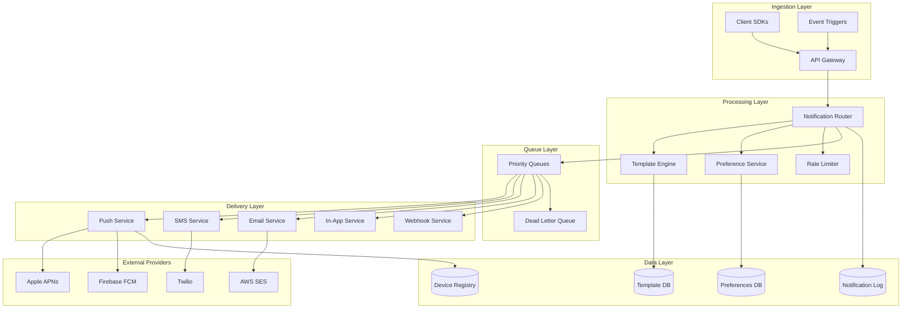
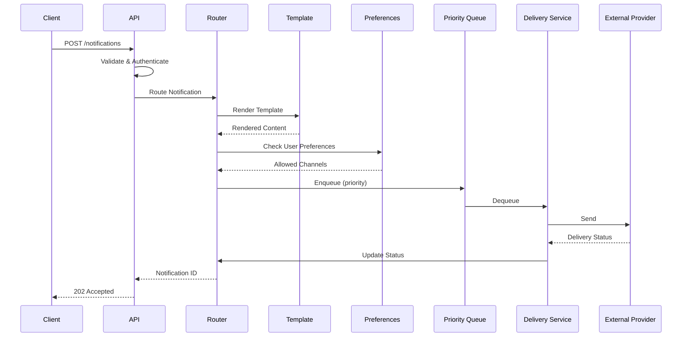
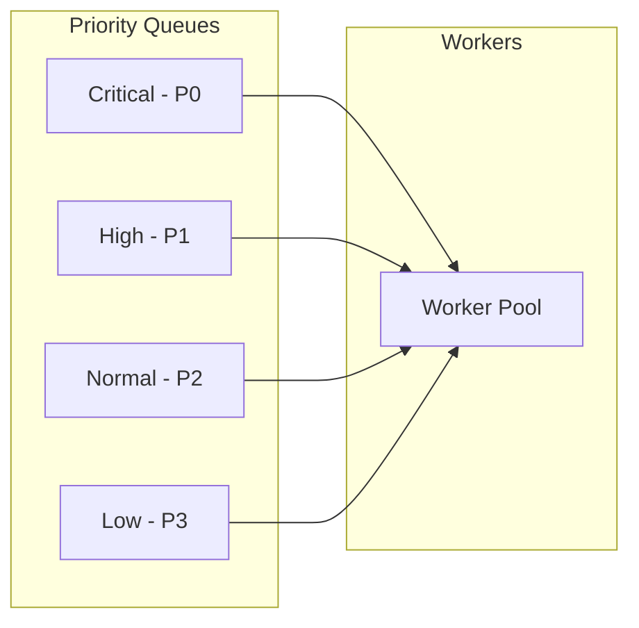
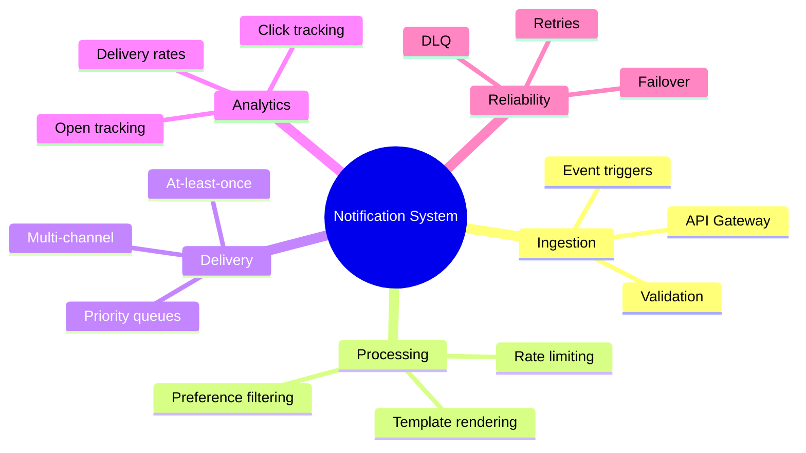

# Design a Notification System

<Info>
**Difficulty**: 🟡 Medium | **Time**: 35-45 min | **Prerequisites**: Message queues, Priority handling, Rate limiting
</Info>

Design a scalable notification system that delivers billions of notifications daily across multiple channels (push, SMS, email, in-app) with reliability guarantees.

---

## 1. Requirements Clarification

### Functional Requirements

| Feature | Description |
|---------|-------------|
| **Multi-channel Delivery** | Push notifications, SMS, Email, In-app, Webhooks |
| **Template Management** | Dynamic templates with variable substitution |
| **Targeting** | Send to users, segments, or topics |
| **Scheduling** | Immediate or scheduled delivery |
| **Priority Levels** | Critical, High, Normal, Low |
| **Preferences** | User opt-in/out per channel and category |
| **Analytics** | Delivery status, open rates, click rates |

### Non-Functional Requirements

- **Latency**: Critical notifications < 1 second, Normal < 5 seconds
- **Throughput**: 1 million notifications/minute peak
- **Reliability**: At-least-once delivery guarantee
- **Availability**: 99.9% uptime

### Capacity Estimation

```
Daily Notifications: 1 billion
Peak factor: 10x (during campaigns/events)

Peak rate: 1B / 86400 × 10 = 115,000 notifications/second

Storage:
- Notification logs: 1B × 500 bytes = 500GB/day
- Templates: 100K templates × 10KB = 1GB
- User preferences: 100M users × 1KB = 100GB
```

---

## 2. High-Level Architecture



---

## 3. Core Components Deep Dive

### 3.1 Notification Request Flow



### 3.2 Notification Router

```python
class NotificationRouter:
    def route(self, request: NotificationRequest) -> str:
        """
        Main entry point for notification processing
        Returns notification_id for tracking
        """
        notification_id = generate_uuid()
        
        # 1. Validate request
        self.validate(request)
        
        # 2. Resolve recipients
        recipients = self.resolve_recipients(request)
        
        # 3. Check rate limits
        for recipient in recipients:
            if not self.rate_limiter.allow(recipient.user_id, request.category):
                self.log_skipped(notification_id, recipient, "RATE_LIMITED")
                continue
        
        # 4. Check preferences
        allowed_recipients = []
        for recipient in recipients:
            prefs = self.preference_service.get(recipient.user_id)
            channels = self.filter_channels(request.channels, prefs)
            if channels:
                allowed_recipients.append((recipient, channels))
        
        # 5. Render template
        rendered = self.template_engine.render(
            request.template_id,
            request.data
        )
        
        # 6. Enqueue for each channel
        for recipient, channels in allowed_recipients:
            for channel in channels:
                self.enqueue(
                    notification_id=notification_id,
                    recipient=recipient,
                    channel=channel,
                    content=rendered[channel],
                    priority=request.priority
                )
        
        # 7. Log notification
        self.log(notification_id, request, len(allowed_recipients))
        
        return notification_id
    
    def resolve_recipients(self, request: NotificationRequest) -> List[Recipient]:
        """Resolve target to actual recipients"""
        if request.user_ids:
            return [Recipient(user_id=uid) for uid in request.user_ids]
        elif request.segment_id:
            return self.segment_service.get_users(request.segment_id)
        elif request.topic:
            return self.subscription_service.get_subscribers(request.topic)
        else:
            raise ValueError("No recipients specified")
    
    def enqueue(self, notification_id, recipient, channel, content, priority):
        """Send to appropriate priority queue"""
        message = NotificationMessage(
            notification_id=notification_id,
            recipient=recipient,
            channel=channel,
            content=content,
            created_at=now()
        )
        
        queue = self.get_queue(channel, priority)
        queue.send(message)
```

### 3.3 Template Engine

```python
class TemplateEngine:
    def render(self, template_id: str, data: dict) -> dict:
        """
        Render template with data for all channels
        Returns dict of channel -> rendered content
        """
        template = self.template_db.get(template_id)
        
        rendered = {}
        for channel, channel_template in template.channels.items():
            rendered[channel] = self.render_channel(channel_template, data)
        
        return rendered
    
    def render_channel(self, template: ChannelTemplate, data: dict) -> Content:
        """Render for specific channel"""
        # Substitute variables using Jinja2 or similar
        title = self.substitute(template.title, data)
        body = self.substitute(template.body, data)
        
        # Channel-specific processing
        if template.channel == "push":
            return PushContent(
                title=title[:50],  # Truncate for push
                body=body[:200],
                image=template.image,
                action_url=self.substitute(template.action_url, data),
                data=data.get("custom_data", {})
            )
        elif template.channel == "email":
            return EmailContent(
                subject=title,
                html_body=self.render_html(template.html_template, data),
                text_body=body,
                from_address=template.from_address
            )
        elif template.channel == "sms":
            return SMSContent(
                body=body[:160],  # SMS character limit
                sender_id=template.sender_id
            )
```

### 3.4 Priority Queue System



```python
class PriorityQueueManager:
    """
    Weighted fair queuing to ensure critical notifications
    are delivered first while not starving lower priorities
    """
    
    PRIORITY_WEIGHTS = {
        "CRITICAL": 100,  # 2FA codes, security alerts
        "HIGH": 50,       # Order confirmations, payments
        "NORMAL": 20,     # Social notifications, updates
        "LOW": 5          # Marketing, newsletters
    }
    
    def dequeue(self) -> Optional[NotificationMessage]:
        """
        Weighted random selection from queues
        Critical gets 100/(100+50+20+5) = 57% of processing
        """
        total_weight = sum(self.PRIORITY_WEIGHTS.values())
        
        # Build weighted queue list
        weighted_queues = []
        for priority, weight in self.PRIORITY_WEIGHTS.items():
            queue = self.get_queue(priority)
            if not queue.is_empty():
                weighted_queues.append((queue, weight))
        
        if not weighted_queues:
            return None
        
        # Weighted random selection
        total = sum(w for _, w in weighted_queues)
        r = random.uniform(0, total)
        
        cumulative = 0
        for queue, weight in weighted_queues:
            cumulative += weight
            if r <= cumulative:
                return queue.receive()
        
        return weighted_queues[-1][0].receive()
```

### 3.5 Push Notification Service

```python
class PushNotificationService:
    def __init__(self):
        self.apns_client = APNsClient()
        self.fcm_client = FCMClient()
    
    def send(self, message: NotificationMessage) -> DeliveryResult:
        """Send push notification to user's devices"""
        devices = self.device_registry.get_devices(message.recipient.user_id)
        
        results = []
        for device in devices:
            try:
                if device.platform == "ios":
                    result = self.send_apns(device, message)
                elif device.platform == "android":
                    result = self.send_fcm(device, message)
                else:
                    result = self.send_web_push(device, message)
                
                results.append(result)
                
                # Handle token invalidation
                if result.status == "INVALID_TOKEN":
                    self.device_registry.remove(device.token)
                    
            except Exception as e:
                results.append(DeliveryResult(
                    device_id=device.id,
                    status="FAILED",
                    error=str(e)
                ))
        
        # Success if at least one device received it
        success = any(r.status == "DELIVERED" for r in results)
        return DeliveryResult(
            notification_id=message.notification_id,
            status="DELIVERED" if success else "FAILED",
            device_results=results
        )
    
    def send_apns(self, device: Device, message: NotificationMessage) -> Result:
        """Send via Apple Push Notification Service"""
        payload = {
            "aps": {
                "alert": {
                    "title": message.content.title,
                    "body": message.content.body
                },
                "badge": message.content.badge,
                "sound": message.content.sound or "default"
            },
            "custom_data": message.content.data
        }
        
        return self.apns_client.send(
            device_token=device.token,
            payload=payload,
            priority=10 if message.priority == "CRITICAL" else 5
        )
    
    def send_fcm(self, device: Device, message: NotificationMessage) -> Result:
        """Send via Firebase Cloud Messaging"""
        fcm_message = {
            "token": device.token,
            "notification": {
                "title": message.content.title,
                "body": message.content.body,
                "image": message.content.image
            },
            "data": message.content.data,
            "android": {
                "priority": "high" if message.priority in ["CRITICAL", "HIGH"] else "normal"
            }
        }
        
        return self.fcm_client.send(fcm_message)
```

### 3.6 User Preferences Service

```python
@dataclass
class UserPreferences:
    user_id: str
    channels: Dict[str, bool]  # email: True, sms: False
    categories: Dict[str, Dict[str, bool]]  # marketing: {email: False, push: True}
    quiet_hours: Optional[QuietHours]
    timezone: str
    language: str

class PreferenceService:
    def get(self, user_id: str) -> UserPreferences:
        # Check cache first
        cached = self.cache.get(f"prefs:{user_id}")
        if cached:
            return cached
        
        prefs = self.db.get(user_id) or self.get_default()
        self.cache.set(f"prefs:{user_id}", prefs, ttl=3600)
        return prefs
    
    def is_allowed(
        self, 
        user_id: str, 
        channel: str, 
        category: str
    ) -> bool:
        """Check if notification is allowed for user"""
        prefs = self.get(user_id)
        
        # Check global channel opt-out
        if not prefs.channels.get(channel, True):
            return False
        
        # Check category-specific preference
        category_prefs = prefs.categories.get(category, {})
        if not category_prefs.get(channel, True):
            return False
        
        # Check quiet hours
        if prefs.quiet_hours:
            user_time = now().astimezone(timezone(prefs.timezone))
            if prefs.quiet_hours.is_quiet_time(user_time):
                return False
        
        return True
```

### 3.7 Rate Limiting

```python
class NotificationRateLimiter:
    """
    Multi-level rate limiting:
    1. Per-user rate limits (prevent spamming)
    2. Per-category limits (e.g., max 2 marketing/day)
    3. Global throughput limits (protect downstream services)
    """
    
    LIMITS = {
        "marketing": {"daily": 2, "hourly": 1},
        "transactional": {"daily": 100, "hourly": 20},
        "social": {"daily": 50, "hourly": 10},
        "security": {"daily": 1000, "hourly": 100},  # High for 2FA
    }
    
    def allow(self, user_id: str, category: str) -> bool:
        limits = self.LIMITS.get(category, {"daily": 10, "hourly": 5})
        
        # Check hourly limit
        hourly_key = f"rate:{user_id}:{category}:hourly:{current_hour()}"
        hourly_count = self.redis.incr(hourly_key)
        self.redis.expire(hourly_key, 3600)
        
        if hourly_count > limits["hourly"]:
            return False
        
        # Check daily limit
        daily_key = f"rate:{user_id}:{category}:daily:{today()}"
        daily_count = self.redis.incr(daily_key)
        self.redis.expire(daily_key, 86400)
        
        if daily_count > limits["daily"]:
            return False
        
        return True
```

---

## 4. Delivery Guarantees

### At-Least-Once Delivery

```python
class DeliveryWorker:
    def process(self, message: NotificationMessage):
        """
        Process with at-least-once semantics using visibility timeout
        """
        try:
            # Attempt delivery
            result = self.deliver(message)
            
            if result.success:
                # Delete from queue only after success
                self.queue.delete(message.receipt_handle)
                self.update_status(message.notification_id, "DELIVERED")
            elif result.permanent_failure:
                # Move to DLQ for investigation
                self.dlq.send(message)
                self.queue.delete(message.receipt_handle)
                self.update_status(message.notification_id, "FAILED")
            else:
                # Transient failure - will be retried after visibility timeout
                self.update_status(message.notification_id, "RETRYING")
                
        except Exception as e:
            # Message becomes visible again after timeout
            self.log_error(message, e)
```

### Retry Strategy

```python
class RetryPolicy:
    """Exponential backoff with jitter"""
    
    MAX_RETRIES = 5
    BASE_DELAY = 1  # seconds
    MAX_DELAY = 300  # 5 minutes
    
    def get_delay(self, attempt: int) -> float:
        delay = min(self.BASE_DELAY * (2 ** attempt), self.MAX_DELAY)
        jitter = random.uniform(0, delay * 0.1)
        return delay + jitter
    
    def should_retry(self, error: Exception, attempt: int) -> bool:
        if attempt >= self.MAX_RETRIES:
            return False
        
        # Don't retry permanent failures
        if isinstance(error, (InvalidTokenError, UserOptedOutError)):
            return False
        
        # Retry transient failures
        if isinstance(error, (NetworkError, RateLimitError, TimeoutError)):
            return True
        
        return False
```

---

## 5. Analytics and Tracking

```python
class NotificationAnalytics:
    def track_sent(self, notification_id: str, channel: str):
        self.metrics.increment("notifications.sent", tags={
            "channel": channel
        })
        
    def track_delivered(self, notification_id: str, channel: str):
        self.metrics.increment("notifications.delivered", tags={
            "channel": channel
        })
        
        # Calculate delivery latency
        notification = self.get_notification(notification_id)
        latency = now() - notification.created_at
        self.metrics.histogram("notifications.delivery_latency", latency)
    
    def track_opened(self, notification_id: str, channel: str):
        """Called when user opens notification"""
        self.metrics.increment("notifications.opened", tags={
            "channel": channel
        })
        
    def track_clicked(self, notification_id: str, action: str):
        """Called when user clicks CTA in notification"""
        self.metrics.increment("notifications.clicked", tags={
            "action": action
        })
    
    def get_campaign_stats(self, campaign_id: str) -> CampaignStats:
        """Aggregate stats for a notification campaign"""
        return CampaignStats(
            sent=self.count("sent", campaign_id),
            delivered=self.count("delivered", campaign_id),
            opened=self.count("opened", campaign_id),
            clicked=self.count("clicked", campaign_id),
            delivery_rate=self.count("delivered") / self.count("sent"),
            open_rate=self.count("opened") / self.count("delivered"),
            click_rate=self.count("clicked") / self.count("opened")
        )
```

---

## 6. Database Schema

```sql
-- Notification requests
CREATE TABLE notifications (
    id UUID PRIMARY KEY,
    template_id UUID NOT NULL,
    category VARCHAR(64) NOT NULL,
    priority VARCHAR(16) NOT NULL,
    data JSONB,
    created_at TIMESTAMP NOT NULL,
    scheduled_at TIMESTAMP,
    status VARCHAR(32) NOT NULL
);

-- Individual delivery attempts
CREATE TABLE notification_deliveries (
    id UUID PRIMARY KEY,
    notification_id UUID NOT NULL,
    user_id UUID NOT NULL,
    channel VARCHAR(32) NOT NULL,
    status VARCHAR(32) NOT NULL,
    delivered_at TIMESTAMP,
    opened_at TIMESTAMP,
    clicked_at TIMESTAMP,
    error_message TEXT,
    attempt_count INT DEFAULT 1,
    
    INDEX idx_notification_id (notification_id),
    INDEX idx_user_id (user_id)
);

-- User preferences
CREATE TABLE user_preferences (
    user_id UUID PRIMARY KEY,
    channel_preferences JSONB NOT NULL,
    category_preferences JSONB NOT NULL,
    quiet_hours_start TIME,
    quiet_hours_end TIME,
    timezone VARCHAR(64) DEFAULT 'UTC',
    language VARCHAR(8) DEFAULT 'en',
    updated_at TIMESTAMP NOT NULL
);

-- Device registry for push
CREATE TABLE user_devices (
    id UUID PRIMARY KEY,
    user_id UUID NOT NULL,
    device_token VARCHAR(512) NOT NULL UNIQUE,
    platform VARCHAR(16) NOT NULL,
    app_version VARCHAR(32),
    created_at TIMESTAMP NOT NULL,
    last_active_at TIMESTAMP,
    
    INDEX idx_user_id (user_id)
);

-- Templates
CREATE TABLE notification_templates (
    id UUID PRIMARY KEY,
    name VARCHAR(128) NOT NULL,
    category VARCHAR(64) NOT NULL,
    channels JSONB NOT NULL,  -- {push: {...}, email: {...}, sms: {...}}
    created_at TIMESTAMP NOT NULL,
    updated_at TIMESTAMP NOT NULL,
    version INT DEFAULT 1
);
```

---

## 7. Interview Tips

### Common Follow-ups

<AccordionGroup>
  <Accordion title="How do you handle notification fatigue?" icon="bell-slash">
    1. **Rate limiting** per category (max 2 marketing/day)
    2. **Smart batching** - consolidate multiple notifications
    3. **Relevance scoring** - only send high-value notifications
    4. **User preferences** - granular opt-out controls
    5. **A/B testing** - optimize timing and frequency
  </Accordion>
  
  <Accordion title="How do you ensure notifications are delivered in order?" icon="list-ol">
    - **Per-user queues** for ordered delivery
    - **Sequence numbers** to detect gaps
    - **Buffering** at the client side for reordering
    - Note: Usually not required—most notifications are independent
  </Accordion>
  
  <Accordion title="How do you handle provider failures?" icon="server">
    1. **Multiple providers** per channel (Twilio + Vonage for SMS)
    2. **Circuit breakers** to detect failing providers
    3. **Automatic failover** to healthy providers
    4. **Provider health monitoring** with SLO tracking
  </Accordion>
</AccordionGroup>

### Key Trade-offs

| Decision | Option A | Option B | Recommendation |
|----------|----------|----------|----------------|
| Delivery guarantee | At-least-once | At-most-once | **At-least-once** (dedupe on client) |
| Queue per channel | Shared queue | Separate queues | Separate (isolation) |
| Template storage | DB | Git (as code) | DB for runtime, Git for version control |
| Analytics | Real-time | Batch | Both (real-time counts, batch for reports) |

---

## 8. Summary



**Key Takeaways:**
1. **Priority queues** ensure critical notifications (2FA) are delivered first
2. **User preferences** respect opt-outs and quiet hours
3. **Rate limiting** prevents notification fatigue
4. **At-least-once delivery** with deduplication at the client
5. **Template engine** for consistent multi-channel content
