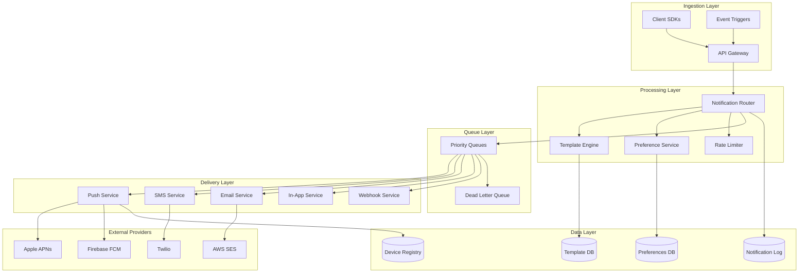
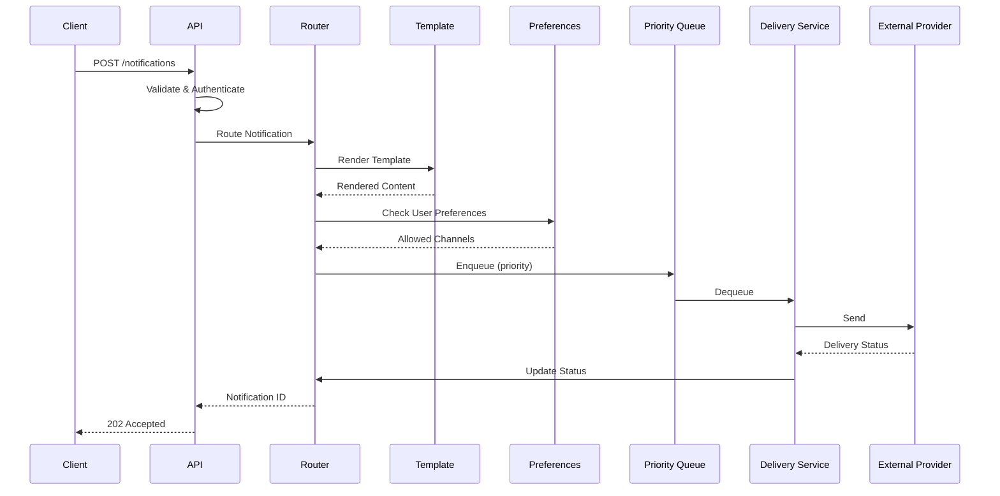
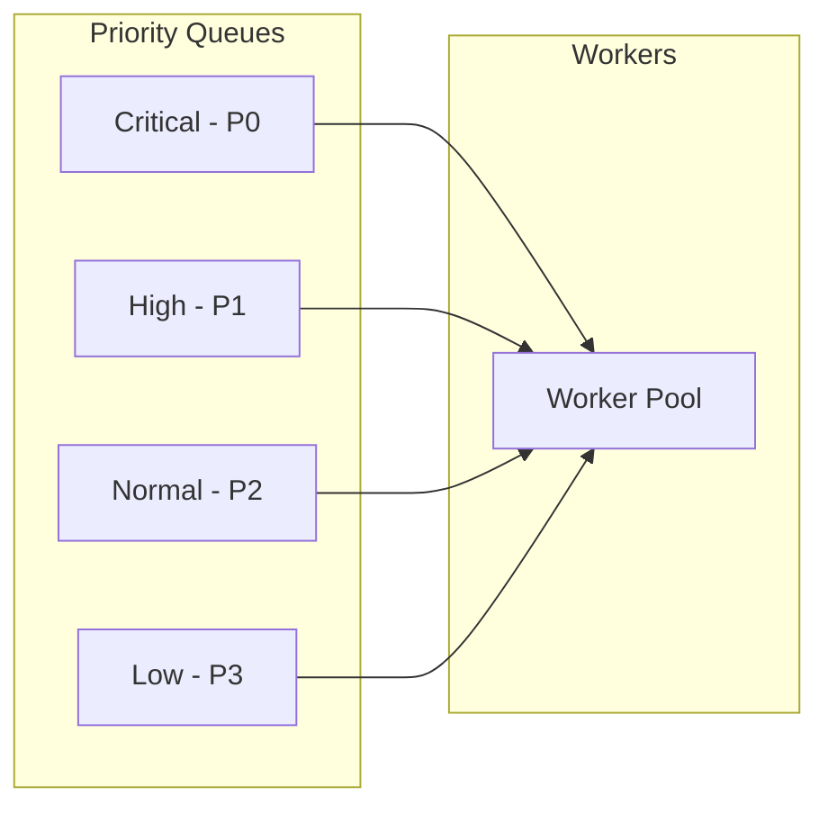
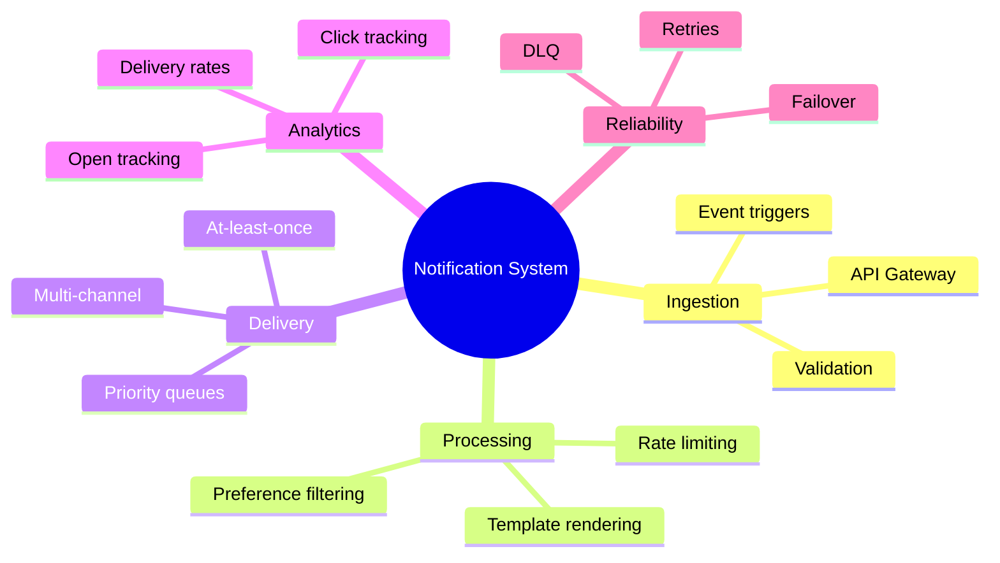

# Design a Notification System

<Info>
**Difficulty**: 🟡 Medium | **Time**: 35-45 min | **Prerequisites**: Message queues, Priority handling, Rate limiting
</Info>

Design a scalable notification system that delivers billions of notifications daily across multiple channels (push, SMS, email, in-app) with reliability guarantees.

---

## 1. Requirements Clarification

### Functional Requirements

| Feature | Description |
|---------|-------------|
| **Multi-channel Delivery** | Push notifications, SMS, Email, In-app, Webhooks |
| **Template Management** | Dynamic templates with variable substitution |
| **Targeting** | Send to users, segments, or topics |
| **Scheduling** | Immediate or scheduled delivery |
| **Priority Levels** | Critical, High, Normal, Low |
| **Preferences** | User opt-in/out per channel and category |
| **Analytics** | Delivery status, open rates, click rates |

### Non-Functional Requirements

- **Latency**: Critical notifications < 1 second, Normal < 5 seconds
- **Throughput**: 1 million notifications/minute peak
- **Reliability**: At-least-once delivery guarantee
- **Availability**: 99.9% uptime

### Capacity Estimation

```
Daily Notifications: 1 billion
Peak factor: 10x (during campaigns/events)

Peak rate: 1B / 86400 x 10 = 115,000 notifications/second
  (APNs handles ~100K pushes/sec per connection, FCM ~500K/sec.
  You need multiple provider connections and careful rate
  management to sustain 115K/sec across all channels.)

Channel breakdown (typical):
  Push: 60% = 600M/day
  Email: 25% = 250M/day
  SMS: 10% = 100M/day (at ~$0.01/msg = $1M/day cost!)
  In-app: 5% = 50M/day

Storage:
- Notification logs: 1B x 500 bytes = 500GB/day
  (At 30-day retention: 15TB. Partition by date for cleanup.)
- Templates: 100K x 10KB = 1GB (tiny, easily cached)
- User preferences: 100M users x 1KB = 100GB
  (Cache 10M active users in Redis = 10GB)
- Device registry: 200M devices x 200 bytes = 40GB

Cost note: SMS at 100M/day x $0.01 = $1M/day = $365M/year.
This is why rate limiting marketing SMS is business-critical.
```

---

## 2. High-Level Architecture


```mermaid
graph TB
    subgraph "Ingestion Layer"
        API[API Gateway]
        SDK[Client SDKs]
        TRIGGER[Event Triggers]
    end
    
    subgraph "Processing Layer"
        ROUTER[Notification Router]
        TEMPLATE[Template Engine]
        PREF[Preference Service]
        RATE[Rate Limiter]
    end
    
    subgraph "Queue Layer"
        PRIORITY[Priority Queues]
        DLQ[Dead Letter Queue]
    end
    
    subgraph "Delivery Layer"
        PUSH[Push Service]
        SMS[SMS Service]
        EMAIL[Email Service]
        INAPP[In-App Service]
        WEBHOOK[Webhook Service]
    end
    
    subgraph "External Providers"
        APNS[Apple APNs]
        FCM[Firebase FCM]
        TWILIO[Twilio]
        SES[AWS SES]
    end
    
    subgraph "Data Layer"
        PREFS_DB[(Preferences DB)]
        TEMPLATE_DB[(Template DB)]
        LOG_DB[(Notification Log)]
        DEVICE_DB[(Device Registry)]
    end
    
    API --> ROUTER
    SDK --> API
    TRIGGER --> API
    
    ROUTER --> TEMPLATE
    ROUTER --> PREF
    ROUTER --> RATE
    
    ROUTER --> PRIORITY
    PRIORITY --> PUSH
    PRIORITY --> SMS
    PRIORITY --> EMAIL
    PRIORITY --> INAPP
    PRIORITY --> WEBHOOK
    
    PRIORITY --> DLQ
    
    PUSH --> APNS
    PUSH --> FCM
    SMS --> TWILIO
    EMAIL --> SES
    
    PREF --> PREFS_DB
    TEMPLATE --> TEMPLATE_DB
    ROUTER --> LOG_DB
    PUSH --> DEVICE_DB
```

---

## 3. Core Components Deep Dive

### 3.1 Notification Request Flow


```mermaid
sequenceDiagram
    participant C as Client
    participant A as API
    participant R as Router
    participant T as Template
    participant P as Preferences
    participant Q as Priority Queue
    participant D as Delivery Service
    participant E as External Provider
    
    C->>A: POST /notifications
    A->>A: Validate & Authenticate
    A->>R: Route Notification
    R->>T: Render Template
    T-->>R: Rendered Content
    R->>P: Check User Preferences
    P-->>R: Allowed Channels
    R->>Q: Enqueue (priority)
    Q->>D: Dequeue
    D->>E: Send
    E-->>D: Delivery Status
    D->>R: Update Status
    R-->>A: Notification ID
    A-->>C: 202 Accepted
```

### 3.2 Notification Router

```python
class NotificationRouter:
    def route(self, request: NotificationRequest) -> str:
        """
        Main entry point for notification processing
        Returns notification_id for tracking
        """
        notification_id = generate_uuid()
        
        # 1. Validate request
        self.validate(request)
        
        # 2. Resolve recipients
        recipients = self.resolve_recipients(request)
        
        # 3. Check rate limits
        for recipient in recipients:
            if not self.rate_limiter.allow(recipient.user_id, request.category):
                self.log_skipped(notification_id, recipient, "RATE_LIMITED")
                continue
        
        # 4. Check preferences
        allowed_recipients = []
        for recipient in recipients:
            prefs = self.preference_service.get(recipient.user_id)
            channels = self.filter_channels(request.channels, prefs)
            if channels:
                allowed_recipients.append((recipient, channels))
        
        # 5. Render template
        rendered = self.template_engine.render(
            request.template_id,
            request.data
        )
        
        # 6. Enqueue for each channel
        for recipient, channels in allowed_recipients:
            for channel in channels:
                self.enqueue(
                    notification_id=notification_id,
                    recipient=recipient,
                    channel=channel,
                    content=rendered[channel],
                    priority=request.priority
                )
        
        # 7. Log notification
        self.log(notification_id, request, len(allowed_recipients))
        
        return notification_id
    
    def resolve_recipients(self, request: NotificationRequest) -> List[Recipient]:
        """Resolve target to actual recipients"""
        if request.user_ids:
            return [Recipient(user_id=uid) for uid in request.user_ids]
        elif request.segment_id:
            return self.segment_service.get_users(request.segment_id)
        elif request.topic:
            return self.subscription_service.get_subscribers(request.topic)
        else:
            raise ValueError("No recipients specified")
    
    def enqueue(self, notification_id, recipient, channel, content, priority):
        """Send to appropriate priority queue"""
        message = NotificationMessage(
            notification_id=notification_id,
            recipient=recipient,
            channel=channel,
            content=content,
            created_at=now()
        )
        
        queue = self.get_queue(channel, priority)
        queue.send(message)
```

### 3.3 Template Engine

```python
class TemplateEngine:
    def render(self, template_id: str, data: dict) -> dict:
        """
        Render template with data for all channels
        Returns dict of channel -> rendered content
        """
        template = self.template_db.get(template_id)
        
        rendered = {}
        for channel, channel_template in template.channels.items():
            rendered[channel] = self.render_channel(channel_template, data)
        
        return rendered
    
    def render_channel(self, template: ChannelTemplate, data: dict) -> Content:
        """Render for specific channel"""
        # Substitute variables using Jinja2 or similar
        title = self.substitute(template.title, data)
        body = self.substitute(template.body, data)
        
        # Channel-specific processing
        if template.channel == "push":
            return PushContent(
                title=title[:50],  # Truncate for push
                body=body[:200],
                image=template.image,
                action_url=self.substitute(template.action_url, data),
                data=data.get("custom_data", {})
            )
        elif template.channel == "email":
            return EmailContent(
                subject=title,
                html_body=self.render_html(template.html_template, data),
                text_body=body,
                from_address=template.from_address
            )
        elif template.channel == "sms":
            return SMSContent(
                body=body[:160],  # SMS character limit
                sender_id=template.sender_id
            )
```

### 3.4 Priority Queue System


```mermaid
graph LR
    subgraph "Priority Queues"
        CRITICAL[Critical - P0]
        HIGH[High - P1]
        NORMAL[Normal - P2]
        LOW[Low - P3]
    end
    
    subgraph "Workers"
        W1[Worker Pool]
    end
    
    CRITICAL --> W1
    HIGH --> W1
    NORMAL --> W1
    LOW --> W1
```

```python
class PriorityQueueManager:
    """
    Weighted fair queuing to ensure critical notifications
    are delivered first while not starving lower priorities
    """
    
    PRIORITY_WEIGHTS = {
        "CRITICAL": 100,  # 2FA codes, security alerts
        "HIGH": 50,       # Order confirmations, payments
        "NORMAL": 20,     # Social notifications, updates
        "LOW": 5          # Marketing, newsletters
    }
    
    def dequeue(self) -> Optional[NotificationMessage]:
        """
        Weighted random selection from queues
        Critical gets 100/(100+50+20+5) = 57% of processing
        """
        total_weight = sum(self.PRIORITY_WEIGHTS.values())
        
        # Build weighted queue list
        weighted_queues = []
        for priority, weight in self.PRIORITY_WEIGHTS.items():
            queue = self.get_queue(priority)
            if not queue.is_empty():
                weighted_queues.append((queue, weight))
        
        if not weighted_queues:
            return None
        
        # Weighted random selection
        total = sum(w for _, w in weighted_queues)
        r = random.uniform(0, total)
        
        cumulative = 0
        for queue, weight in weighted_queues:
            cumulative += weight
            if r <= cumulative:
                return queue.receive()
        
        return weighted_queues[-1][0].receive()
```

### 3.5 Push Notification Service

```python
class PushNotificationService:
    def __init__(self):
        self.apns_client = APNsClient()
        self.fcm_client = FCMClient()
    
    def send(self, message: NotificationMessage) -> DeliveryResult:
        """Send push notification to user's devices"""
        devices = self.device_registry.get_devices(message.recipient.user_id)
        
        results = []
        for device in devices:
            try:
                if device.platform == "ios":
                    result = self.send_apns(device, message)
                elif device.platform == "android":
                    result = self.send_fcm(device, message)
                else:
                    result = self.send_web_push(device, message)
                
                results.append(result)
                
                # Handle token invalidation
                if result.status == "INVALID_TOKEN":
                    self.device_registry.remove(device.token)
                    
            except Exception as e:
                results.append(DeliveryResult(
                    device_id=device.id,
                    status="FAILED",
                    error=str(e)
                ))
        
        # Success if at least one device received it
        success = any(r.status == "DELIVERED" for r in results)
        return DeliveryResult(
            notification_id=message.notification_id,
            status="DELIVERED" if success else "FAILED",
            device_results=results
        )
    
    def send_apns(self, device: Device, message: NotificationMessage) -> Result:
        """Send via Apple Push Notification Service"""
        payload = {
            "aps": {
                "alert": {
                    "title": message.content.title,
                    "body": message.content.body
                },
                "badge": message.content.badge,
                "sound": message.content.sound or "default"
            },
            "custom_data": message.content.data
        }
        
        return self.apns_client.send(
            device_token=device.token,
            payload=payload,
            priority=10 if message.priority == "CRITICAL" else 5
        )
    
    def send_fcm(self, device: Device, message: NotificationMessage) -> Result:
        """Send via Firebase Cloud Messaging"""
        fcm_message = {
            "token": device.token,
            "notification": {
                "title": message.content.title,
                "body": message.content.body,
                "image": message.content.image
            },
            "data": message.content.data,
            "android": {
                "priority": "high" if message.priority in ["CRITICAL", "HIGH"] else "normal"
            }
        }
        
        return self.fcm_client.send(fcm_message)
```

### 3.6 User Preferences Service

```python
@dataclass
class UserPreferences:
    user_id: str
    channels: Dict[str, bool]  # email: True, sms: False
    categories: Dict[str, Dict[str, bool]]  # marketing: {email: False, push: True}
    quiet_hours: Optional[QuietHours]
    timezone: str
    language: str

class PreferenceService:
    def get(self, user_id: str) -> UserPreferences:
        # Check cache first
        cached = self.cache.get(f"prefs:{user_id}")
        if cached:
            return cached
        
        prefs = self.db.get(user_id) or self.get_default()
        self.cache.set(f"prefs:{user_id}", prefs, ttl=3600)
        return prefs
    
    def is_allowed(
        self, 
        user_id: str, 
        channel: str, 
        category: str
    ) -> bool:
        """Check if notification is allowed for user"""
        prefs = self.get(user_id)
        
        # Check global channel opt-out
        if not prefs.channels.get(channel, True):
            return False
        
        # Check category-specific preference
        category_prefs = prefs.categories.get(category, {})
        if not category_prefs.get(channel, True):
            return False
        
        # Check quiet hours
        if prefs.quiet_hours:
            user_time = now().astimezone(timezone(prefs.timezone))
            if prefs.quiet_hours.is_quiet_time(user_time):
                return False
        
        return True
```

### 3.7 Rate Limiting

```python
class NotificationRateLimiter:
    """
    Multi-level rate limiting:
    1. Per-user rate limits (prevent spamming)
    2. Per-category limits (e.g., max 2 marketing/day)
    3. Global throughput limits (protect downstream services)
    """
    
    LIMITS = {
        "marketing": {"daily": 2, "hourly": 1},
        "transactional": {"daily": 100, "hourly": 20},
        "social": {"daily": 50, "hourly": 10},
        "security": {"daily": 1000, "hourly": 100},  # High for 2FA
    }
    
    def allow(self, user_id: str, category: str) -> bool:
        limits = self.LIMITS.get(category, {"daily": 10, "hourly": 5})
        
        # Check hourly limit
        hourly_key = f"rate:{user_id}:{category}:hourly:{current_hour()}"
        hourly_count = self.redis.incr(hourly_key)
        self.redis.expire(hourly_key, 3600)
        
        if hourly_count > limits["hourly"]:
            return False
        
        # Check daily limit
        daily_key = f"rate:{user_id}:{category}:daily:{today()}"
        daily_count = self.redis.incr(daily_key)
        self.redis.expire(daily_key, 86400)
        
        if daily_count > limits["daily"]:
            return False
        
        return True
```

---

## 4. Delivery Guarantees

### At-Least-Once Delivery

```python
class DeliveryWorker:
    def process(self, message: NotificationMessage):
        """
        Process with at-least-once semantics using visibility timeout
        """
        try:
            # Attempt delivery
            result = self.deliver(message)
            
            if result.success:
                # Delete from queue only after success
                self.queue.delete(message.receipt_handle)
                self.update_status(message.notification_id, "DELIVERED")
            elif result.permanent_failure:
                # Move to DLQ for investigation
                self.dlq.send(message)
                self.queue.delete(message.receipt_handle)
                self.update_status(message.notification_id, "FAILED")
            else:
                # Transient failure - will be retried after visibility timeout
                self.update_status(message.notification_id, "RETRYING")
                
        except Exception as e:
            # Message becomes visible again after timeout
            self.log_error(message, e)
```

### Retry Strategy

```python
class RetryPolicy:
    """Exponential backoff with jitter"""
    
    MAX_RETRIES = 5
    BASE_DELAY = 1  # seconds
    MAX_DELAY = 300  # 5 minutes
    
    def get_delay(self, attempt: int) -> float:
        delay = min(self.BASE_DELAY * (2 ** attempt), self.MAX_DELAY)
        jitter = random.uniform(0, delay * 0.1)
        return delay + jitter
    
    def should_retry(self, error: Exception, attempt: int) -> bool:
        if attempt >= self.MAX_RETRIES:
            return False
        
        # Don't retry permanent failures
        if isinstance(error, (InvalidTokenError, UserOptedOutError)):
            return False
        
        # Retry transient failures
        if isinstance(error, (NetworkError, RateLimitError, TimeoutError)):
            return True
        
        return False
```

---

## 5. Analytics and Tracking

```python
class NotificationAnalytics:
    def track_sent(self, notification_id: str, channel: str):
        self.metrics.increment("notifications.sent", tags={
            "channel": channel
        })
        
    def track_delivered(self, notification_id: str, channel: str):
        self.metrics.increment("notifications.delivered", tags={
            "channel": channel
        })
        
        # Calculate delivery latency
        notification = self.get_notification(notification_id)
        latency = now() - notification.created_at
        self.metrics.histogram("notifications.delivery_latency", latency)
    
    def track_opened(self, notification_id: str, channel: str):
        """Called when user opens notification"""
        self.metrics.increment("notifications.opened", tags={
            "channel": channel
        })
        
    def track_clicked(self, notification_id: str, action: str):
        """Called when user clicks CTA in notification"""
        self.metrics.increment("notifications.clicked", tags={
            "action": action
        })
    
    def get_campaign_stats(self, campaign_id: str) -> CampaignStats:
        """Aggregate stats for a notification campaign"""
        return CampaignStats(
            sent=self.count("sent", campaign_id),
            delivered=self.count("delivered", campaign_id),
            opened=self.count("opened", campaign_id),
            clicked=self.count("clicked", campaign_id),
            delivery_rate=self.count("delivered") / self.count("sent"),
            open_rate=self.count("opened") / self.count("delivered"),
            click_rate=self.count("clicked") / self.count("opened")
        )
```

---

## 6. Database Schema

```sql
-- Notification requests
CREATE TABLE notifications (
    id UUID PRIMARY KEY,
    template_id UUID NOT NULL,
    category VARCHAR(64) NOT NULL,
    priority VARCHAR(16) NOT NULL,
    data JSONB,
    created_at TIMESTAMP NOT NULL,
    scheduled_at TIMESTAMP,
    status VARCHAR(32) NOT NULL
);

-- Individual delivery attempts
CREATE TABLE notification_deliveries (
    id UUID PRIMARY KEY,
    notification_id UUID NOT NULL,
    user_id UUID NOT NULL,
    channel VARCHAR(32) NOT NULL,
    status VARCHAR(32) NOT NULL,
    delivered_at TIMESTAMP,
    opened_at TIMESTAMP,
    clicked_at TIMESTAMP,
    error_message TEXT,
    attempt_count INT DEFAULT 1,
    
    INDEX idx_notification_id (notification_id),
    INDEX idx_user_id (user_id)
);

-- User preferences
CREATE TABLE user_preferences (
    user_id UUID PRIMARY KEY,
    channel_preferences JSONB NOT NULL,
    category_preferences JSONB NOT NULL,
    quiet_hours_start TIME,
    quiet_hours_end TIME,
    timezone VARCHAR(64) DEFAULT 'UTC',
    language VARCHAR(8) DEFAULT 'en',
    updated_at TIMESTAMP NOT NULL
);

-- Device registry for push
CREATE TABLE user_devices (
    id UUID PRIMARY KEY,
    user_id UUID NOT NULL,
    device_token VARCHAR(512) NOT NULL UNIQUE,
    platform VARCHAR(16) NOT NULL,
    app_version VARCHAR(32),
    created_at TIMESTAMP NOT NULL,
    last_active_at TIMESTAMP,
    
    INDEX idx_user_id (user_id)
);

-- Templates
CREATE TABLE notification_templates (
    id UUID PRIMARY KEY,
    name VARCHAR(128) NOT NULL,
    category VARCHAR(64) NOT NULL,
    channels JSONB NOT NULL,  -- {push: {...}, email: {...}, sms: {...}}
    created_at TIMESTAMP NOT NULL,
    updated_at TIMESTAMP NOT NULL,
    version INT DEFAULT 1
);
```

---

## 7. Interview Tips

### Common Follow-ups

<AccordionGroup>
  <Accordion title="How do you handle notification fatigue?" icon="bell-slash">
    1. **Rate limiting** per category (max 2 marketing/day)
    2. **Smart batching** - consolidate multiple notifications
    3. **Relevance scoring** - only send high-value notifications
    4. **User preferences** - granular opt-out controls
    5. **A/B testing** - optimize timing and frequency
  </Accordion>
  
  <Accordion title="How do you ensure notifications are delivered in order?" icon="list-ol">
    - **Per-user queues** for ordered delivery
    - **Sequence numbers** to detect gaps
    - **Buffering** at the client side for reordering
    - Note: Usually not required—most notifications are independent
  </Accordion>
  
  <Accordion title="How do you handle provider failures?" icon="server">
    1. **Multiple providers** per channel (Twilio + Vonage for SMS)
    2. **Circuit breakers** to detect failing providers
    3. **Automatic failover** to healthy providers
    4. **Provider health monitoring** with SLO tracking
  </Accordion>
</AccordionGroup>

### Key Trade-offs

| Decision | Option A | Option B | Recommendation |
|----------|----------|----------|----------------|
| Delivery guarantee | At-least-once | At-most-once | **At-least-once** (dedupe on client). The reasoning: a duplicate push notification is mildly annoying, but a missing 2FA code blocks the user entirely. Design for at-least-once and handle duplicates downstream. Exception: SMS is expensive (~$0.01/message) -- for marketing SMS, at-most-once may be preferable to avoid double-billing. |
| Queue per channel | Shared queue | Separate queues | Separate queues for **fault isolation**. If the SMS provider goes down, it should not create backpressure that blocks push and email delivery. With shared queues, one slow consumer starves all channels. The cost is operational complexity (more queues to monitor). |
| Template storage | DB | Git (as code) | DB for runtime, Git for version control. In practice, use both: templates are authored and reviewed in Git, then deployed to the DB via a CI/CD pipeline. This gives you version history, rollback capability, and code review for template changes -- critical when a bad template can spam millions of users. |
| Analytics | Real-time | Batch | Both. Real-time counters (Redis) for dashboards and alerting ("delivery rate just dropped 20%"), batch processing (Spark/BigQuery) for campaign reports and trend analysis. Real-time analytics should trigger circuit breakers if delivery failure rates spike. |

### Common Candidate Mistakes

```
Mistake 1: No deduplication strategy
  With at-least-once delivery, the same notification can be
  processed twice (worker crashes after sending but before
  acknowledging). You need a deduplication layer -- either
  client-side (using notification_id) or a server-side seen-set
  in Redis with a short TTL.

Mistake 2: Treating all notifications equally
  A 2FA code and a marketing email have fundamentally different
  SLAs. 2FA must arrive within seconds (P0), marketing can wait
  hours (P3). Without priority queues, a marketing campaign blast
  of 10M emails can delay security-critical notifications.

Mistake 3: Not respecting timezone and quiet hours
  Sending a push notification at 3 AM in the user's timezone
  destroys trust and increases opt-outs. Always convert to
  user-local time before delivery. Store timezone in the user
  preference record, not just in the device registration.

Mistake 4: Ignoring provider rate limits
  APNs, FCM, Twilio, and SES all have rate limits. If you send
  1M push notifications through APNs without throttling, you will
  get rate-limited or temporarily banned. Use per-provider rate
  limiters and respect backpressure signals (HTTP 429 responses).

Mistake 5: No fallback strategy for provider outages
  If your only SMS provider goes down, critical notifications
  (password resets, 2FA) stop working. Always have at least two
  providers per channel with automatic failover. Use a circuit
  breaker pattern: after N consecutive failures, route to the
  backup provider.
```

---

## 8. Summary


```mermaid
mindmap
  root((Notification System))
    Ingestion
      API Gateway
      Event triggers
      Validation
    Processing
      Template rendering
      Preference filtering
      Rate limiting
    Delivery
      Priority queues
      Multi-channel
      At-least-once
    Analytics
      Delivery rates
      Open tracking
      Click tracking
    Reliability
      Retries
      DLQ
      Failover
```

**Key Takeaways:**
1. **Priority queues** ensure critical notifications (2FA) are delivered first
2. **User preferences** respect opt-outs and quiet hours
3. **Rate limiting** prevents notification fatigue
4. **At-least-once delivery** with deduplication at the client
5. **Template engine** for consistent multi-channel content

---

## Interview Deep-Dive Questions

### Q1: Your notification system sends 1 billion notifications per day. A marketing team triggers a campaign to 50 million users at once. How do you prevent this blast from delaying 2FA codes that need to arrive within 5 seconds?

**Strong Answer:**
- This is the classic **priority inversion** problem in notification systems, and it is the number one thing interviewers look for. The answer is priority queues with strict isolation, not just ordering.
- The architecture uses **separate physical queues per priority level**, not a single queue with priority tags. Critical notifications (2FA, security alerts) go to a dedicated P0 queue with dedicated worker pools. Marketing blasts go to a P3 queue with its own workers. Even if the P3 queue backs up to 50 million messages, the P0 queue stays empty and processes in milliseconds.
- Why separate queues instead of a priority field? Because most message brokers (SQS, RabbitMQ) implement priority queues by scanning all messages. When your P3 queue has 50M messages and a P0 message arrives, the broker still has to manage that massive backlog. With separate queues, the P0 queue has near-zero depth at all times.
- Worker allocation follows a **weighted fair queuing** model: 60% of workers are assigned to P0/P1, 30% to P2, 10% to P3. During normal load, P0 workers are mostly idle and "steal" from lower queues. During a marketing blast, P3 workers saturate while P0 remains unaffected.
- The marketing blast itself needs **throttled fan-out**. You do not enqueue 50M messages instantly -- you use a fan-out service that emits messages at a controlled rate (say, 100K/minute) to avoid overwhelming downstream providers. APNs and FCM have their own rate limits; hitting those limits causes your P0 messages to get rejected too if you share the provider connection pool.

**Red flag answer:** "Use a priority field on each message in a single SQS queue." SQS priority is limited (1-10) and does not guarantee strict ordering. A single queue with 50M messages will have increased dequeue latency regardless of priority. The candidate does not understand that priority isolation requires physical separation.

**Follow-ups:**
1. Your P0 queue workers are idle 95% of the time. The finance team says this is wasted compute. How do you justify the cost, and is there a way to use those idle workers productively without risking P0 latency?
2. The marketing team schedules 5 campaigns simultaneously (250M total messages). Your P3 queue depth is growing faster than workers can drain. What backpressure mechanisms do you apply?

---

### Q2: Walk me through how you would implement at-least-once delivery for push notifications without sending duplicate notifications to the user's device.

**Strong Answer:**
- At-least-once delivery means the system guarantees every notification is delivered, possibly more than once. This happens because the worker sends the notification, then attempts to ACK the queue message. If the worker crashes between send and ACK, the message becomes visible again and another worker re-sends it.
- **Server-side deduplication** uses a Redis set with a short TTL. Before sending, the worker checks: `SETNX dedup:{notification_id}:{user_id} 1 EX 3600`. If the key already exists, this is a duplicate and we skip it. If not, we proceed. The TTL (1 hour) should be longer than the maximum retry window (typically 5-15 minutes) to catch all duplicates.
- **Client-side deduplication** is the second line of defense. Every notification carries a unique `notification_id`. The mobile app maintains a local set of recently seen IDs. If a duplicate arrives, the app suppresses it before displaying. This handles the case where server-side dedup fails (Redis was down during the retry).
- The tricky part is **idempotency of side effects**. If the notification triggers an action (increment badge count, update inbox), that side effect must also be idempotent. Badge count should be set to an absolute value (`badge: 5`), not incremented (`badge: +1`), because a duplicate would double-increment.
- For email specifically, at-least-once is more dangerous because duplicate emails are visible and annoying. For email, I would use a stronger dedup mechanism: write the notification delivery record to the database first (with a unique constraint on `notification_id` + `channel` + `user_id`), then send. The unique constraint prevents double-sends even under race conditions.

**Red flag answer:** "Just use at-most-once -- send the notification and immediately ACK the queue." This guarantees no duplicates but means any failure results in a lost notification. A missing 2FA code blocks the user entirely. The candidate does not understand that lost notifications are almost always worse than duplicate ones.

**Follow-ups:**
1. Your Redis dedup set is consuming 20GB of memory because you process 1B notifications/day and each dedup key lives for 1 hour. How do you reduce memory without sacrificing dedup accuracy?
2. A user receives the same marketing push notification 3 times despite your dedup layer. Walk me through how you would debug this end-to-end.

---

### Q3: A user in Tokyo has configured quiet hours from 10 PM to 7 AM, receives marketing notifications in Japanese, but wants 2FA codes in English at any time. How does your preference and routing system handle this?

**Strong Answer:**
- This requires a **multi-dimensional preference model** that crosses channel, category, time, and language. The preference record is not a flat "notifications: on/off" -- it is a nested structure: `preferences[category][channel] = {enabled, language, bypass_quiet_hours}`.
- The routing flow for this user: (1) Notification arrives for user. (2) Preference service loads their config (cached in Redis, TTL 5 min). (3) Check the notification category: if "security" (2FA), the `bypass_quiet_hours` flag is true, so skip the time check. If "marketing," check quiet hours against the user's timezone. (4) At 11 PM Tokyo time, marketing notifications are **queued, not dropped** -- they are scheduled for delivery at 7 AM local time. Dropping them loses the notification; delaying respects the user's preference.
- Language routing: the template engine renders per-locale. The user's preference says `marketing.language = "ja"`, `security.language = "en"`. When the template renders, it selects the appropriate localization. The template itself must have multi-locale support: `template.render(locale="ja")` for marketing, `template.render(locale="en")` for 2FA.
- **The gotcha with quiet hours**: timezone-aware scheduling is harder than it sounds. A user in Tokyo (UTC+9) sets quiet hours 10 PM - 7 AM. Your server is in UTC. You must convert: 10 PM JST = 1 PM UTC, 7 AM JST = 10 PM UTC. The quiet window in UTC is 13:00 - 22:00, which spans a calendar day boundary differently. If you store quiet hours as UTC and the user changes timezones (travels to London), you need to recalculate. Best practice: store quiet hours in the user's local time and their timezone string, then convert at delivery time.
- Daylight saving time makes this worse. Japan does not observe DST, but a user in New York does. Their quiet hours shift by an hour twice a year. Your conversion must use a proper timezone library (pytz, `java.time.ZonedDateTime`), not a fixed UTC offset.

**Red flag answer:** "Store quiet hours as UTC offsets." This breaks for DST transitions and for users who travel. Or "just drop notifications during quiet hours" -- dropping marketing notifications means the user never sees them, which is a business loss. Queuing them for the next available window is the correct approach.

**Follow-ups:**
1. The user travels from Tokyo to London. Their phone reports a new timezone. Should you automatically update their quiet hours, or keep them on Tokyo time? What are the product trade-offs?
2. You have 100M users across 40 timezones and need to schedule delayed notifications for quiet hours. How do you implement the scheduled delivery efficiently without scanning all delayed notifications every second?

---

### Q4: Your notification system uses a single Kafka cluster for all channels. The SMS provider (Twilio) goes down for 30 minutes. What happens to push and email delivery, and how would you redesign to prevent this?

**Strong Answer:**
- With a single shared Kafka topic for all channels, the SMS consumer group stops processing (messages pile up because Twilio rejects them). But here is the critical problem: **Kafka partitions are ordered, and consumer lag on SMS partitions backs up the entire consumer group**. If you have push, email, and SMS consumers reading from the same topic, a slow SMS consumer does not directly block push -- unless you are using a single consumer group that processes all channels.
- The real danger is **backpressure propagation**. If SMS workers retry aggressively against a down Twilio, they hold open connections and consume worker threads. If those workers share a thread pool with push and email workers, the entire delivery layer degrades. I have seen this exact scenario cause a 45-minute total notification outage at a company doing 500M notifications/day, all because one SMS provider returned 503s.
- **The fix is fault isolation through separate queues per channel.** Push notifications go to `notifications-push` topic, SMS to `notifications-sms`, email to `notifications-email`. Each has independent consumer groups, independent worker pools, and independent circuit breakers. When Twilio goes down, only SMS delivery stops. Push and email are completely unaffected.
- Add a **circuit breaker** per provider. After 5 consecutive failures to Twilio, the circuit opens. New SMS messages are either routed to a backup provider (Vonage, MessageBird) or held in a retry queue with exponential backoff. The circuit half-opens after 30 seconds, sends a probe request, and closes if successful.
- The notification router at the top of the pipeline still fans out to all channel queues. The isolation happens at the delivery layer, not the routing layer. This means a single notification request for "push + SMS + email" results in three independent messages in three independent queues.

**Red flag answer:** "Kafka is fast enough to handle all channels in one topic." Speed is not the issue -- isolation is. The candidate conflates throughput with fault isolation. Or "just add more partitions" -- more partitions does not solve the problem of one slow consumer affecting system behavior.

**Follow-ups:**
1. You have separate queues per channel now, but the SMS retry queue has 10 million undelivered messages from the Twilio outage. Twilio comes back up. How do you drain this backlog without re-triggering Twilio rate limits?
2. Your backup SMS provider (Vonage) charges 3x more than Twilio. How do you decide when to failover vs. when to queue and wait for Twilio to recover?

---

### Q5: You need to send a notification to 10 million users who are subscribed to a "flash sale" topic. Walk me through the fan-out strategy and the bottlenecks you would hit.

**Strong Answer:**
- This is a **fan-out-on-write** problem. The triggering event is a single API call ("send flash sale notification to topic subscribers"), but the execution requires 10 million individual delivery operations. The fan-out has three phases: resolve recipients, render templates, and enqueue for delivery.
- **Phase 1 - Recipient resolution**: Query the subscription table for all users subscribed to the "flash_sale" topic. With 10M subscribers, this is not a single `SELECT * FROM subscriptions WHERE topic = 'flash_sale'` -- that would time out. Use **cursor-based pagination** (`WHERE user_id > last_seen_id ORDER BY user_id LIMIT 10000`) and emit batches of 10K users to a fan-out queue.
- **Phase 2 - Fan-out workers**: Workers consume batches from the fan-out queue, check each user's preferences (cached in Redis), render the template per locale, and enqueue individual delivery messages. At 10K users per batch, you need 1,000 batches. With 50 fan-out workers processing a batch in 2 seconds, total fan-out time is about 40 seconds.
- **Phase 3 - Delivery**: 10M messages hit the channel-specific queues. The bottleneck shifts to downstream providers. APNs can handle roughly 10K-50K messages per second per connection. FCM allows ~1K messages per request via batch API (topic messaging or multicast). You need to respect these limits, which means the actual delivery takes 5-15 minutes for 10M users.
- **Key bottleneck**: preference lookup. If every fan-out worker does a Redis GET for each user's preferences, that is 10M Redis reads in 40 seconds = 250K reads/sec. This is achievable for a well-provisioned Redis cluster but is the first thing that saturates. Mitigation: batch reads with MGET (fetch 100 preference records in one round-trip).
- **The mistake to avoid**: do not try to enqueue 10M messages synchronously in the API handler. The API should return `202 Accepted` with a campaign ID immediately, and the fan-out happens asynchronously. The caller polls a status endpoint to track progress.

**Red flag answer:** "Use FCM topic messaging and let Firebase handle the fan-out." For push-only notifications, this works (FCM supports topic subscriptions natively). But the question specifies multi-channel delivery. You cannot offload email and SMS fan-out to FCM. A strong candidate recognizes when to leverage provider features vs. when to build custom fan-out.

**Follow-ups:**
1. Your flash sale is time-sensitive -- users who receive the notification 15 minutes late miss the deal. How do you guarantee the 10M notifications are delivered within a 5-minute window?
2. You discover that 2 million of the 10 million subscribers have uninstalled the app (invalid device tokens). How do you handle this efficiently during fan-out without slowing down the delivery of valid notifications?

---

### Q6: How would you design the analytics pipeline to track delivery rates, open rates, and click rates in real time without adding latency to the notification delivery path?

**Strong Answer:**
- The fundamental principle is **asynchronous event emission**. The delivery worker sends the notification, then fires-and-forgets an analytics event to Kafka. The delivery latency is unaffected because the Kafka produce is non-blocking (batched, async). If Kafka is temporarily down, events are buffered locally and retried.
- **Delivery tracking** is straightforward: the delivery worker emits `notification_delivered` events with notification_id, user_id, channel, timestamp, and provider_response_code. These flow into Kafka, then to a stream processor (Flink or Kafka Streams) that maintains real-time counters in Redis: `delivered:campaign:{id}`, `delivered:channel:push:hourly:{timestamp}`.
- **Open tracking** depends on the channel. For email, embed a 1x1 tracking pixel (``) -- when the email client loads the image, you record the open. For push notifications, the mobile SDK fires an event when the notification is displayed. For in-app, you track when the notification card enters the viewport.
- **Click tracking** uses redirect URLs. Every CTA link in the notification points to `https://track.example.com/click/{notification_id}?dest=<encoded_url>`. The tracking service records the click, then 302-redirects to the actual destination. Latency budget: the redirect must complete in <50ms so the user does not perceive a delay.
- **Real-time dashboards** read from the Redis counters (delivery rate = delivered / sent, open rate = opened / delivered). **Batch analytics** for historical trends use the Kafka events consumed by a Spark or BigQuery pipeline that computes daily/weekly aggregates.
- **Critical alert**: if the delivery rate for a campaign drops below 90% or a specific channel drops below 80%, trigger an alert. This is your circuit breaker signal -- a provider may be failing silently (returning 200 but not actually delivering).

**Red flag answer:** "Write analytics to the database synchronously during delivery." This adds 5-20ms of database write latency to every notification delivery. At 100K notifications/sec, this is 100K extra database writes per second on the critical path. The candidate does not understand the importance of keeping the hot path lean.

**Follow-ups:**
1. Your email open tracking shows a 95% open rate for a campaign, which seems impossibly high. What is happening, and how do you get accurate open metrics?
2. Privacy regulations (GDPR, Apple Mail Privacy Protection) are blocking your tracking pixels. How do you measure engagement without per-user tracking?

---

### Q7: Your notification system handles transactional notifications (order confirmations, 2FA) and marketing notifications. An engineer proposes using the same infrastructure for both. What are the risks, and how would you architect the separation?

**Strong Answer:**
- Using the same infrastructure is fine architecturally but **operationally dangerous** without proper isolation. The core risk: marketing operations (bulk sends, A/B tests, campaign blasts) can interfere with transactional delivery. A marketing email blast of 20M messages can exhaust your SES sending quota, causing 2FA emails to bounce with "throttling" errors. I have seen this happen at companies where a Black Friday campaign killed password reset emails for 2 hours.
- **Separation at the provider level**: Use dedicated provider accounts or sub-accounts for transactional vs. marketing. AWS SES allows "configuration sets" with independent sending quotas. Twilio has separate messaging services. This ensures a marketing blast cannot consume transactional quota.
- **Separation at the queue level**: As discussed earlier, separate queues for priority levels. But go further -- separate Kafka clusters or at minimum separate topics with independent consumer groups. Transactional infrastructure should be able to operate even if the marketing infrastructure is completely down.
- **Separation at the domain level for email**: Use different sending domains: `notifications@transactional.example.com` for transactional, `offers@marketing.example.com` for marketing. This is critical because email reputation is per-domain. If your marketing emails get flagged as spam, it should not tank the deliverability of your transactional emails.
- **Separation at the rate limit level**: Transactional notifications should have no per-user rate limits (a user legitimately ordering 20 items should get 20 confirmation emails). Marketing notifications have strict category-level limits (max 2 promotional emails per day).
- **What to share**: Template engine, preference service, analytics pipeline, and the notification logging database can all be shared safely. These are read-heavy or append-only systems that do not have the interference problems of queues and delivery infrastructure.

**Red flag answer:** "Just use priority queues to separate them." Priority queues address ordering but not resource isolation. If both share the same SES account and the marketing blast exhausts the sending quota, priority does not matter -- transactional emails cannot send either. The candidate confuses logical separation with infrastructure isolation.

**Follow-ups:**
1. Your transactional email domain has a 99.5% inbox placement rate, but after a marketing team accidentally sent to a purchased email list, your shared IP reputation tanked and transactional emails started going to spam. How do you prevent this architecturally?
2. The CTO wants to consolidate both systems into one to reduce infrastructure costs. What metrics and SLAs would you present to argue for keeping them separate?

---

### Q8: A user reports they received a push notification but did not receive the corresponding email, even though they are opted in for both channels. Walk me through your debugging process.

**Strong Answer:**
- This is a **distributed tracing problem** across multiple services. The debugging process follows the notification's lifecycle, using the `notification_id` as the correlation key.
- **Step 1 - Check the notification log**: Query `SELECT * FROM notification_deliveries WHERE notification_id = 'X' AND user_id = 'Y'`. This tells you whether both channels were attempted. If only push exists, the routing layer filtered out email before enqueuing.
- **Step 2 - If email was never enqueued**: Check the preference service. Was the user opted in at the time of send? Preference caches have TTLs -- the user may have opted in after the cached preferences were loaded. Check the rate limiter -- did the user hit their email rate limit? Check the template -- does the template have an email variant? I have seen cases where a template was configured for push + SMS but someone forgot to add the email channel.
- **Step 3 - If email was enqueued but status is FAILED**: Check the delivery worker logs. Common causes: SES returned a bounce (email address is invalid or mailbox full), SES returned a complaint (email previously marked as spam), the email was suppressed by SES's global suppression list.
- **Step 4 - If email status is DELIVERED but user did not receive it**: "Delivered" means the email provider accepted it, not that the user saw it. Check: spam folder, promotions tab (Gmail), email client filtering rules, corporate email firewalls. Query SES delivery metrics for the specific `message_id` to see if it bounced downstream.
- **The tooling that makes this possible**: Every notification must have end-to-end tracing. When the notification is created, attach a trace ID. Every service (router, preference, queue, delivery worker, provider callback) logs with this trace ID. A single query in your log aggregation system (Datadog, Splunk) with the notification_id should show the complete timeline.

**Red flag answer:** "Check if the email server is working." This is too vague and shows no systematic debugging methodology. A strong candidate immediately reaches for the notification_id, traces the lifecycle, and narrows down which stage failed. They think in terms of "where in the pipeline did the email diverge from push?"

**Follow-ups:**
1. You discover the email was "delivered" according to SES but landed in the user's spam folder. What specific email deliverability factors would you investigate, and how do you fix it?
2. This debugging process took you 30 minutes of manual log searching. How would you build tooling so that customer support can diagnose this in under 2 minutes?
