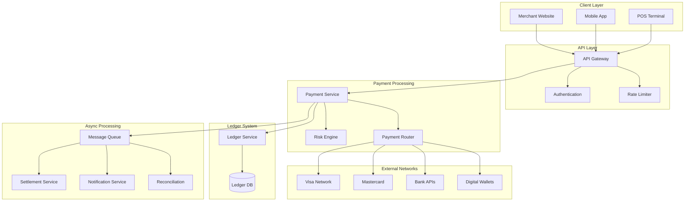
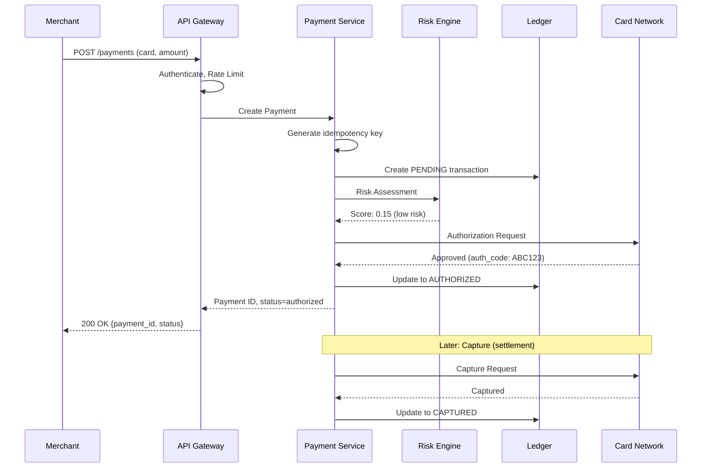
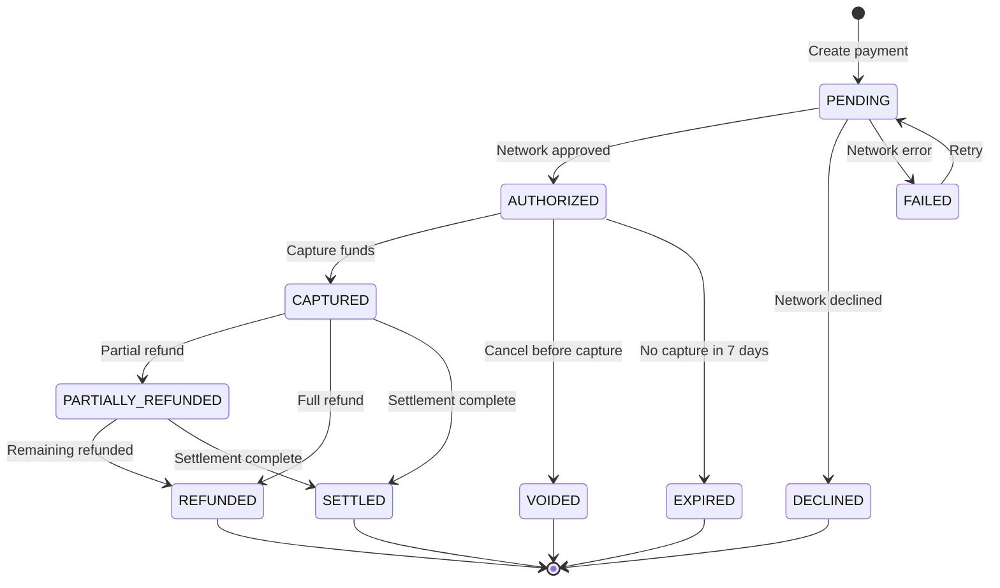
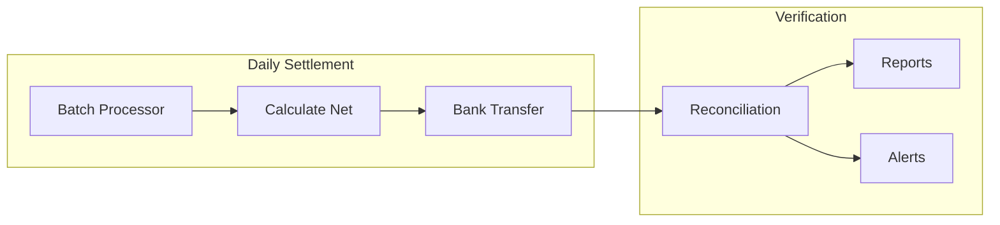
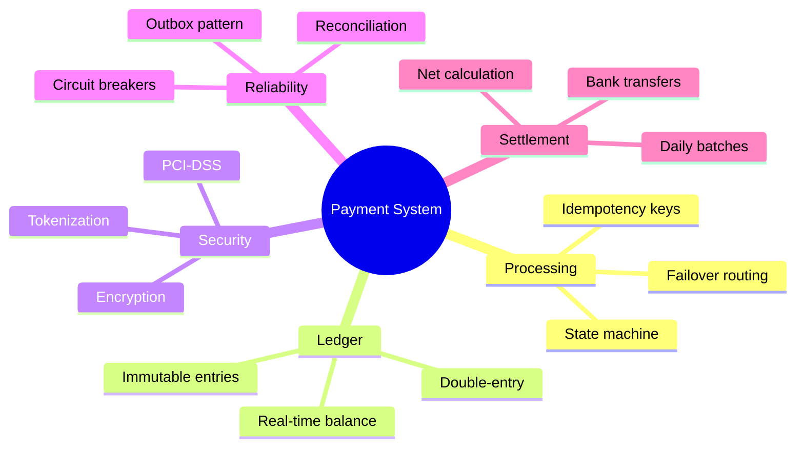

# Design a Payment System

<Info>
**Difficulty**: 🔴 Hard | **Time**: 45-60 min | **Prerequisites**: Distributed transactions, Idempotency, Reconciliation
</Info>

Design a payment processing system like Stripe or PayPal that handles millions of transactions daily with absolute reliability—because money doesn't tolerate bugs.

---

## 1. Requirements Clarification

### Functional Requirements

| Feature | Description |
|---------|-------------|
| **Payment Processing** | Accept payments via cards, bank transfers, digital wallets |
| **Merchant Integration** | APIs for businesses to accept payments |
| **Refunds** | Process full and partial refunds |
| **Payouts** | Transfer funds to merchant bank accounts |
| **Recurring Payments** | Subscriptions and scheduled payments |
| **Fraud Detection** | Real-time fraud screening |
| **Reporting** | Transaction history and analytics |

### Non-Functional Requirements

- **Reliability**: 99.999% uptime (5 nines = 5 minutes downtime/year)
- **Consistency**: EXACTLY-ONCE payment processing
- **Latency**: Payment authorization < 500ms
- **Security**: PCI-DSS Level 1 compliance
- **Auditability**: Complete audit trail for every transaction

### Capacity Estimation

```
Daily Transactions: 10 million
Average transaction size: $50
Daily Volume: $500 million

Peak TPS: 10M / 86400 × 3 ≈ 350 TPS
Storage: 10M × 1KB = 10GB/day ≈ 3.6TB/year
```

---

## 2. High-Level Architecture



---

## 3. Core Components Deep Dive

### 3.1 Payment Flow



### 3.2 Idempotency (Critical!)

Every payment operation MUST be idempotent. Network failures happen, and retries must not create duplicate charges.

```python
class PaymentService:
    def process_payment(self, request: PaymentRequest) -> PaymentResult:
        """
        Idempotent payment processing using client-provided idempotency key
        """
        idempotency_key = request.idempotency_key
        
        # Check if we've seen this request before
        existing = self.idempotency_store.get(idempotency_key)
        if existing:
            if existing.status == "COMPLETED":
                return existing.result  # Return cached result
            elif existing.status == "PROCESSING":
                raise PaymentInProgressError("Retry later")
        
        # Mark as processing
        self.idempotency_store.set(
            idempotency_key, 
            IdempotencyRecord(status="PROCESSING", created_at=now())
        )
        
        try:
            # Actual payment processing
            result = self._do_payment(request)
            
            # Store result
            self.idempotency_store.set(
                idempotency_key,
                IdempotencyRecord(status="COMPLETED", result=result)
            )
            return result
            
        except Exception as e:
            # Clear idempotency record on failure (allow retry)
            self.idempotency_store.delete(idempotency_key)
            raise
    
    def _do_payment(self, request: PaymentRequest) -> PaymentResult:
        """The actual payment logic"""
        # Create ledger entry
        txn_id = self.ledger.create_transaction(
            merchant_id=request.merchant_id,
            amount=request.amount,
            currency=request.currency,
            status="PENDING"
        )
        
        try:
            # Risk check
            risk_score = self.risk_engine.assess(request)
            if risk_score > 0.8:
                self.ledger.update(txn_id, status="DECLINED_FRAUD")
                return PaymentResult(status="DECLINED", reason="FRAUD")
            
            # Route to payment network
            auth_result = self.router.authorize(request)
            
            if auth_result.approved:
                self.ledger.update(
                    txn_id, 
                    status="AUTHORIZED",
                    auth_code=auth_result.auth_code
                )
                return PaymentResult(
                    status="AUTHORIZED",
                    payment_id=txn_id,
                    auth_code=auth_result.auth_code
                )
            else:
                self.ledger.update(txn_id, status="DECLINED")
                return PaymentResult(status="DECLINED", reason=auth_result.reason)
                
        except Exception as e:
            self.ledger.update(txn_id, status="ERROR")
            raise
```

### 3.3 Double-Entry Ledger

Every payment must be recorded using **double-entry bookkeeping**—this is non-negotiable for financial systems.

```python
@dataclass
class LedgerEntry:
    entry_id: str
    account_id: str
    transaction_id: str
    amount: Decimal  # Positive = debit, Negative = credit
    currency: str
    created_at: datetime
    
class LedgerService:
    def record_payment(self, payment: Payment) -> str:
        """
        Double-entry: Every debit has an equal credit
        Customer pays $100 → Customer: -100, Merchant: +100
        """
        transaction_id = generate_uuid()
        
        entries = [
            LedgerEntry(
                entry_id=generate_uuid(),
                account_id=payment.customer_account,
                transaction_id=transaction_id,
                amount=-payment.amount,  # Credit (money leaving)
                currency=payment.currency,
                created_at=now()
            ),
            LedgerEntry(
                entry_id=generate_uuid(),
                account_id=payment.merchant_account,
                transaction_id=transaction_id,
                amount=payment.amount,  # Debit (money arriving)
                currency=payment.currency,
                created_at=now()
            )
        ]
        
        # CRITICAL: Insert atomically
        with self.db.transaction():
            for entry in entries:
                self.db.insert(entry)
            
            # Verify balance (sum of all entries = 0)
            balance = sum(e.amount for e in entries)
            assert balance == 0, "Ledger imbalance!"
        
        return transaction_id
    
    def get_balance(self, account_id: str) -> Decimal:
        """Sum of all entries = current balance"""
        return self.db.query(
            "SELECT SUM(amount) FROM ledger_entries WHERE account_id = ?",
            account_id
        )
```

### 3.4 Payment State Machine



```python
class PaymentStateMachine:
    VALID_TRANSITIONS = {
        "PENDING": ["AUTHORIZED", "DECLINED", "FAILED"],
        "AUTHORIZED": ["CAPTURED", "VOIDED", "EXPIRED"],
        "CAPTURED": ["PARTIALLY_REFUNDED", "REFUNDED", "SETTLED"],
        "PARTIALLY_REFUNDED": ["REFUNDED", "SETTLED"],
        "FAILED": ["PENDING"],  # Retry
    }
    
    def transition(self, payment_id: str, new_status: str) -> Payment:
        payment = self.db.get(payment_id)
        
        if new_status not in self.VALID_TRANSITIONS.get(payment.status, []):
            raise InvalidTransitionError(
                f"Cannot transition from {payment.status} to {new_status}"
            )
        
        payment.status = new_status
        payment.updated_at = now()
        payment.status_history.append({
            "status": new_status,
            "timestamp": now()
        })
        
        self.db.update(payment)
        self.event_bus.publish(f"payment.{new_status.lower()}", payment)
        
        return payment
```

### 3.5 Risk Engine

Real-time fraud detection is essential:

```python
class RiskEngine:
    def assess(self, payment: PaymentRequest) -> float:
        """
        Returns risk score 0.0 (safe) to 1.0 (fraudulent)
        """
        signals = []
        
        # Velocity checks
        signals.append(self.check_velocity(payment))
        
        # Device/IP reputation
        signals.append(self.check_device(payment.device_fingerprint))
        signals.append(self.check_ip(payment.ip_address))
        
        # Geographic anomalies
        signals.append(self.check_geo_anomaly(payment))
        
        # Card testing patterns
        signals.append(self.check_card_testing(payment))
        
        # ML model
        ml_score = self.ml_model.predict(payment)
        signals.append(ml_score)
        
        # Weighted average
        return sum(s.score * s.weight for s in signals) / sum(s.weight for s in signals)
    
    def check_velocity(self, payment: PaymentRequest) -> Signal:
        """How many payments from this card/user in recent time windows"""
        card_hash = hash(payment.card_number)
        
        last_hour = self.redis.get(f"velocity:{card_hash}:1h")
        last_day = self.redis.get(f"velocity:{card_hash}:24h")
        
        if last_hour > 10:
            return Signal(score=0.9, weight=2.0)  # High risk
        if last_day > 50:
            return Signal(score=0.7, weight=1.5)
        
        return Signal(score=0.1, weight=1.0)  # Normal
```

### 3.6 Payment Routing

Intelligent routing to optimize success rates and minimize costs:

```python
class PaymentRouter:
    def route(self, payment: PaymentRequest) -> PaymentProcessor:
        """
        Select optimal payment processor based on:
        - Card type/network
        - Geographic region
        - Success rates
        - Processing fees
        - Processor health
        """
        candidates = self.get_supported_processors(payment)
        
        # Filter by health
        healthy = [p for p in candidates if self.health_check(p)]
        
        if not healthy:
            raise NoHealthyProcessorError()
        
        # Score each processor
        scored = []
        for processor in healthy:
            score = (
                self.get_success_rate(processor, payment) * 0.5 +  # Prioritize success
                (1 - self.get_fee_rate(processor, payment)) * 0.3 +  # Lower fees better
                self.get_latency_score(processor) * 0.2  # Faster is better
            )
            scored.append((processor, score))
        
        # Return highest scored
        return max(scored, key=lambda x: x[1])[0]
    
    def authorize(self, payment: PaymentRequest) -> AuthResult:
        """Authorize with failover"""
        processors = self.get_fallback_chain(payment)
        
        for processor in processors:
            try:
                result = processor.authorize(payment)
                if result.approved or result.hard_decline:
                    return result
                # Soft decline - try next processor
            except ProcessorError:
                continue  # Try next
        
        return AuthResult(approved=False, reason="ALL_PROCESSORS_FAILED")
```

---

## 4. Settlement and Reconciliation

### Settlement Flow



```python
class SettlementService:
    def run_daily_settlement(self, settlement_date: date):
        """
        Called daily via cron job
        1. Aggregate all captured payments by merchant
        2. Calculate net (payments - refunds - fees)
        3. Initiate bank transfers
        """
        for merchant in self.get_active_merchants():
            # Get all captured transactions
            transactions = self.ledger.get_transactions(
                merchant_id=merchant.id,
                status="CAPTURED",
                date=settlement_date
            )
            
            # Calculate totals
            gross = sum(t.amount for t in transactions)
            refunds = sum(t.amount for t in transactions if t.type == "REFUND")
            fees = self.calculate_fees(transactions)
            net = gross - refunds - fees
            
            # Create payout
            if net > 0:
                payout = Payout(
                    merchant_id=merchant.id,
                    amount=net,
                    bank_account=merchant.payout_account,
                    settlement_date=settlement_date
                )
                
                self.bank_api.transfer(payout)
                self.ledger.record_payout(payout)

class ReconciliationService:
    def reconcile(self, date: date):
        """
        Compare our records with external sources
        Flag any discrepancies for investigation
        """
        discrepancies = []
        
        # Compare with card networks
        for network in [VISA, MASTERCARD, AMEX]:
            our_txns = self.ledger.get_by_network(network, date)
            their_txns = network.get_settlement_report(date)
            
            for txn in our_txns:
                match = self.find_match(txn, their_txns)
                if not match:
                    discrepancies.append(Discrepancy(
                        type="MISSING_FROM_NETWORK",
                        transaction=txn
                    ))
                elif match.amount != txn.amount:
                    discrepancies.append(Discrepancy(
                        type="AMOUNT_MISMATCH",
                        ours=txn,
                        theirs=match
                    ))
        
        if discrepancies:
            self.alert_operations(discrepancies)
        
        return ReconciliationReport(date=date, discrepancies=discrepancies)
```

---

## 5. Reliability Patterns

### Exactly-Once Processing

```python
def process_with_outbox(payment: PaymentRequest):
    """
    Transactional outbox pattern for exactly-once event publishing
    """
    with db.transaction():
        # 1. Process payment
        payment_id = ledger.create_transaction(payment)
        
        # 2. Write to outbox (same transaction!)
        outbox.insert(OutboxEvent(
            event_type="payment.created",
            payload={"payment_id": payment_id},
            created_at=now()
        ))
    
    # Separate process polls outbox and publishes events
    # Deletes from outbox after successful publish
```

### Circuit Breaker for Payment Networks

```python
class CircuitBreaker:
    def __init__(self, failure_threshold=5, reset_timeout=60):
        self.failure_count = 0
        self.failure_threshold = failure_threshold
        self.reset_timeout = reset_timeout
        self.state = "CLOSED"
        self.last_failure_time = None
    
    def call(self, func):
        if self.state == "OPEN":
            if now() - self.last_failure_time > self.reset_timeout:
                self.state = "HALF_OPEN"
            else:
                raise CircuitOpenError("Circuit is open, failing fast")
        
        try:
            result = func()
            if self.state == "HALF_OPEN":
                self.state = "CLOSED"
                self.failure_count = 0
            return result
        except Exception as e:
            self.failure_count += 1
            self.last_failure_time = now()
            if self.failure_count >= self.failure_threshold:
                self.state = "OPEN"
            raise

# Usage
visa_breaker = CircuitBreaker()
try:
    result = visa_breaker.call(lambda: visa_api.authorize(payment))
except CircuitOpenError:
    # Fail over to alternative processor
    result = mastercard_api.authorize(payment)
```

---

## 6. Security Considerations

### PCI-DSS Compliance

| Requirement | Implementation |
|-------------|----------------|
| **Encrypt cardholder data** | TLS in transit, AES-256 at rest |
| **Never store CVV** | Process and discard immediately |
| **Tokenization** | Replace card numbers with tokens |
| **Access control** | Role-based access, audit logging |
| **Network segmentation** | Cardholder data in isolated network |

### Card Tokenization

```python
class TokenizationService:
    def tokenize(self, card_number: str) -> str:
        """
        Replace card number with non-reversible token
        Only the token vault can map token → card
        """
        # Check if already tokenized
        existing = self.vault.get_by_card(hash(card_number))
        if existing:
            return existing.token
        
        # Create new token
        token = f"tok_{secrets.token_hex(16)}"
        
        # Store in HSM-backed vault
        self.vault.store(
            token=token,
            encrypted_card=self.hsm.encrypt(card_number),
            card_hash=hash(card_number),
            last_four=card_number[-4:]
        )
        
        return token
    
    def get_card(self, token: str) -> str:
        """Only called by payment processor service"""
        record = self.vault.get(token)
        return self.hsm.decrypt(record.encrypted_card)
```

---

## 7. Database Schema

```sql
-- Core payment table
CREATE TABLE payments (
    id UUID PRIMARY KEY,
    merchant_id UUID NOT NULL,
    customer_id UUID,
    amount DECIMAL(19, 4) NOT NULL,
    currency VARCHAR(3) NOT NULL,
    status VARCHAR(32) NOT NULL,
    payment_method VARCHAR(32) NOT NULL,
    card_token VARCHAR(64),
    auth_code VARCHAR(32),
    network_reference VARCHAR(64),
    idempotency_key VARCHAR(64) UNIQUE,
    created_at TIMESTAMP NOT NULL,
    updated_at TIMESTAMP NOT NULL,
    captured_at TIMESTAMP,
    settled_at TIMESTAMP,
    metadata JSONB
);

-- Double-entry ledger
CREATE TABLE ledger_entries (
    id UUID PRIMARY KEY,
    account_id UUID NOT NULL,
    transaction_id UUID NOT NULL,
    amount DECIMAL(19, 4) NOT NULL,
    currency VARCHAR(3) NOT NULL,
    entry_type VARCHAR(32) NOT NULL,
    created_at TIMESTAMP NOT NULL,
    
    INDEX idx_account_id (account_id),
    INDEX idx_transaction_id (transaction_id)
);

-- Outbox for event publishing
CREATE TABLE outbox (
    id UUID PRIMARY KEY,
    event_type VARCHAR(64) NOT NULL,
    aggregate_id UUID NOT NULL,
    payload JSONB NOT NULL,
    created_at TIMESTAMP NOT NULL,
    processed_at TIMESTAMP
);
```

---

## 8. Interview Tips

### Common Follow-ups

<AccordionGroup>
  <Accordion title="How do you handle network failures during authorization?" icon="wifi-slash">
    1. **Timeout with retry** - Use idempotency keys to safely retry
    2. **Status check** - Query network for transaction status before retry
    3. **Reversal** - If unsure, initiate reversal (void) and retry fresh
    4. **Manual review** - Flag for operations if automated recovery fails
  </Accordion>
  
  <Accordion title="How do you handle currency conversion?" icon="money-bill-transfer">
    - **Lock exchange rate** at payment creation time
    - **Store both currencies** (original and converted)
    - **Daily rate updates** from forex provider
    - **Margin buffer** for rate fluctuation during settlement
  </Accordion>
  
  <Accordion title="How do you prevent double-charging?" icon="clone">
    1. **Client-generated idempotency key** - Required on all requests
    2. **Database unique constraint** - Prevent duplicate inserts
    3. **Distributed lock** - Prevent concurrent processing
    4. **Audit log** - Trace all operations for investigation
  </Accordion>
</AccordionGroup>

### Key Trade-offs

| Decision | Option A | Option B | Recommendation |
|----------|----------|----------|----------------|
| Consistency | Strong (slow) | Eventual (fast) | **Strong** for payments |
| Ledger DB | RDBMS | Append-only log | RDBMS with immutable entries |
| Payment state | In-memory | Database | Database with cache |
| Event publishing | Sync | Async (outbox) | **Outbox pattern** |

---

## 9. Summary



**Key Takeaways:**
1. **Idempotency is non-negotiable** - Every operation must be safely retryable
2. **Double-entry ledger** - Money in must equal money out
3. **State machine** - Enforce valid payment transitions
4. **Reconciliation** - Trust but verify against external sources
5. **Circuit breakers** - Fail fast when networks are unhealthy
