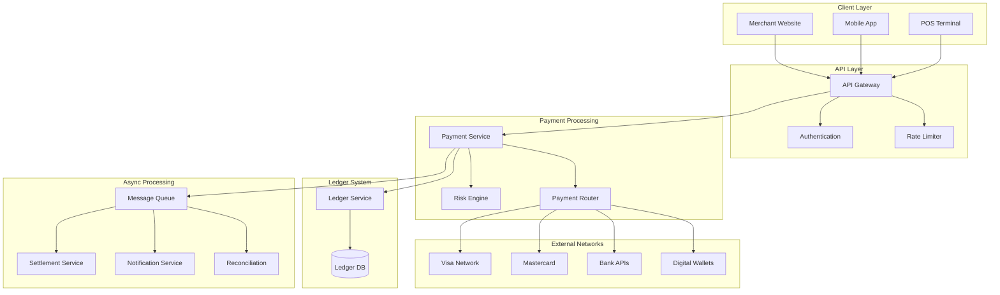
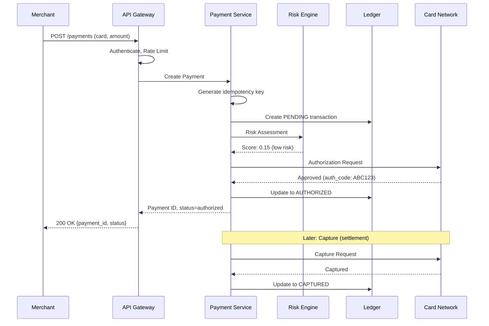
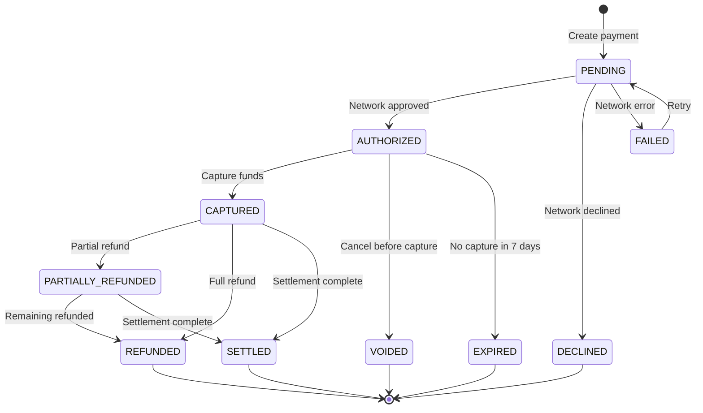
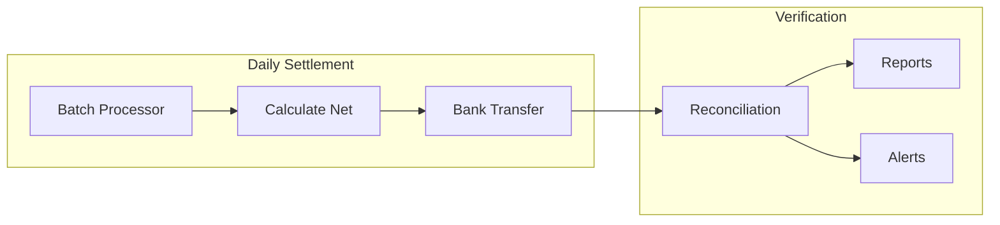
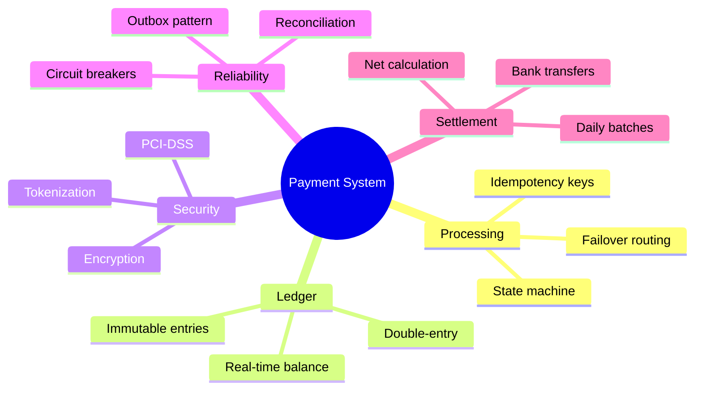

# Design a Payment System

<Info>
**Difficulty**: 🔴 Hard | **Time**: 45-60 min | **Prerequisites**: Distributed transactions, Idempotency, Reconciliation
</Info>

Design a payment processing system like Stripe or PayPal that handles millions of transactions daily with absolute reliability—because money doesn't tolerate bugs.

---

## 1. Requirements Clarification

### Functional Requirements

| Feature | Description |
|---------|-------------|
| **Payment Processing** | Accept payments via cards, bank transfers, digital wallets |
| **Merchant Integration** | APIs for businesses to accept payments |
| **Refunds** | Process full and partial refunds |
| **Payouts** | Transfer funds to merchant bank accounts |
| **Recurring Payments** | Subscriptions and scheduled payments |
| **Fraud Detection** | Real-time fraud screening |
| **Reporting** | Transaction history and analytics |

### Non-Functional Requirements

- **Reliability**: 99.999% uptime (5 nines = 5 minutes downtime/year)
- **Consistency**: EXACTLY-ONCE payment processing
- **Latency**: Payment authorization < 500ms
- **Security**: PCI-DSS Level 1 compliance
- **Auditability**: Complete audit trail for every transaction

### Capacity Estimation

```
Daily Transactions: 10 million
Average transaction size: $50
Daily Volume: $500 million
Annual Volume: ~$180 billion

Peak TPS: 10M / 86400 x 3 ≈ 350 TPS
  (For reference: Visa handles ~65K TPS at peak, Stripe ~10K TPS.
  350 TPS is well within single-database territory, but design
  for 10x growth.)

Storage:
  Transaction records: 10M x 1KB = 10GB/day ≈ 3.6TB/year
  Ledger entries: 10M x 2 entries x 500B = 10GB/day
  Audit logs: 10M x 5 events x 200B = 10GB/day
  Total: ~30GB/day ≈ 11TB/year
  Retention: 7+ years (regulatory) = ~77TB total

Idempotency store (Redis):
  10M keys/day x 48-hour TTL = 20M active keys
  20M x 100 bytes = 2GB -- fits easily in Redis
```

---

## 2. High-Level Architecture


```mermaid
graph TB
    subgraph "Client Layer"
        WEB[Merchant Website]
        MOBILE[Mobile App]
        POS[POS Terminal]
    end
    
    subgraph "API Layer"
        GW[API Gateway]
        AUTH[Authentication]
        RL[Rate Limiter]
    end
    
    subgraph "Payment Processing"
        PSP[Payment Service]
        RISK[Risk Engine]
        ROUTE[Payment Router]
    end
    
    subgraph "External Networks"
        VISA[Visa Network]
        MC[Mastercard]
        BANK[Bank APIs]
        WALLET[Digital Wallets]
    end
    
    subgraph "Ledger System"
        LED[Ledger Service]
        LEDDB[(Ledger DB)]
    end
    
    subgraph "Async Processing"
        QUEUE[Message Queue]
        SETTLE[Settlement Service]
        NOTIFY[Notification Service]
        RECON[Reconciliation]
    end
    
    WEB --> GW
    MOBILE --> GW
    POS --> GW
    
    GW --> AUTH
    GW --> RL
    GW --> PSP
    
    PSP --> RISK
    PSP --> ROUTE
    PSP --> LED
    
    ROUTE --> VISA
    ROUTE --> MC
    ROUTE --> BANK
    ROUTE --> WALLET
    
    LED --> LEDDB
    
    PSP --> QUEUE
    QUEUE --> SETTLE
    QUEUE --> NOTIFY
    QUEUE --> RECON
```

---

## 3. Core Components Deep Dive

### 3.1 Payment Flow


```mermaid
sequenceDiagram
    participant M as Merchant
    participant G as API Gateway
    participant P as Payment Service
    participant R as Risk Engine
    participant L as Ledger
    participant N as Card Network
    
    M->>G: POST /payments (card, amount)
    G->>G: Authenticate, Rate Limit
    G->>P: Create Payment
    P->>P: Generate idempotency key
    P->>L: Create PENDING transaction
    P->>R: Risk Assessment
    R-->>P: Score: 0.15 (low risk)
    P->>N: Authorization Request
    N-->>P: Approved (auth_code: ABC123)
    P->>L: Update to AUTHORIZED
    P-->>G: Payment ID, status=authorized
    G-->>M: 200 OK {payment_id, status}
    
    Note over P,N: Later: Capture (settlement)
    P->>N: Capture Request
    N-->>P: Captured
    P->>L: Update to CAPTURED
```

### 3.2 Idempotency (Critical!)

Every payment operation MUST be idempotent. Network failures happen, and retries must not create duplicate charges.

```python
class PaymentService:
    def process_payment(self, request: PaymentRequest) -> PaymentResult:
        """
        Idempotent payment processing using client-provided idempotency key
        """
        idempotency_key = request.idempotency_key
        
        # Check if we've seen this request before
        existing = self.idempotency_store.get(idempotency_key)
        if existing:
            if existing.status == "COMPLETED":
                return existing.result  # Return cached result
            elif existing.status == "PROCESSING":
                raise PaymentInProgressError("Retry later")
        
        # Mark as processing
        self.idempotency_store.set(
            idempotency_key, 
            IdempotencyRecord(status="PROCESSING", created_at=now())
        )
        
        try:
            # Actual payment processing
            result = self._do_payment(request)
            
            # Store result
            self.idempotency_store.set(
                idempotency_key,
                IdempotencyRecord(status="COMPLETED", result=result)
            )
            return result
            
        except Exception as e:
            # Clear idempotency record on failure (allow retry)
            self.idempotency_store.delete(idempotency_key)
            raise
    
    def _do_payment(self, request: PaymentRequest) -> PaymentResult:
        """The actual payment logic"""
        # Create ledger entry
        txn_id = self.ledger.create_transaction(
            merchant_id=request.merchant_id,
            amount=request.amount,
            currency=request.currency,
            status="PENDING"
        )
        
        try:
            # Risk check
            risk_score = self.risk_engine.assess(request)
            if risk_score > 0.8:
                self.ledger.update(txn_id, status="DECLINED_FRAUD")
                return PaymentResult(status="DECLINED", reason="FRAUD")
            
            # Route to payment network
            auth_result = self.router.authorize(request)
            
            if auth_result.approved:
                self.ledger.update(
                    txn_id, 
                    status="AUTHORIZED",
                    auth_code=auth_result.auth_code
                )
                return PaymentResult(
                    status="AUTHORIZED",
                    payment_id=txn_id,
                    auth_code=auth_result.auth_code
                )
            else:
                self.ledger.update(txn_id, status="DECLINED")
                return PaymentResult(status="DECLINED", reason=auth_result.reason)
                
        except Exception as e:
            self.ledger.update(txn_id, status="ERROR")
            raise
```

### 3.3 Double-Entry Ledger

Every payment must be recorded using **double-entry bookkeeping**—this is non-negotiable for financial systems.

```python
@dataclass
class LedgerEntry:
    entry_id: str
    account_id: str
    transaction_id: str
    amount: Decimal  # Positive = debit, Negative = credit
    currency: str
    created_at: datetime
    
class LedgerService:
    def record_payment(self, payment: Payment) -> str:
        """
        Double-entry: Every debit has an equal credit
        Customer pays $100 → Customer: -100, Merchant: +100
        """
        transaction_id = generate_uuid()
        
        entries = [
            LedgerEntry(
                entry_id=generate_uuid(),
                account_id=payment.customer_account,
                transaction_id=transaction_id,
                amount=-payment.amount,  # Credit (money leaving)
                currency=payment.currency,
                created_at=now()
            ),
            LedgerEntry(
                entry_id=generate_uuid(),
                account_id=payment.merchant_account,
                transaction_id=transaction_id,
                amount=payment.amount,  # Debit (money arriving)
                currency=payment.currency,
                created_at=now()
            )
        ]
        
        # CRITICAL: Insert atomically
        with self.db.transaction():
            for entry in entries:
                self.db.insert(entry)
            
            # Verify balance (sum of all entries = 0)
            balance = sum(e.amount for e in entries)
            assert balance == 0, "Ledger imbalance!"
        
        return transaction_id
    
    def get_balance(self, account_id: str) -> Decimal:
        """Sum of all entries = current balance"""
        return self.db.query(
            "SELECT SUM(amount) FROM ledger_entries WHERE account_id = ?",
            account_id
        )
```

### 3.4 Payment State Machine


```mermaid
stateDiagram-v2
    [*] --> PENDING: Create payment
    PENDING --> AUTHORIZED: Network approved
    PENDING --> DECLINED: Network declined
    PENDING --> FAILED: Network error
    
    AUTHORIZED --> CAPTURED: Capture funds
    AUTHORIZED --> VOIDED: Cancel before capture
    AUTHORIZED --> EXPIRED: No capture in 7 days
    
    CAPTURED --> PARTIALLY_REFUNDED: Partial refund
    CAPTURED --> REFUNDED: Full refund
    CAPTURED --> SETTLED: Settlement complete
    
    PARTIALLY_REFUNDED --> REFUNDED: Remaining refunded
    PARTIALLY_REFUNDED --> SETTLED: Settlement complete
    
    FAILED --> PENDING: Retry
    
    SETTLED --> [*]
    REFUNDED --> [*]
    VOIDED --> [*]
    DECLINED --> [*]
    EXPIRED --> [*]
```

```python
class PaymentStateMachine:
    VALID_TRANSITIONS = {
        "PENDING": ["AUTHORIZED", "DECLINED", "FAILED"],
        "AUTHORIZED": ["CAPTURED", "VOIDED", "EXPIRED"],
        "CAPTURED": ["PARTIALLY_REFUNDED", "REFUNDED", "SETTLED"],
        "PARTIALLY_REFUNDED": ["REFUNDED", "SETTLED"],
        "FAILED": ["PENDING"],  # Retry
    }
    
    def transition(self, payment_id: str, new_status: str) -> Payment:
        payment = self.db.get(payment_id)
        
        if new_status not in self.VALID_TRANSITIONS.get(payment.status, []):
            raise InvalidTransitionError(
                f"Cannot transition from {payment.status} to {new_status}"
            )
        
        payment.status = new_status
        payment.updated_at = now()
        payment.status_history.append({
            "status": new_status,
            "timestamp": now()
        })
        
        self.db.update(payment)
        self.event_bus.publish(f"payment.{new_status.lower()}", payment)
        
        return payment
```

### 3.5 Risk Engine

Real-time fraud detection is essential:

```python
class RiskEngine:
    def assess(self, payment: PaymentRequest) -> float:
        """
        Returns risk score 0.0 (safe) to 1.0 (fraudulent)
        """
        signals = []
        
        # Velocity checks
        signals.append(self.check_velocity(payment))
        
        # Device/IP reputation
        signals.append(self.check_device(payment.device_fingerprint))
        signals.append(self.check_ip(payment.ip_address))
        
        # Geographic anomalies
        signals.append(self.check_geo_anomaly(payment))
        
        # Card testing patterns
        signals.append(self.check_card_testing(payment))
        
        # ML model
        ml_score = self.ml_model.predict(payment)
        signals.append(ml_score)
        
        # Weighted average
        return sum(s.score * s.weight for s in signals) / sum(s.weight for s in signals)
    
    def check_velocity(self, payment: PaymentRequest) -> Signal:
        """How many payments from this card/user in recent time windows"""
        card_hash = hash(payment.card_number)
        
        last_hour = self.redis.get(f"velocity:{card_hash}:1h")
        last_day = self.redis.get(f"velocity:{card_hash}:24h")
        
        if last_hour > 10:
            return Signal(score=0.9, weight=2.0)  # High risk
        if last_day > 50:
            return Signal(score=0.7, weight=1.5)
        
        return Signal(score=0.1, weight=1.0)  # Normal
```

### 3.6 Payment Routing

Intelligent routing to optimize success rates and minimize costs:

```python
class PaymentRouter:
    def route(self, payment: PaymentRequest) -> PaymentProcessor:
        """
        Select optimal payment processor based on:
        - Card type/network
        - Geographic region
        - Success rates
        - Processing fees
        - Processor health
        """
        candidates = self.get_supported_processors(payment)
        
        # Filter by health
        healthy = [p for p in candidates if self.health_check(p)]
        
        if not healthy:
            raise NoHealthyProcessorError()
        
        # Score each processor
        scored = []
        for processor in healthy:
            score = (
                self.get_success_rate(processor, payment) * 0.5 +  # Prioritize success
                (1 - self.get_fee_rate(processor, payment)) * 0.3 +  # Lower fees better
                self.get_latency_score(processor) * 0.2  # Faster is better
            )
            scored.append((processor, score))
        
        # Return highest scored
        return max(scored, key=lambda x: x[1])[0]
    
    def authorize(self, payment: PaymentRequest) -> AuthResult:
        """Authorize with failover"""
        processors = self.get_fallback_chain(payment)
        
        for processor in processors:
            try:
                result = processor.authorize(payment)
                if result.approved or result.hard_decline:
                    return result
                # Soft decline - try next processor
            except ProcessorError:
                continue  # Try next
        
        return AuthResult(approved=False, reason="ALL_PROCESSORS_FAILED")
```

---

## 4. Settlement and Reconciliation

### Settlement Flow


```mermaid
graph LR
    subgraph "Daily Settlement"
        BATCH[Batch Processor]
        CALC[Calculate Net]
        TRANSFER[Bank Transfer]
    end
    
    subgraph "Verification"
        RECON[Reconciliation]
        REPORT[Reports]
        ALERT[Alerts]
    end
    
    BATCH --> CALC
    CALC --> TRANSFER
    TRANSFER --> RECON
    RECON --> REPORT
    RECON --> ALERT
```

```python
class SettlementService:
    def run_daily_settlement(self, settlement_date: date):
        """
        Called daily via cron job
        1. Aggregate all captured payments by merchant
        2. Calculate net (payments - refunds - fees)
        3. Initiate bank transfers
        """
        for merchant in self.get_active_merchants():
            # Get all captured transactions
            transactions = self.ledger.get_transactions(
                merchant_id=merchant.id,
                status="CAPTURED",
                date=settlement_date
            )
            
            # Calculate totals
            gross = sum(t.amount for t in transactions)
            refunds = sum(t.amount for t in transactions if t.type == "REFUND")
            fees = self.calculate_fees(transactions)
            net = gross - refunds - fees
            
            # Create payout
            if net > 0:
                payout = Payout(
                    merchant_id=merchant.id,
                    amount=net,
                    bank_account=merchant.payout_account,
                    settlement_date=settlement_date
                )
                
                self.bank_api.transfer(payout)
                self.ledger.record_payout(payout)

class ReconciliationService:
    def reconcile(self, date: date):
        """
        Compare our records with external sources
        Flag any discrepancies for investigation
        """
        discrepancies = []
        
        # Compare with card networks
        for network in [VISA, MASTERCARD, AMEX]:
            our_txns = self.ledger.get_by_network(network, date)
            their_txns = network.get_settlement_report(date)
            
            for txn in our_txns:
                match = self.find_match(txn, their_txns)
                if not match:
                    discrepancies.append(Discrepancy(
                        type="MISSING_FROM_NETWORK",
                        transaction=txn
                    ))
                elif match.amount != txn.amount:
                    discrepancies.append(Discrepancy(
                        type="AMOUNT_MISMATCH",
                        ours=txn,
                        theirs=match
                    ))
        
        if discrepancies:
            self.alert_operations(discrepancies)
        
        return ReconciliationReport(date=date, discrepancies=discrepancies)
```

---

## 5. Reliability Patterns

### Exactly-Once Processing

```python
def process_with_outbox(payment: PaymentRequest):
    """
    Transactional outbox pattern for exactly-once event publishing
    """
    with db.transaction():
        # 1. Process payment
        payment_id = ledger.create_transaction(payment)
        
        # 2. Write to outbox (same transaction!)
        outbox.insert(OutboxEvent(
            event_type="payment.created",
            payload={"payment_id": payment_id},
            created_at=now()
        ))
    
    # Separate process polls outbox and publishes events
    # Deletes from outbox after successful publish
```

### Circuit Breaker for Payment Networks

```python
class CircuitBreaker:
    def __init__(self, failure_threshold=5, reset_timeout=60):
        self.failure_count = 0
        self.failure_threshold = failure_threshold
        self.reset_timeout = reset_timeout
        self.state = "CLOSED"
        self.last_failure_time = None
    
    def call(self, func):
        if self.state == "OPEN":
            if now() - self.last_failure_time > self.reset_timeout:
                self.state = "HALF_OPEN"
            else:
                raise CircuitOpenError("Circuit is open, failing fast")
        
        try:
            result = func()
            if self.state == "HALF_OPEN":
                self.state = "CLOSED"
                self.failure_count = 0
            return result
        except Exception as e:
            self.failure_count += 1
            self.last_failure_time = now()
            if self.failure_count >= self.failure_threshold:
                self.state = "OPEN"
            raise

# Usage
visa_breaker = CircuitBreaker()
try:
    result = visa_breaker.call(lambda: visa_api.authorize(payment))
except CircuitOpenError:
    # Fail over to alternative processor
    result = mastercard_api.authorize(payment)
```

---

## 6. Security Considerations

### PCI-DSS Compliance

| Requirement | Implementation |
|-------------|----------------|
| **Encrypt cardholder data** | TLS in transit, AES-256 at rest |
| **Never store CVV** | Process and discard immediately |
| **Tokenization** | Replace card numbers with tokens |
| **Access control** | Role-based access, audit logging |
| **Network segmentation** | Cardholder data in isolated network |

### Card Tokenization

```python
class TokenizationService:
    def tokenize(self, card_number: str) -> str:
        """
        Replace card number with non-reversible token
        Only the token vault can map token → card
        """
        # Check if already tokenized
        existing = self.vault.get_by_card(hash(card_number))
        if existing:
            return existing.token
        
        # Create new token
        token = f"tok_{secrets.token_hex(16)}"
        
        # Store in HSM-backed vault
        self.vault.store(
            token=token,
            encrypted_card=self.hsm.encrypt(card_number),
            card_hash=hash(card_number),
            last_four=card_number[-4:]
        )
        
        return token
    
    def get_card(self, token: str) -> str:
        """Only called by payment processor service"""
        record = self.vault.get(token)
        return self.hsm.decrypt(record.encrypted_card)
```

---

## 7. Database Schema

```sql
-- Core payment table
CREATE TABLE payments (
    id UUID PRIMARY KEY,
    merchant_id UUID NOT NULL,
    customer_id UUID,
    amount DECIMAL(19, 4) NOT NULL,
    currency VARCHAR(3) NOT NULL,
    status VARCHAR(32) NOT NULL,
    payment_method VARCHAR(32) NOT NULL,
    card_token VARCHAR(64),
    auth_code VARCHAR(32),
    network_reference VARCHAR(64),
    idempotency_key VARCHAR(64) UNIQUE,
    created_at TIMESTAMP NOT NULL,
    updated_at TIMESTAMP NOT NULL,
    captured_at TIMESTAMP,
    settled_at TIMESTAMP,
    metadata JSONB
);

-- Double-entry ledger
CREATE TABLE ledger_entries (
    id UUID PRIMARY KEY,
    account_id UUID NOT NULL,
    transaction_id UUID NOT NULL,
    amount DECIMAL(19, 4) NOT NULL,
    currency VARCHAR(3) NOT NULL,
    entry_type VARCHAR(32) NOT NULL,
    created_at TIMESTAMP NOT NULL,
    
    INDEX idx_account_id (account_id),
    INDEX idx_transaction_id (transaction_id)
);

-- Outbox for event publishing
CREATE TABLE outbox (
    id UUID PRIMARY KEY,
    event_type VARCHAR(64) NOT NULL,
    aggregate_id UUID NOT NULL,
    payload JSONB NOT NULL,
    created_at TIMESTAMP NOT NULL,
    processed_at TIMESTAMP
);
```

---

## 8. Interview Tips

### Common Follow-ups

<AccordionGroup>
  <Accordion title="How do you handle network failures during authorization?" icon="wifi-slash">
    1. **Timeout with retry** - Use idempotency keys to safely retry
    2. **Status check** - Query network for transaction status before retry
    3. **Reversal** - If unsure, initiate reversal (void) and retry fresh
    4. **Manual review** - Flag for operations if automated recovery fails
  </Accordion>
  
  <Accordion title="How do you handle currency conversion?" icon="money-bill-transfer">
    - **Lock exchange rate** at payment creation time
    - **Store both currencies** (original and converted)
    - **Daily rate updates** from forex provider
    - **Margin buffer** for rate fluctuation during settlement
  </Accordion>
  
  <Accordion title="How do you prevent double-charging?" icon="clone">
    1. **Client-generated idempotency key** - Required on all requests
    2. **Database unique constraint** - Prevent duplicate inserts
    3. **Distributed lock** - Prevent concurrent processing
    4. **Audit log** - Trace all operations for investigation
  </Accordion>
</AccordionGroup>

### Key Trade-offs

| Decision | Option A | Option B | Recommendation |
|----------|----------|----------|----------------|
| Consistency | Strong (slow) | Eventual (fast) | **Strong** for payments -- this is non-negotiable. In a financial system, the cost of inconsistency is not a bad user experience; it is actual money lost or regulatory violations. You are trading ~50ms of additional latency for correctness, which is always worth it when money is involved. |
| Ledger DB | RDBMS | Append-only log | RDBMS with immutable entries. Never UPDATE or DELETE ledger rows -- only INSERT. This gives you a complete audit trail. Stripe, Square, and every serious payment system uses append-only ledger entries. The trade-off: storage grows linearly, but ledger data compresses well and storage is cheap compared to the cost of a lost audit trail. |
| Payment state | In-memory | Database | Database with cache. Payment state MUST survive process restarts. In-memory state means a server crash mid-transaction can leave payments in an unknown state. Use the database as the source of truth with Redis caching the hot path for read performance. |
| Event publishing | Sync | Async (outbox) | **Outbox pattern** -- this is the only safe approach. If you publish events synchronously, a network failure after database commit but before event publish means your downstream systems never learn about the payment. The outbox pattern guarantees that if the payment is recorded, the event will eventually be published. |

### Common Candidate Mistakes

```
Mistake 1: Using floating-point arithmetic for money
  Never use float or double for currency calculations. Floating-
  point math causes rounding errors: 0.1 + 0.2 = 0.30000000000000004.
  Use Decimal types with explicit precision (DECIMAL(19,4) in SQL).
  Stripe stores amounts in the smallest currency unit (cents) as
  integers to avoid this entirely.

Mistake 2: Not distinguishing authorization from capture
  Authorization reserves funds on the customer's card. Capture
  actually moves the money. These are two separate steps, often
  separated by days (e.g., Amazon authorizes when you order,
  captures when they ship). Candidates who treat payment as a
  single atomic operation miss the auth-hold/capture lifecycle,
  voids, and expiration of uncaptured authorizations (typically
  7 days).

Mistake 3: Clearing the idempotency record on failure
  This is subtle but critical. If a payment attempt fails with an
  UNKNOWN status (timeout, network error), clearing the idempotency
  record allows a retry that may create a duplicate charge. The safe
  approach: keep the record, mark it as "requires investigation,"
  and query the payment processor for the transaction status before
  retrying.

Mistake 4: Ignoring reconciliation
  Every payment system accumulates discrepancies over time --
  network timeouts, partial failures, processor bugs. Daily
  reconciliation (comparing your ledger against processor settlement
  reports) is not optional; it is how you catch problems before they
  become audit findings. Stripe runs reconciliation continuously,
  not just daily.

Mistake 5: Designing the system without thinking about PCI scope
  Any component that touches raw card numbers falls under PCI-DSS
  compliance. The correct design minimizes PCI scope by tokenizing
  card data at the earliest possible point (ideally on the client
  via a hosted payment form like Stripe Elements). Your backend
  should never see a raw card number.
```

---

## 9. Summary


```mermaid
mindmap
  root((Payment System))
    Processing
      Idempotency keys
      State machine
      Failover routing
    Ledger
      Double-entry
      Immutable entries
      Real-time balance
    Security
      PCI-DSS
      Tokenization
      Encryption
    Reliability
      Circuit breakers
      Outbox pattern
      Reconciliation
    Settlement
      Daily batches
      Net calculation
      Bank transfers
```

**Key Takeaways:**
1. **Idempotency is non-negotiable** - Every operation must be safely retryable
2. **Double-entry ledger** - Money in must equal money out
3. **State machine** - Enforce valid payment transitions
4. **Reconciliation** - Trust but verify against external sources
5. **Circuit breakers** - Fail fast when networks are unhealthy

---

## Interview Deep-Dive Questions

<AccordionGroup>
  <Accordion title="Q1: Explain how you would implement idempotency for payment processing. What happens when a network timeout occurs after the payment processor has charged the card but before your system receives the response?" icon="key">
    **What the interviewer is really testing:** Whether you understand the hardest edge case in payment idempotency -- the "unknown outcome" scenario -- and can design for it without double-charging or losing a payment.

    **Strong Answer:**
    - Idempotency in payments means that retrying the same request produces the same result without creating a duplicate charge. The client generates a unique idempotency key (typically a UUID) and sends it with every payment request. The server stores a mapping from idempotency key to the result.
    - The straightforward cases are simple: if the key exists and the result is SUCCESS, return the cached success. If the key exists and the result is FAILED, return the cached failure (or allow a new attempt depending on the failure type).
    - The hard case is the "unknown outcome" timeout. The payment processor charged the card, but your system never received the confirmation. If you clear the idempotency record and the client retries, you risk a double charge. If you do not clear it, the payment sits in limbo.
    - The correct design: (1) Mark the idempotency record as `PROCESSING` before calling the processor. (2) On timeout, mark it as `UNKNOWN` -- do NOT delete it. (3) Before any retry, query the payment processor's API using the processor's reference ID to check the transaction status. This is called a "status inquiry" or "lookup." (4) If the processor says it succeeded, update your ledger and return success. If it says it failed, clear the record and allow retry. If the processor also does not know (rare), escalate to manual review.
    - The idempotency store should have a TTL (24-48 hours) so it does not grow unbounded, but the TTL must be longer than any possible retry window.
    - **Example:** Stripe's idempotency implementation stores the complete HTTP response for each idempotency key. On retry, they replay the exact same response, including headers and status code. They keep idempotency keys for 24 hours. Their documentation explicitly warns that clearing a key on failure can cause double charges if the original request actually succeeded at the processor level.

    **Red flag answer:** "Delete the idempotency record on failure so the client can retry" -- this is the classic mistake that causes double charges on timeout scenarios.

    **Follow-ups:**
    1. How do you handle the case where two instances of your payment service receive the same idempotency key at the same time? What prevents both from calling the processor?
    2. Should the idempotency key be client-generated or server-generated? What are the security implications of trusting client-generated keys?
  </Accordion>

  <Accordion title="Q2: How would you design the reconciliation system for a payment platform processing 10 million transactions per day?" icon="scale-balanced">
    **What the interviewer is really testing:** Whether you understand that payment systems accumulate discrepancies over time and that reconciliation is not optional -- it is the safety net that catches bugs, network glitches, and fraud.

    **Strong Answer:**
    - Reconciliation is the process of comparing your internal records against external sources (card networks, bank statements, processor settlement reports) to find discrepancies. At 10M transactions/day, you cannot do this manually -- it must be automated with human investigation only for flagged exceptions.
    - **Three-way reconciliation:** Compare (1) your ledger entries, (2) the payment processor's settlement report, and (3) the bank statement. All three must agree on amount, currency, date, and status for each transaction. Any mismatch is a "break" that requires investigation.
    - Types of discrepancies: (a) **Missing from processor** -- you recorded a payment but the processor has no record (likely a timeout where the payment never reached them). (b) **Missing from your ledger** -- the processor has a record you do not (extremely dangerous -- means money moved without your knowledge). (c) **Amount mismatch** -- often caused by currency conversion differences or partial captures. (d) **Status mismatch** -- you think it is captured, processor says it was refunded.
    - The reconciliation pipeline: (1) Ingest settlement files from processors (usually CSV/SFTP delivered daily). (2) Normalize into a common format. (3) Match against your ledger using composite keys (processor reference + amount + date). (4) Flag unmatched or mismatched records. (5) Auto-resolve common known patterns (e.g., timing differences where a transaction on your side at 11:59 PM appears on the processor's report the next day). (6) Route remaining breaks to an operations dashboard for human investigation.
    - Run reconciliation on T+1 (one day after the transaction date) and again on T+3 for stragglers. Set SLAs: 99% of breaks should be auto-resolved, remaining 1% investigated within 24 hours.
    - **Example:** Stripe runs continuous reconciliation (not just daily). They match every authorization, capture, and refund event against processor responses in near-real-time. When they detect a discrepancy, an automated system attempts resolution before any human is paged. They reportedly reconcile over $1 trillion in annual payment volume this way.

    **Red flag answer:** Treating reconciliation as a "nice-to-have" or suggesting you only need to check your own database. If you do not reconcile against external sources, you have no way to detect money leakage.

    **Follow-ups:**
    1. What happens when reconciliation finds that the processor charged a customer but your ledger has no record? How do you fix this without the customer noticing?
    2. How would you handle reconciliation across multiple processors in different currencies with different settlement timelines (Visa settles in T+2, some bank transfers in T+5)?
  </Accordion>

  <Accordion title="Q3: How do you minimize PCI-DSS scope in your payment system architecture, and what is the role of tokenization?" icon="shield-halved">
    **What the interviewer is really testing:** Whether you understand that PCI compliance is not just about encryption -- it is about minimizing the surface area of systems that handle raw card data, because every component in scope requires expensive audits and operational overhead.

    **Strong Answer:**
    - PCI-DSS compliance applies to any system that stores, processes, or transmits cardholder data (card number, expiration date, CVV). The compliance burden is enormous: network segmentation, regular penetration testing, quarterly vulnerability scans, annual audits. The goal is to minimize the number of components that fall "in scope."
    - The primary technique is **tokenization at the edge:** capture card data in the browser or mobile app using a hosted payment form (like Stripe Elements or Braintree's Drop-in UI). The card number goes directly from the client to the payment processor's tokenization service -- your backend never sees it. You receive a token (`tok_abc123`) that represents the card. All subsequent operations (charge, refund, recurring billing) use the token.
    - This means your entire backend -- API servers, databases, message queues, logging systems -- is out of PCI scope. Only the client-side JavaScript snippet (which you do not host -- the processor does) touches raw card data.
    - CVV must never be stored, even encrypted. You capture it at payment time, send it to the processor for verification, and discard it immediately. No database, no log, no cache should ever contain a CVV.
    - For token storage: tokens are not sensitive under PCI-DSS (they are meaningless without access to the processor's vault), so you can store them in your regular database. However, you should still encrypt them at rest and restrict access as defense-in-depth.
    - Network segmentation: if any component does handle raw card data (e.g., you build your own tokenization service for some reason), it must be in an isolated network segment with strict firewall rules, dedicated logging that does not commingle with non-PCI systems, and limited human access with MFA.
    - **Example:** When Square built their payment system, they created a separate HSM-backed "card vault" microservice that is the only system handling raw card numbers. Everything else uses tokens. This vault has its own deployment pipeline, its own audit trail, and a team of fewer than 10 engineers with access -- versus hundreds of engineers working on the rest of the platform.

    **Red flag answer:** Suggesting you encrypt card numbers and store them in your database (this still puts your database, backup system, key management, and all accessor services in PCI scope), or not knowing what a tokenization service does.

    **Follow-ups:**
    1. A merchant wants to display the last four digits of the card on their order confirmation page. Does storing last-four digits put your system in PCI scope? What about BIN (first six digits)?
    2. Your logging system accidentally captured a full card number in a debug log (this happens more often than people think). What is your incident response procedure?
  </Accordion>

  <Accordion title="Q4: Design the refund flow for a payment system. What makes refunds significantly harder than payments, and how do you handle partial refunds?" icon="rotate-left">
    **What the interviewer is really testing:** Whether you understand that refunds are not simply "payments in reverse" -- they have unique timing constraints, state complexities, and failure modes.

    **Strong Answer:**
    - Refunds are harder than payments for several reasons: (1) A refund depends on the original payment's state -- you can only refund a CAPTURED payment, not an AUTHORIZED or PENDING one (for those, you VOID). (2) The refund cannot exceed the original charge amount, but can be partial. (3) Refunds go through different processing rails (the return path to the card) and have different timelines (3-10 business days vs. instant authorization). (4) Multiple partial refunds against a single payment must be tracked and their total must not exceed the original amount.
    - The state model: a CAPTURED payment can transition to PARTIALLY_REFUNDED (some amount returned) or REFUNDED (full amount returned). Each refund is a separate ledger transaction linked to the original payment ID. The system must track `total_refunded` per payment and reject any refund request where `amount_requested + total_already_refunded > original_amount`.
    - Ledger entries for a refund: reverse the original entries. If the original payment was `Customer: -$100, Merchant: +$100`, the refund creates `Customer: +$50, Merchant: -$50` (for a partial refund of $50). The double-entry invariant (sum = 0) is maintained.
    - Edge cases: (a) **Refund after settlement:** if the merchant has already been paid out, the refund amount must be deducted from their next payout or clawed back. (b) **Refund on an expired card:** the card network will attempt to route the refund to the new card or issue a check. Your system must handle the "refund failed" callback. (c) **Currency fluctuation:** if the original payment was in EUR and the refund happens 30 days later, the exchange rate may have changed. Typically, you refund the exact original amount in the original currency, not the converted amount.
    - **Example:** Stripe's refund API is simple on the surface (`POST /refunds` with `payment_intent` and `amount`) but behind the scenes, they track a `amount_refundable` field that is updated atomically with each refund. They also distinguish between `refund` (goes back to the original payment method) and `credit` (applied as platform credit), each with different ledger treatment.

    **Red flag answer:** Treating refunds as the exact reverse of the payment charge, or not considering partial refunds and the need to track cumulative refund amounts against the original payment.

    **Follow-ups:**
    1. A customer disputes a charge (chargeback) at the same time the merchant initiates a refund. Now you have both a refund and a chargeback for the same payment. How do you prevent the customer from getting their money back twice?
    2. How would you design the refund system to support "instant refunds" (crediting the customer immediately from your platform's balance) while the actual card refund processes over 5-10 days?
  </Accordion>

  <Accordion title="Q5: Explain double-entry bookkeeping in the context of a payment ledger. Why is it critical, and how do you detect ledger inconsistencies?" icon="book">
    **What the interviewer is really testing:** Whether you understand the fundamental accounting principle that underpins every financial system, and can translate it into a concrete database design.

    **Strong Answer:**
    - Double-entry bookkeeping is a 600-year-old accounting principle: every financial transaction creates exactly two entries -- a debit and a credit -- that sum to zero. In a payment system, this means every dollar that moves must be accounted for on both sides. If `$100` leaves a customer's account, exactly `$100` must arrive somewhere (merchant account, platform fee account, tax account, etc.).
    - In database terms: a `ledger_entries` table where each row is one side of a transaction. A payment of `$100` with a `$3` fee creates three entries: Customer `-$100`, Merchant `+$97`, Platform Fee Account `+$3`. Sum = 0. This is enforced as a database constraint: the INSERT is wrapped in a transaction, and before committing, you verify that the sum of all entries for the transaction ID equals zero. If not, the transaction rolls back.
    - Ledger entries are **append-only and immutable**. You never UPDATE or DELETE a ledger row. If you need to correct something, you create new entries that reverse the original (this is how refunds and adjustments work). This gives you a complete, auditable history of every financial event.
    - For querying balances: the balance of any account is simply `SELECT SUM(amount) FROM ledger_entries WHERE account_id = ?`. At scale, you maintain a materialized `account_balances` table that is updated transactionally alongside new ledger entries, but the ledger entries remain the source of truth. If the balance table ever disagrees with the ledger sum, you trust the ledger.
    - Detecting inconsistencies: run a periodic "balance proof" job that recalculates every account balance from the raw ledger entries and compares it against the materialized balance table. Any discrepancy means a bug or data corruption. Also run a "cross-foot" check: the global sum of ALL ledger entries across ALL accounts must equal zero. If it does not, money has appeared from or disappeared into nowhere.
    - **Example:** Stripe's ledger system processes millions of entries per day and maintains the zero-sum invariant at the transaction level. Their "balance transaction" API exposes this: every balance change shows both sides of the entry, making it trivial for merchants to reconcile. When they detect an imbalance (rare, but it happens due to distributed system edge cases), it triggers a P0 incident.

    **Red flag answer:** Describing a single-entry system where you just track a `balance` field on each account and increment/decrement it (this makes it impossible to audit where money came from or went, and balance corruption is undetectable).

    **Follow-ups:**
    1. At 10M transactions/day, the ledger table grows by 30M+ rows/day (multiple entries per transaction). How do you handle queries like "give me this merchant's balance" without scanning millions of rows?
    2. How would you handle multi-currency transactions in the ledger? If a customer pays in EUR but the merchant's account is in USD, how many ledger entries are created and what accounts are involved?
  </Accordion>

  <Accordion title="Q6: How would you design the payment routing system to maximize authorization success rates while minimizing processing costs?" icon="route">
    **What the interviewer is really testing:** Whether you understand that payment routing is an optimization problem with multiple competing objectives, and that the choice of processor significantly impacts both revenue and cost.

    **Strong Answer:**
    - Payment routing selects which processor (Visa direct, Mastercard, Adyen, Stripe, local acquirers) handles a given transaction. This choice matters because: (a) different processors have different success rates for different card types/regions (a local Brazilian acquirer has 10-15% higher success rates for Brazilian cards than a US-based global processor), (b) processing fees vary from 1.5% to 3%+ depending on the route, and (c) processor health varies -- one may be experiencing elevated latency or failures.
    - The routing decision uses a scoring model: `score = success_rate_weight * predicted_success_rate + cost_weight * (1 - fee_rate) + latency_weight * latency_score + health_weight * health_score`. The weights are tunable and typically prioritize success rate (because a failed payment loses the entire transaction value, not just the fee difference).
    - **Success rate prediction:** Build a model using historical data -- for a given `(card_bin, issuing_country, card_type, amount_range, processor)` tuple, what is the historical approval rate? BIN (Bank Identification Number, first 6 digits of card) is the strongest predictor because it identifies the issuing bank.
    - **Failover chain:** If the primary processor declines with a "soft decline" (insufficient funds, try again), route to the next-best processor. Hard declines (stolen card, invalid number) should not be retried -- they will fail on every processor. Distinguishing soft vs. hard declines requires parsing processor-specific response codes.
    - **Circuit breakers:** Monitor each processor's error rate and latency in real-time. If a processor's error rate exceeds a threshold (e.g., 5% in a 5-minute window), open the circuit and route traffic away until it recovers. This prevents cascade failures where a slow processor causes timeouts across your system.
    - **Example:** Adyen's routing engine considers over 20 signals per transaction and maintains separate success-rate models per issuing bank. They claim their smart routing increases authorization rates by 3-5% compared to single-processor setups. At $500M daily volume, a 3% improvement in auth rate means $15M more in successful transactions per day.

    **Red flag answer:** Routing all transactions to a single processor, or making routing decisions based only on cost without considering success rates (a cheaper processor with 5% lower success rates costs more in lost revenue than the fee savings).

    **Follow-ups:**
    1. How do you handle "cascade retries" safely? If Processor A returns a timeout and you retry on Processor B, how do you ensure Processor A did not actually charge the card?
    2. A new processor offers 30% lower fees but you have no historical success rate data for them. How do you onboard them without risking a spike in declined transactions?
  </Accordion>

  <Accordion title="Q7: What happens between authorization and settlement in a card payment? Why is this two-step process necessary, and what can go wrong?" icon="clock">
    **What the interviewer is really testing:** Whether you understand the full payment lifecycle beyond just "charge the card," including the auth-hold/capture gap, voids, and expiration of uncaptured authorizations.

    **Strong Answer:**
    - Card payments are a two-step process: **Authorization** (asking the issuing bank to reserve funds) and **Capture** (actually moving the funds). These can be separated by minutes, hours, or even days.
    - Authorization places a "hold" on the cardholder's available credit. The money has not moved yet -- the issuing bank has simply promised to honor the charge when you capture it. The merchant has a window (typically 7 days for credit cards, shorter for debit) to capture the authorization.
    - Why separate them? (a) **E-commerce:** Amazon authorizes when you place an order but captures only when the item ships. If the item is out of stock, they void the authorization instead of refunding a charge. (b) **Hotels/car rentals:** Authorize a hold at check-in, capture the final amount at check-out (which may be different from the authorized amount). (c) **Tips:** Restaurants authorize the meal amount, then capture meal + tip.
    - What can go wrong: (a) **Authorization expires:** if you do not capture within 7 days, the authorization expires and the hold is released. You must re-authorize if you still want to charge. (b) **Partial capture:** you can capture less than the authorized amount (e.g., one item in a multi-item order is out of stock). The remaining hold is released. (c) **Over-capture:** some processors allow capturing slightly more than authorized (for tips), but this is risky and may be declined by the issuer. (d) **Auth-hold complaints:** customers see the hold on their statement and call their bank thinking they were charged. This generates support tickets.
    - In your system design, the payment state machine must handle: PENDING to AUTHORIZED to CAPTURED (happy path), AUTHORIZED to VOIDED (cancel before capture), and AUTHORIZED to EXPIRED (capture window missed).
    - **Example:** When you book a hotel on Booking.com, they authorize your card at booking time but capture at check-in or check-out. If you cancel within the free cancellation window, they void the authorization -- no refund needed because no money moved. This is much cleaner (and cheaper in processing fees) than charging and refunding.

    **Red flag answer:** Treating payment as a single atomic operation ("charge the card"), or not knowing that authorization and capture are separate network calls to the card network.

    **Follow-ups:**
    1. A customer contacts support saying "I was charged twice" -- but when you check, one is an auth hold and one is a capture. How does your system expose this distinction to customer support agents, and how do you explain it to the customer?
    2. You have an order that was authorized 6 days ago. The item is about to ship, but the auth expires in 24 hours. What is your strategy -- capture immediately and risk shipping delays, or wait and risk auth expiration?
  </Accordion>

  <Accordion title="Q8: How do you ensure exactly-once processing in a payment system when messages can be delivered more than once and services can crash mid-operation?" icon="bullseye">
    **What the interviewer is really testing:** Whether you understand that true exactly-once is impossible in distributed systems, and that the practical approach is "effectively once" through idempotency plus the transactional outbox pattern.

    **Strong Answer:**
    - True exactly-once delivery is impossible in a distributed system (this is a consequence of the Two Generals Problem). What we achieve is "effectively exactly-once processing" by combining at-least-once delivery with idempotent processing. Messages may arrive more than once, but processing them multiple times produces the same result as processing them once.
    - The **transactional outbox pattern** is the key technique: (1) Within a single database transaction, write the payment record to the payments table AND write an event to an outbox table. This guarantees that either both are written or neither is. (2) A separate "outbox relay" process polls the outbox table, publishes events to Kafka, and marks them as published. (3) If the relay crashes after publishing but before marking, it will re-publish on recovery -- but downstream consumers are idempotent, so this is safe.
    - Every downstream consumer must be idempotent. When the settlement service receives a `payment.captured` event, it checks if it has already processed that event (using the event ID or payment ID as a deduplication key). If yes, it skips processing.
    - For the payment service itself: the idempotency key prevents duplicate charges even if the API request is retried. The state machine prevents invalid transitions (you cannot capture an already-captured payment). Together, these make the entire pipeline effectively exactly-once.
    - The alternative -- using distributed transactions (2PC) -- is impractical at scale because it requires all participants to be available and introduces a global coordinator that becomes a single point of failure. The outbox pattern trades global coordination for eventual consistency, which is acceptable because settlement and notifications do not need to be synchronous with payment processing.
    - **Example:** Stripe uses a variant of the outbox pattern they call "reliable event delivery." Every state change in their payment lifecycle writes to both the payments table and an events log in the same transaction. A dedicated event delivery system then fans out these events to webhooks and internal consumers, with at-least-once guarantees and consumer-side deduplication.

    **Red flag answer:** Claiming you can achieve exactly-once by using Kafka's "exactly-once semantics" alone (Kafka's exactly-once is limited to its own producer-consumer pipeline and does not extend to external side effects like charging a card), or suggesting two-phase commit across all services.

    **Follow-ups:**
    1. The outbox relay process crashes after publishing an event to Kafka but before marking the outbox row as processed. On recovery, it re-publishes the event. The settlement service receives the duplicate. Walk through exactly how the settlement service deduplicates this.
    2. How long do you keep idempotency records and outbox entries? What is the trade-off between storage cost and safety window?
  </Accordion>
</AccordionGroup>
